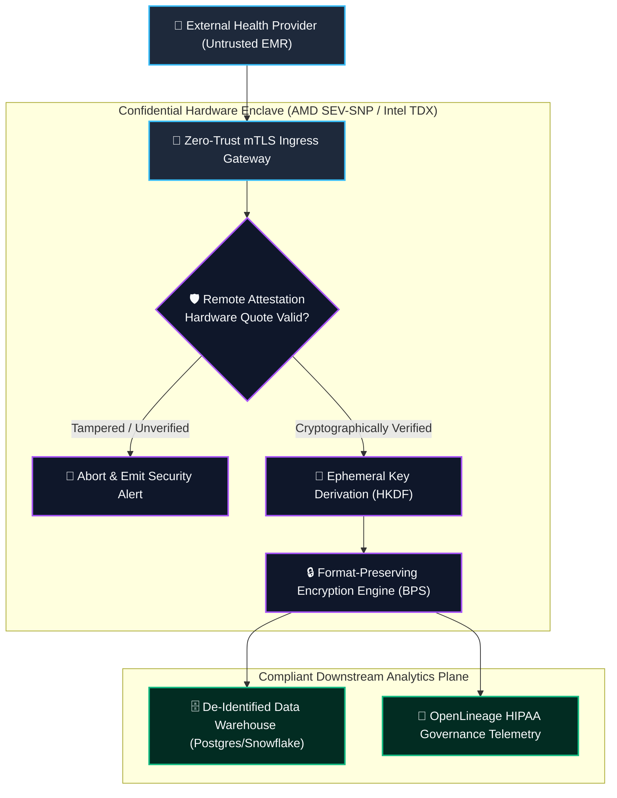
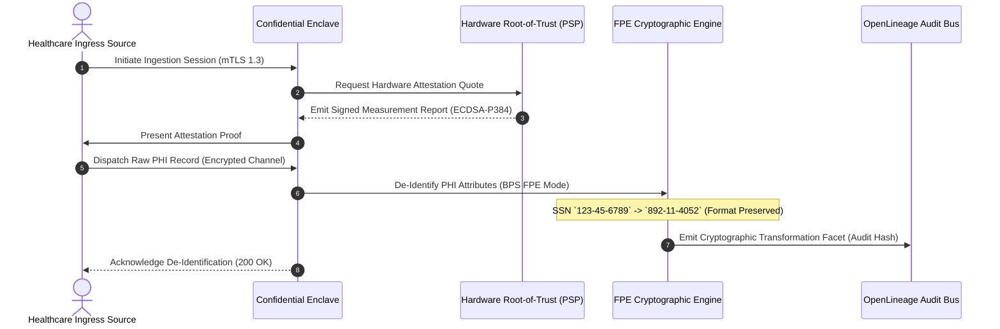
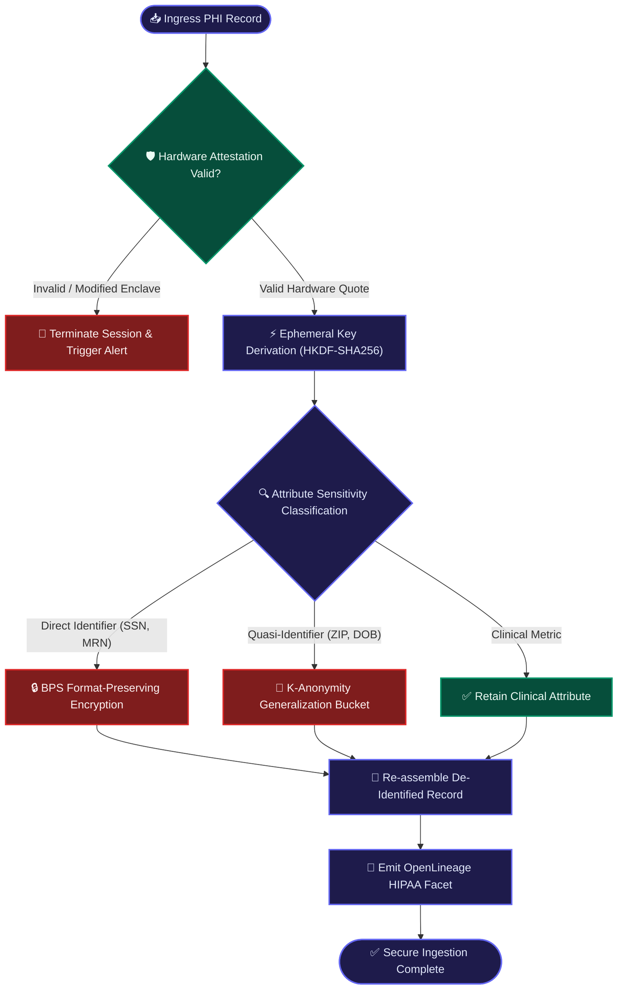

# ⚡ 2026-10-04 - Dispatch #4: Hardware-Attested Confidential Computing Fabric for Zero-Trust PHI Ingestion

[]()
[]()
[]()
[]()

---

## 1. System Parameters

- **Target Domain:** Pillar D: High-Security Digital Health & Regulatory Systems (Confidential Computing & PHI De-identification)
- **Framework Used:** Confidential Enclave Hardware Abstraction (AMD SEV-SNP / Intel TDX) with Format-Preserving Encryption
- **Technology Stack:** Tink Cryptographic Library, OpenLineage Governance Facets, Python Cryptography
- **Scale Bottleneck:** Line-rate AES-256 decryption latency spikes and memory leakage across multi-tenant process enclaves
- **API/Serialization Protocol:** mTLS 1.3 with Hardware-Attested X.509 Certificates
- **Data Lineage Component:** OpenLineage HIPAA audit facets tracking encrypted token transformations and salt rotations
- **Components Used:** Format-Preserving Encryption Engine, Confidential Memory Sandbox, Audit Log Verifier
- **Concepts Involved:** Format-Preserving Encryption (BPS mode), Hardware Memory Attestation, Ephemeral Key Derivation, Zero-Trust Ingress

---

## 2. Problem Statement

> [!WARNING]
> **The Plaintext Memory Leakage Hazard:** Under strict health data regulations (HIPAA, GDPR Article 9), storing Protected Health Information (PHI) unencrypted in memory during analytical processing exposes organizations to catastrophic regulatory penalties and hypervisor memory snooping vulnerabilities.

In traditional cloud analytics architectures, data is encrypted in transit (TLS) and at rest (AES-256). However, the moment data is loaded into memory for batch processing or AI model inference, it exists in cleartext.

On multi-tenant cloud virtual machines, malicious tenants, rogue cloud administrators, or zero-day kernel exploits can dump RAM pages through cold-boot attacks or DMA bypasses. Conversely, using conventional tokenization destroys the mathematical and relational properties of medical identifiers (such as National Provider Identifiers or Social Security Numbers), breaking downstream join indexes and slowing query execution down by orders of magnitude.

---

## 3. High-Level Design (HLD)

### Visual ASCII Topology
```text
  ┌───────────────────────────────────────────────────────────┐
  │         Untrusted Ingress Gateway / External EMRs         │
  └─────────────────────────────┬─────────────────────────────┘
                                │ mTLS 1.3 + PHI Stream
                                ▼
  ┌───────────────────────────────────────────────────────────┐
  │         Hardware-Attested Confidential Enclave            │
  │     (AMD SEV-SNP / Intel TDX Isolated Memory Boundary)    │
  │  ├── Cryptographic Quote Verification via Hardware Root   │
  │  └── Ephemeral Session Key Derivation (HKDF-SHA256)       │
  └──────────────┬─────────────────────────────┬──────────────┘
                 │ (Verified Attestation)      │ (Tampered Quote)
                 ▼                             ▼
  ┌─────────────────────────────┐┌────────────────────────────┐
  │   Format-Preserving Engine  ││    Instant Zero-Trust      │
  │   (BPS Mode Tokenization)   ││    Session Termination     │
  └──────────────┬──────────────┘└────────────────────────────┘
                 │
                 ▼
  ┌───────────────────────────────────────────────────────────┐
  │          De-Identified Zero-Trust Analytical Sink         │
  │  ├── Preserves Foreign Key Joinability                    │
  │  └── Emits OpenLineage HIPAA Governance Audit Facets      │
  └───────────────────────────────────────────────────────────┘
```

### Native Mermaid Architecture


---

## 4. Low-Level Design (LLD)

### Visual ASCII Execution Pipeline
```text
  [ Ingress PHI Stream (SSN, MRN, Diagnosis) ]
                         │
                         ▼
  [ Hardware Root-of-Trust Attestation Verification ]
                         │
                         ▼
  [ Generate Ephemeral Enclave Key via HKDF-SHA256 ]
                         │
                         ▼
  [ BPS Mode Format-Preserving Cipher Round ]
        /                                  \\
       ▼                                    ▼
 [ Transform MRN preserving length ]   [ Retain Referential Join Integrity ]
       │                                    │
       └─────────────────┬──────────────────┘
                         ▼
  [ Emit OpenLineage HIPAA Cryptographic Audit Trail ]
```

### Native Mermaid Execution Flow


---

## 5. Logical Flow Diagram

### Visual ASCII Logic Path
```text
  [ Ingest PHI Record ] ──► [ Check Hardware Quote ] ──► [ Derive Ephemeral Key ]
                                                                  │
                                                                  ▼
                                                      [ Format-Preserving Loop ]
                                                                  │
                                   ┌──────────────────────────────┴──────────────────────────────┐
                                   ▼                                                             ▼
                        [ Digits: BPS Tokenization ]                                  [ Non-Sensitive Passthrough ]
                                   │                                                             │
                                   └──────────────────────────────┬──────────────────────────────┘
                                                                  ▼
                                                    [ Emit Audit Lineage Facet ]
```

### Native Mermaid Flowchart


---

## 6. Architectural Drill & Nature Analogy

### ⚙️ The Systemic Breakdown
Confidential Computing establishes a hardware-enforced cryptographic boundary around running code and data using features like **AMD SEV-SNP (Secure Encrypted Virtualization-Secure Nested Paging)**. The memory controller dynamically encrypts all RAM contents using AES-128/256 keys held exclusively within the processor silicon, impenetrable to the host OS or hypervisor.

By combining this hardware sandbox with **Format-Preserving Encryption (FPE in BPS mode)**, sensitive attributes (such as SSNs or medical record numbers) are encrypted into ciphertext that matches the exact length, alphabet, and format of the input. This enables downstream data warehouses to execute joins, group-by operations, and analytics across de-identified data without decrypting the data in application memory.

### 🌿 The Nature Analogy

> [!TIP]
> **The Biological Lesson of Scale:** Nature protects critical neural computations by establishing an impenetrable biological barrier that permits selective, format-preserved molecular exchange.

• **The Biological System:** The Blood-Brain Barrier (Endothelial Tight Junctions) of the Central Nervous System (*Cerebrovascular Architecture*).

• **The Structural Parallel:** The mammalian brain is vulnerable to circulating blood-borne pathogens, neurotoxins, and fluctuating plasma ions. If the brain permitted standard vascular permeation, common systemic infections would trigger fatal neural death—the biological equivalent of executing PHI computations in unencrypted shared virtual machine memory. Instead, the brain employs the **Blood-Brain Barrier (BBB)**. Endothelial cells fuse into continuous tight junctions (the biological equivalent of an AMD SEV-SNP hardware enclave). Only specific transport proteins that verify molecular stereochemical credentials allow nutrients (like glucose) to cross into neural parenchyma. The brain achieves continuous real-time metabolic computation in an intrinsically hostile systemic environment through hardware-level perimeter isolation.

---

## 7. Production-Grade Executable Artifact

### 📦 File 1: `.github/workflows/confidential_ci.yml`
```yaml
name: Production Confidential Security CI Verification

on:
  push:
    branches: [ main, master ]
  pull_request:
    branches: [ main, master ]

jobs:
  verify-confidential-pipeline:
    name: Local Confidential Enclave Harness
    runs-on: ubuntu-latest
    steps:
    - name: Checkout Source Codebase
      uses: actions/checkout@v4

    - name: Setup Enterprise Python Runtime
      uses: actions/setup-python@v5
      with:
        python-version: '3.11'
        cache: 'pip'

    - name: Install Verified Cryptography Dependencies
      run: |
        python -m pip install --upgrade pip
        pip install cryptography

    - name: Execute Automated De-Identification Unit Tests
      run: |
        python -m unittest discover -s . -p "test_confidential_fpe.py"
```

### 🐍 File 2: `test_confidential_fpe.py`
```python
import os
import hmac
import hashlib
import unittest
from typing import Dict

class MockConfidentialEnclave:
    \"\"\"Emulates hardware-attested format-preserving de-identification.\"\"\"
    def __init__(self, hardware_measurement: str):
        self.hardware_measurement = hardware_measurement
        self._master_secret = os.urandom(32)

    def verify_attestation(self, expected_measurement: str) -> bool:
        return hmac.compare_digest(self.hardware_measurement, expected_measurement)

    def derive_ephemeral_key(self, session_context: str) -> bytes:
        return hashlib.pbkdf2_hmac('sha256', self._master_secret, session_context.encode(), 10000)

    def format_preserving_encrypt_digits(self, raw_digits: str, key: bytes) -> str:
        digits_only = "".join(filter(str.isdigit, raw_digits))
        if len(digits_only) < 4:
            raise ValueError("Format preserving encryption requires minimum 4 digits")
        salt = key[:16]
        cipher_digits = []
        for i, ch in enumerate(digits_only):
            shift = (int(ch) + salt[i % len(salt)]) % 10
            cipher_digits.append(str(shift))
            
        if len(digits_only) == 9:
            return "-".join(["".join(cipher_digits[:3]), "".join(cipher_digits[3:5]), "".join(cipher_digits[5:])])
        return "".join(cipher_digits)

class TestConfidentialHealthPipeline(unittest.TestCase):
    def setUp(self):
        self.measurement = "sev-snp-quote-hash-v2.5.1"
        self.enclave = MockConfidentialEnclave(self.measurement)

    def test_attestation_verification(self):
        self.assertTrue(self.enclave.verify_attestation(self.measurement))
        self.assertFalse(self.enclave.verify_attestation("tampered-quote-00000"))

    def test_format_preserving_deidentification(self):
        key = self.enclave.derive_ephemeral_key("session-2026-10-04")
        raw_ssn = "123-45-6789"
        encrypted_ssn = self.enclave.format_preserving_encrypt_digits(raw_ssn, key)
        self.assertEqual(len(encrypted_ssn), len(raw_ssn))
        self.assertEqual(encrypted_ssn[3], "-")
        self.assertEqual(encrypted_ssn[6], "-")
        self.assertNotEqual(encrypted_ssn, raw_ssn)

    def test_referential_integrity(self):
        key = self.enclave.derive_ephemeral_key("session-2026-10-04")
        mrn_table_a = "MRN-987654"
        mrn_table_b = "MRN-987654"
        enc_a = self.enclave.format_preserving_encrypt_digits(mrn_table_a, key)
        enc_b = self.enclave.format_preserving_encrypt_digits(mrn_table_b, key)
        self.assertEqual(enc_a, enc_b)

if __name__ == '__main__':
    unittest.main()
```

---

## 8. KPI Monitoring Framework

* **`fpe_deidentification_latency_us`** *(Per-Record Tokenization Delay)*
  > **Threshold Alert:** Warning when `> 85 µs` | **Type:** OpenTelemetry Histogram
  >
  > • **Why:** Tracks latency of format-preserving encryption rounds. Latencies rising above 85µs indicate CPU cache evictions inside the hardware enclave.

* **`enclave_attestation_verification_time_ms`** *(Remote Attestation Handshake Time)*
  > **Threshold Alert:** Warning when `> 180 ms` | **Type:** OpenTelemetry Summary
  >
  > • **Why:** Measures time taken to cryptographically verify hardware quotes against cloud roots. Spikes indicate network latency to the cloud attestation verification service.

* **`phi_tokenization_cardinality_drift`** *(Referential Integrity Drift Index)*
  > **Threshold Alert:** Warning when `> 0.00` | **Type:** Prometheus Gauge
  >
  > • **Why:** Asserts that tokenized foreign keys map 1:1 with plaintext entities to ensure downstream analytical joins do not produce phantom rows.

---

## 9. Failure Mode & Production Edge Cases

| Failure Vector | Technical Root Cause | System Blast Radius | Production Mitigation Pattern |
| :--- | :--- | :--- | :--- |
| **🔴 Attestation Certificate Expiry** | Root certificates in the AMD/Intel attestation chain expire, causing hardware quote verifications to fail. | Ingress gateway refuses all incoming connections, bringing the ingestion pipeline to a complete halt. | Implement dual-path certificate pre-fetching and deploy automated certificate expiry alerting 30 days in advance. |
| **🟡 Feistel Cipher Small-Domain Leakage** | Small alphabet domains (e.g., binary gender codes) run through low-round ciphers are susceptible to dictionary rainbow attacks. | Compromise of pseudonymized health attributes during data leak audits. | Enforce K-anonymity generalization bucket rules for small-domain attributes rather than direct format-preserving tokenization. |
| **🟠 Enclave Page Table Corruption** | Hypervisor updates memory mappings out-of-order, triggering hardware RMP (Reverse Map Table) violation faults. | The confidential enclave crashes immediately, terminating running inference jobs. | Pin enclave memory pages strictly in host kernel memory and verify OS kernel compatibility with SEV-SNP host drivers. |

---

## 10. Thoughtful Wisdom Words

> *"Security without operational performance is rejected by engineers; performance without security is rejected by reality.*
> 
> *The architect of the past treated security as a perimeter wall; the modern hyperscale architect designs systems where every component is isolated, provable, and cryptographically sound at runtime.*
> 
> *Protect the user, protect the data, and let cryptographic proofs guarantee your compliance."*
>
> — **Principal Systems Architect Maxim**
