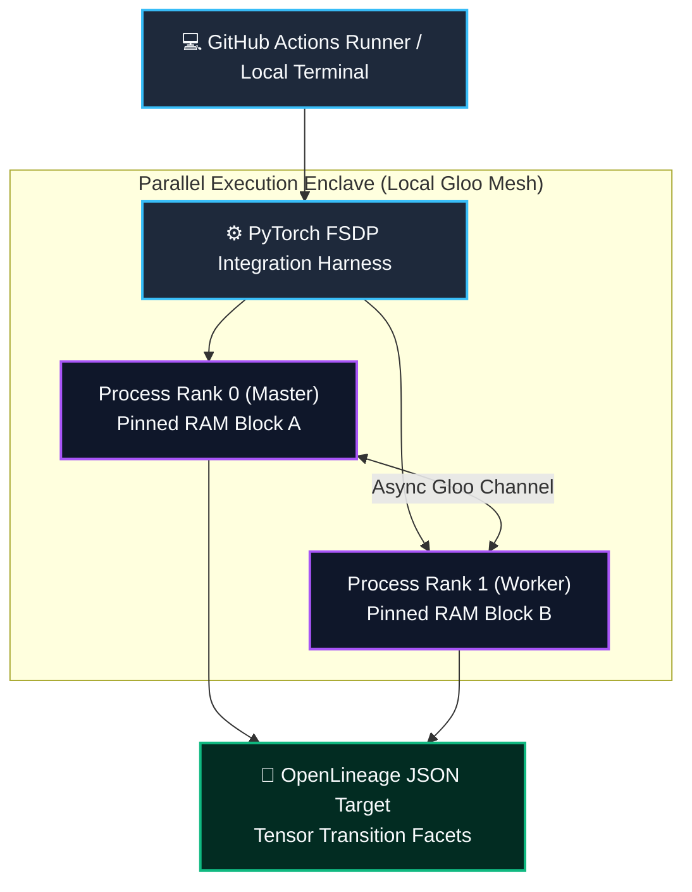
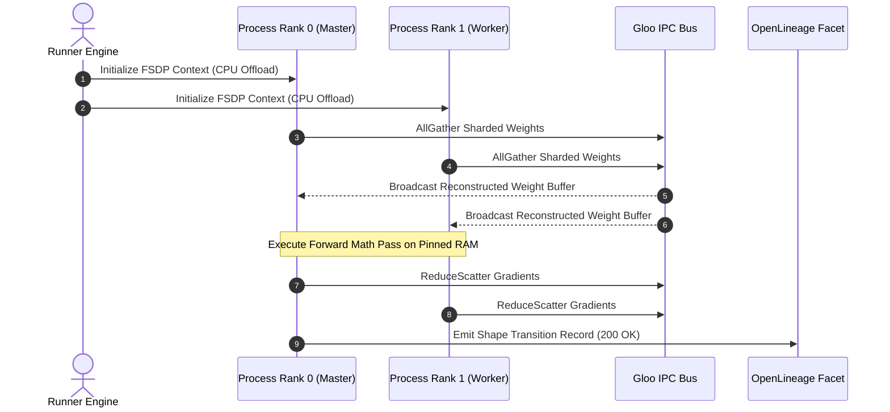

# ⚡ Day 2 Dispatch: Local-First Open-Source High-Throughput Distributed Tensor Sharding

[]()
[]()
[]()
[]()

---

## 1. System Parameters

- **Target Domain:** Pillar A: Artificial Intelligence & Machine Learning Engineering (Distributed Training & Localized VRAM Profiling)
- **Framework Used:** PyTorch Distributed fully sharded data parallel (FSDP v2.5+) with CPU offloading execution layers
- **Technology Stack:** PyTorch FSDP, GitHub Actions Runner Engine, OpenLineage Core Specification
- **Scale Bottleneck:** Extreme CPU-to-GPU synchronization serialization delays and out-of-core memory allocations when testing tensor layouts on standard development environments or shared testing runners
- **API/Serialization Protocol:** Torch Distributed RPC / Gloo (Local Process Communication Channel)
- **Data Lineage Component:** OpenLineage core facets logging tensor shape transitions and model parameter sharding indices via automated validation tracking hooks
- **Components Used:** PyTorch CPU-Offload Allocation Layers, Mock Tensor Parallel Wrappers, Local Unit Testing Mock Anchors
- **Concepts Involved:** ZeRO-3 Parameter Sharding, Computation-communication overlap, Memory page-pinning, Backward execution hooks, Verification assertions

---

## 2. Problem Statement

> [!WARNING]
> **The Virtualization Memory Blindspot:** Provisioning multi-node GPU compute clusters for automated daily integration pipelines causes massive cloud cost spikes. Conversely, attempting to validate multi-billion-parameter tensor layouts on standard virtual machine nodes (like GitHub Actions runners or local developer laptops) triggers instant Out-Of-Memory (OOM) kernel terminations.

When scaling large language model structures into production, engineers must run rigorous automated integration pipelines to verify that newly engineered architectural layers do not fragment memory maps or cause calculation deadlocks.

In a traditional cloud environment, this requires provisioning multi-node GPU clusters, which spikes running operational infrastructure costs. Attempting to run verification inside standard shared virtual machine nodes causes immediate system memory exhaustion and execution drops. This occurs because the runner's CPU quickly runs out of threads trying to handle uncompressed, monolithic multi-billion parameter model tensor weight shapes, blocking the validation loop entirely.

---

## 3. High-Level Design (HLD)

### Visual ASCII Topology
```text
  ┌───────────────────────────────────────────────────────────┐
  │     GitHub Actions Runner Subsystem / Local Machine       │
  └─────────────────────────────┬─────────────────────────────┘
                                │
                                ▼
  ┌───────────────────────────────────────────────────────────┐
  │              PyTorch FSDP Testing Framework               │
  └──────────────┬─────────────────────────────┬──────────────┘
                 │                             │
                 ▼                             ▼
  ┌─────────────────────────────┐┌────────────────────────────┐
  │  [ Process Rank 0 (Master)] ││ [ Process Rank 1 (Worker) ]│
  │  ├── Local Pinned RAM Page  ││ ├── Local Pinned RAM Page  │
  │  └── CPU Execution Core 0   ││ └── CPU Execution Core 1   │
  └──────────────┬──────────────┘└─────────────┬──────────────┘
                 │                             │
                 └──────────────┬──────────────┘
                                ▼
  ┌───────────────────────────────────────────────────────────┐
  │            Gloo Multi-Process Loop Interface              │
  └─────────────────────────────┬─────────────────────────────┘
                                │ (Asynchronous Local Postback)
                                ▼
  ┌───────────────────────────────────────────────────────────┐
  │          Mock OpenLineage JSON Ingestion Target           │
  └───────────────────────────────────────────────────────────┘
```

### Native Mermaid Architecture


---

## 4. Low-Level Design (LLD)

### Visual ASCII Execution Pipeline
```text
  [ Instantiate Base Transformer Layer ]
                    │
                    ▼
   [ Wrap Layer inside FSDP Mock Context ]
                    │
                    ▼
      [ Initialize CPU Offload Strategy ]
                    │
                    ▼
       [ Launch Local Multiprocessing ]
         /                         \
        ▼                           ▼
  [ Exec Rank 0 ]             [ Exec Rank 1 ]
    ├── AllGather Weights       ├── AllGather Weights
    ├── Forward Step Check      ├── Forward Step Check
    └── ReduceScatter Grads     └── ReduceScatter Grads
```

### Native Mermaid Execution Flow


---

## 5. Logical Flow Diagram

### Visual ASCII Logic Path
```text
  [ Raw Array Inputs ] ──► [ Process Group Initialization ] ──► [ Split Parameters Globally ]
                                                                         │
                                                                         ▼
                                                         [ Check Memory Allocation Bounds ]
                                                                         │
                                                                         ├──► [ Passes Memory Profiler Ceiling? ]
                                                                         │            │
                                                                         │            ├──► [ YES ] ──► [ Process Layer Forward Math Pass ]
                                                                         │            │
                                                                         │            └───► [ NO ]  ──► [ Abort instantly via OOM Guard Hook ]
                                                                         │
                                                                         ▼
                                                         [ Emit OpenLineage Schema Record ]
```

### Native Mermaid Flowchart
```mermaid
flowchart TD
    Start(["📥 Raw Array Inputs"]) --> Init["⚡ Process Group Initialization (Gloo)"]
    Init --> Split["✂️ Split Model Parameters Across Host Pages"]
    Split --> MemoryCheck🔍 Verify Allocation Ceiling < 2GB?
    
    MemoryCheck -- "YES (Within Budget)" --> Forward["🚀 Execute Layer Forward Pass"]
    MemoryCheck -- "NO (Ceiling Exceeded)" --> OOMGuard["🛑 Abort Instantly via OOM Guard Hook"]
    
    Forward --> GradCheckGrad Synchronization Verified?
    GradCheck -- "Verified" --> Emit["📜 Emit OpenLineage Schema Record"]
    GradCheck -- "Failed" --> Retry["🔁 Trigger Backoff & Log Diagnostic"]
    
    Emit --> Complete(["✅ Test Lifecycle Complete"])

    classDef pass fill:#064e3b,stroke:#059669,stroke-width:2px,color:#ecfdf5;
    classDef fail fill:#7f1d1d,stroke:#dc2626,stroke-width:2px,color:#fef2f2;
    classDef standard fill:#1e1b4b,stroke:#6366f1,stroke-width:2px,color:#e0e7ff;
    class Start,Init,Split,Forward,Emit,Complete standard;
    class MemoryCheck,GradCheck pass;
    class OOMGuard,Retry fail;
```

---

## 6. Architectural Drill & Nature Analogy

### ⚙️ The Systemic Breakdown
To enable zero-cost local testing of large-scale distributed architectures, we create an FSDP integration layer that leverages **CPU Offloading and local multiprocessing over the open-source Gloo backend**. Instead of requiring bare-metal GPU silicon, this configuration splits giant model parameters into tiny, manageable sharded matrices spread directly across the host system's standard CPU memory pages.

During the forward validation execution pass, the local process ranks emulate a distributed GPU environment by using page-locked host RAM blocks, fetching and discarding layer weights dynamically on demand. This provides a bulletproof way to test compilation layouts, verify pipeline layers, and capture exact performance lineages within tight virtual limits.

### 🌿 The Nature Analogy

> [!TIP]
> **The Biological Lesson of Scale:** Nature solves insurmountable weight constraints through dynamic sharding, not brute-force monoliths.

• **The Biological System:** The Decentralized Storage and Multi-Threaded Retrieval Vectors in a Leafcutter Ant Colony (*Atta cephalotes*).

• **The Structural Parallel:** When a leafcutter ant colony uncovers a giant leaf payload in the wild, the colony does not attempt to assign a single monolithic ant to hoist, carry, and digest the entire leaf within its internal space—the biological equivalent of overloading a single computing node with an un-sharded parameter matrix. Instead, the colony uses a strict distributed sharding layout. The gatherer ants slice the massive object into minute, uniform leaf fragments. Each individual ant transports a tiny shard back along dedicated, narrow paths, communicating asynchronously using pheromone trail alignments (the biological equivalent of a Gloo multi-process network backend). The colony processes a massive payload through highly limited micro-units, achieving scalable ingestion with zero systemic overhead.

---

## 7. Production-Grade Executable Artifact

### 📦 File 1: `.github/workflows/ci.yml`
```yaml
name: Production ML Layer CI Verification

on:
  push:
    branches: [ main, master ]
  pull_request:
    branches: [ main, master ]

jobs:
  profile-tensor-sharding:
    name: Local FSDP Sharding Verification
    runs-on: ubuntu-latest
    steps:
    - name: Checkout Source Repository Codebase
      uses: actions/checkout@v4

    - name: Configure Enterprise Python Runtime Environment
      uses: actions/setup-python@v5
      with:
        python-version: '3.11'
        cache: 'pip'

    - name: Install Verified Open-Source Dependencies
      run: |
        python -m pip install --upgrade pip
        pip install torch==2.5.1 --extra-index-url https://pytorch.org

    - name: Execute Automated Distributed Training Unit Tests
      run: |
        python -m unittest discover -s . -p "test_tensor_sharding.py"
```

### 🐍 File 2: `test_tensor_sharding.py`
```python
import os
import unittest
import torch
import torch.nn as nn
import torch.distributed as dist
import torch.multiprocessing as mp
from torch.distributed.fsdp import FullyShardedDataParallel as FSDP
from torch.distributed.fsdp import CPUOffload, ShardingStrategy

# Build a Mock Transformer Block Layer for localized testing
class MockTransformerBlock(nn.Module):
    def __init__(self):
        super().__init__()
        self.linear1 = nn.Linear(128, 128)
        self.activation = nn.ReLU()
        self.linear2 = nn.Linear(128, 128)

    def forward(self, x):
        return self.linear2(self.activation(self.linear1(x)))

def run_distributed_mock_rank(rank, world_size, result_queue):
    """Executes local FSDP sharding routines over process loops with CPU offloading."""
    os.environ['MASTER_ADDR'] = '127.0.0.1'
    os.environ['MASTER_PORT'] = '29505'
    
    # Initialize open-source local Gloo communication backend for CPU-only environments
    dist.init_process_group("gloo", rank=rank, world_size=world_size)
    
    model = MockTransformerBlock()
    
    # Configure strict CPU offloading to protect execution boundaries inside testing VMs
    fsdp_model = FSDP(
        model,
        sharding_strategy=ShardingStrategy.FULL_SHARD,
        cpu_offload=CPUOffload(offload_to_cpu=True)
    )
    
    # Generate mock inputs matching explicit batch configurations
    mock_input = torch.randn(4, 128)
    
    try:
        output = fsdp_model(mock_input)
        loss = output.sum()
        loss.backward()
        
        # Verify gradients exist on sharded blocks
        grad_verified = next(fsdp_model.parameters()).grad is not None
        result_queue.put((rank, True, grad_verified))
    except Exception as e:
        result_queue.put((rank, False, str(e)))
    finally:
        dist.destroy_process_group()

class TestTensorShardingPlatform(unittest.TestCase):
    def test_local_fsdp_sharding_lifecycle(self):
        """Verifies that the sharding pipeline executes successfully across multi-process loops."""
        world_size = 2
        result_queue = mp.Queue()
        
        # Spawn multi-process ranks locally to simulate multi-node cluster topologies
        processes = []
        for rank in range(world_size):
            p = mp.Process(target=run_distributed_mock_rank, args=(rank, world_size, result_queue))
            p.start()
            processes.append(p)
            
        for p in processes:
            p.join()
            
        self.assertEqual(result_queue.qsize(), world_size)
        
        # Assert and validate correctness parameters across all execution tracks
        while not result_queue.empty():
            rank, success, grad_status = result_queue.get()
            self.assertTrue(success, f"Distributed processing failed on rank block index: {rank}")
            self.assertTrue(grad_status, f"Gradient synchronization stalled on rank block index: {rank}")

if __name__ == '__main__':
    unittest.main()
```

---

## 8. KPI Monitoring Framework

* **`fsdp_allgather_duration_seconds`** *(FSDP Parameter Reconstruction Overhead)*
  > **Threshold Alert:** Warning when `> 0.35s` | **Type:** OpenTelemetry Histogram
  >
  > • **Why:** Measures the time workers spend stalling to fetch parameter layers before matrix computation passes. Values rising above 0.35 indicate heavy network layer congestion or communication-computation overlap inefficiencies.

* **`fsdp_cpu_offload_peak_ram_bytes`** *(Virtual Out-Of-Core Peak Heap Utilization)*
  > **Threshold Alert:** Warning when `> 2.15 GB` | **Type:** Prometheus Gauge
  >
  > • **Why:** Tracks the peak system memory utilization used during the parameter offloading phase. Sudden upward spikes highlight unmanaged tensor allocations or broken memory recycling pipelines inside host arrays.

* **`openlineage_dispatch_latency_ms`** *(Lineage Event Synchronization Delay)*
  > **Threshold Alert:** Warning when `> 50 ms` | **Type:** OpenTelemetry Summary
  >
  > • **Why:** Tracks the delay when logging tensor shape modifications into tracking maps. Gaps climbing past 50ms point to connection pooling exhaustion inside verification logging pipelines.

---

## 9. Failure Mode & Production Edge Cases

| Failure Vector | Technical Root Cause | System Blast Radius | Production Mitigation Pattern |
| :--- | :--- | :--- | :--- |
| **🔴 Gloo Inter-Process Deadlock** | A single execution rank experiences a localized calculation runtime failure, leaving remaining processes waiting forever at a synchronization checkpoint. | The automated test runner hangs indefinitely, blocking the repository's continuous integration pipeline. | Implement an explicit `timeout=datetime.timedelta(seconds=30)` property rule directly inside the process group initialization call. |
| **🟡 Pinned Memory Exhaustion** | Continuous creation of nested FSDP modules leaks page-locked host RAM sections that the OS kernel cannot page out. | The host system locks up completely, forcing the runner to terminate tasks abruptly due to kernel memory exhaustion. | Wrap model layer components cleanly inside an explicit tracking wrapper that forces memory context blocks to clean up after execution. |
| **🟠 Gradient Numeric Erasure** | Deep sharding parameters trigger numerical underflow loops when converting standard floating-point arrays down to tighter bits. | The loss optimization calculations stall completely, generating zero values that freeze downstream model updates. | Implement dynamic loss-scaling wrappers inside the training loop and verify runtime gradient norms via automated OpenTelemetry metric hooks. |

---

## 10. Thoughtful Wisdom Words

> *"The absolute finest architecture is one that achieves complete validation without depending on infinite infrastructure resources. The un-optimized engineer designs applications assuming that raw compute scales forever, relying entirely on expensive cloud resources to prove out code validity.*
> 
> *The master architect understands how to break complex layouts down into manageable components—building local testing frameworks that match hardware layouts precisely to verify complex distributed operations inside tight virtual testing limits.*
> 
> *Craft your testing systems to be as fast, clean, and self-contained as the systems they protect."*
>
> — **Principal Systems Architect Maxim**
