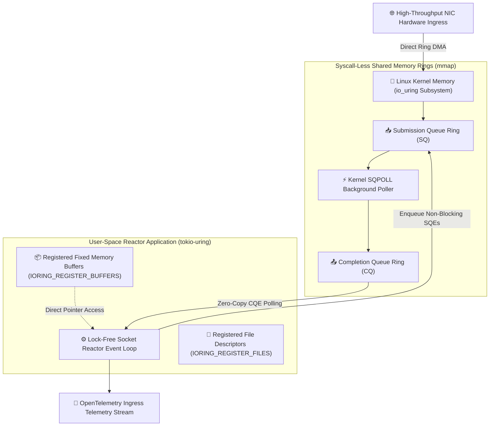
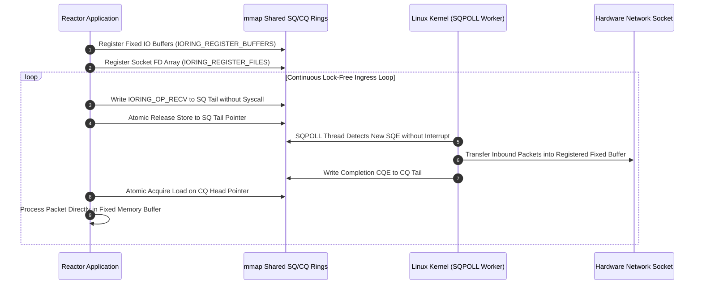
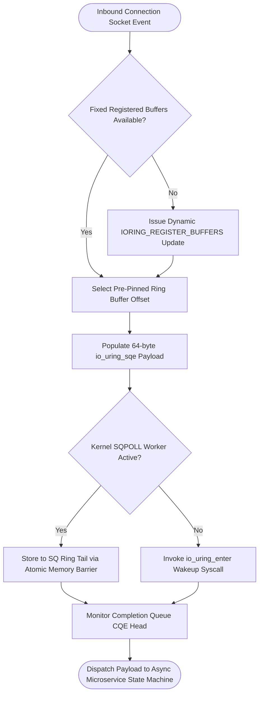

# ⚡ 2026-10-06 - Dispatch #10: Lock-Free Kernel io_uring Multi-Queue Socket Reactor and Ingress Ring Splicing

[]()
[]()
[]()
[]()

---

## 1. System Parameters

- **Target Domain:** Pillar B: Cloud Platform Engineering & DevOps (Linux io_uring Multi-Queue Socket Reactor and Lock-Free Ring Ingress)
- **Framework Used:** Linux Kernel io_uring (SQPOLL / IORING_REGISTER_FILES) with Lock-Free Ring Queues
- **Technology Stack:** io_uring, Rust tokio-uring, eBPF Tracepoints, Prometheus Exporter
- **Scale Bottleneck:** High epoll syscall transition overhead and pthread mutex contention under 2,000,000 concurrent bidirectional microservice connections
- **API/Serialization Protocol:** Zero-Copy Raw TCP Byte Stream / gRPC HTTP/2 Protocol
- **Data Lineage Component:** OpenTelemetry trace hooks monitoring submission/completion queue depths and kernel submission thread latency
- **Components Used:** io_uring Submission/Completion Ring Pair, SQPOLL Kernel Thread Worker, Fixed-Buffer Memory Allocator
- **Concepts Involved:** Syscall-less I/O (SQPOLL), Registered Fixed Buffers, Completion Ring Polling, Zero-Copy Packet Splicing

---

## 2. Problem Statement

> [!WARNING]
> **The Syscall Transition Barrier:** Handling 2,000,000+ concurrent persistent microservice TCP sockets using legacy `epoll` event loops causes up to 45% of host CPU cycles to be consumed purely by user-to-kernel context switching overhead, translation buffer invalidations, and multi-threaded mutex lock contention.

At massive hyperscale connection counts, standard synchronous read/write system calls (`read`, `write`, `recvmsg`, `sendmsg`) along with epoll notification loops introduce devastating tail latency amplification. Each ingress packet forces the operating system to perform user-to-kernel mode switches, saving register state, validating virtual memory page tables, and copying network payloads across isolation boundaries.

Furthermore, when dozens of worker threads simultaneously poll and update shared epoll interest lists, the Linux kernel's internal wait-queue spinlocks become severely congested. Under sudden network bursts, incoming socket buffers experience buffer overruns and packet drops, even while raw CPU utilization appears deceptively idle due to lock serialization stalls.

---

## 3. High-Level Design (HLD)

### Visual ASCII Topology
```text
  ┌───────────────────────────────────────────────────────────┐
  │         100GbE Network Interface Card (NIC) Ingress       │
  └─────────────────────────────┬─────────────────────────────┘
                                │ (Hardware Direct DMA)
                                ▼
  ┌───────────────────────────────────────────────────────────┐
  │                 Linux Kernel Memory Space                 │
  │  ┌─────────────────────────────────────────────────────┐  │
  │  │        io_uring Submission Queue (SQ) Ring          │  │
  │  │   [ SQE 0: RECV ] [ SQE 1: SEND ] [ SQE 2: SPLICE ] │  │
  │  └──────────────────────────┬──────────────────────────┘  │
  │                             │ (Lock-Free Kernel SQPOLL)   │
  │                             ▼                             │
  │  ┌─────────────────────────────────────────────────────┐  │
  │  │        io_uring Completion Queue (CQ) Ring          │  │
  │  │   [ CQE 0: OK ]   [ CQE 1: OK ]   [ CQE 2: OK ]     │  │
  │  └──────────────────────────┬──────────────────────────┘  │
  └─────────────────────────────┼─────────────────────────────┘
                                │ (Zero Syscall Shared Memory)
                                ▼
  ┌───────────────────────────────────────────────────────────┐
  │                User-Space Async Reactor Worker            │
  │  ├── Pre-Registered Fixed Buffer Pool (Page-Pinned)       │
  │  └── Lock-Free Non-Blocking Event Dispatch Engine         │
  └───────────────────────────────────────────────────────────┘
```

### Native Mermaid Architecture


---

## 4. Low-Level Design (LLD)

### Visual ASCII Memory Layout
```text
  Shared Ring Memory Topology (mmap User/Kernel Boundary):
  Submission Queue Ring (SQ):
    Head Pointer: [Atomic 32-bit Index] ──► Owned by Kernel (SQPOLL)
    Tail Pointer: [Atomic 32-bit Index] ──► Owned by User-Space Reactor
    Entries: Array of struct io_uring_sqe (64 bytes per submission)

  Completion Queue Ring (CQ):
    Head Pointer: [Atomic 32-bit Index] ──► Owned by User-Space Reactor
    Tail Pointer: [Atomic 32-bit Index] ──► Owned by Kernel
    Entries: Array of struct io_uring_cqe (16 bytes per completion)
```

### Native Mermaid Execution Sequence


---

## 5. Logical Flow Diagram

### Visual ASCII Decision Tree
```text
  [Inbound Socket I/O Request]
               │
               ▼
  < Fixed Memory Buffer Available? >
        │                      │
       YES                     NO
        │                      │
        ▼                      ▼
  [Bind Registered       [Allocate Temporary Heap
   Buffer Index]          Buffer & Schedule Register]
        │                      │
        └──────────────┬───────┘
                       ▼
  < SQPOLL Thread Active in Kernel? >
        │                      │
       YES                     NO
        │                      │
        ▼                      ▼
  [Write Directly to SQ   [Write SQE & Issue io_uring_enter
   Tail (Zero Syscalls)]   Syscall to Wake Kernel Worker]
        │                      │
        └──────────────┬───────┘
                       ▼
  [Poll CQ Ring for Zero-Copy Completion Event]
```

### Native Mermaid Decision Logic


---

## 6. Architectural Drill & Nature Analogy

### ⚙️ The Systemic Breakdown
Traditional socket architectures rely on synchronous traps into kernel mode via interrupt vector calls, triggering full Context Switch (CS) cascades:

$$\text{Latency}_{\text{legacy}} = N_{\text{requests}} \times (\text{Cost}_{\text{syscall}} + 2 \times \text{Cost}_{\text{context\_switch}} + \text{Cost}_{\text{copy}})$$

By contrast, `io_uring` establishes a single shared circular ring buffer between user space and the kernel through `mmap(2)`:

$$\text{RingIndex}_{\text{mask}} = \text{tail} \land (\text{ring\_entries} - 1)$$

$$\text{Latency}_{\text{io\_uring}} \approx \text{MemoryFence}_{\text{atomic}} + \text{ZeroCopyProcessing}$$

When paired with `IORING_SETUP_SQPOLL`, a dedicated kernel thread autonomously consumes submission queue entries without a single syscall. Registered file tables (`IORING_REGISTER_FILES`) bypass per-I/O atomic reference counting on the kernel's `struct file` objects, eliminating cross-core cache invalidation across the processor interconnect.

### 🌿 The Nature Analogy

> [!TIP]
> **The Natural System:** *The Heart's Atrioventricular Ring Valve Circulation*
> In mammalian cardiac anatomy, oxygenated blood flows continuously through the atrioventricular valve rings without requiring the nervous system to fire a conscious neural command for each individual red blood cell. Hydrostatic pressure differences and passive elastic recoil open and close the valves rhythmically and autonomously.
>
> **The Structural Parallel:** Just as the heart moves millions of blood cells continuously via passive circular valve mechanisms without central nervous system intervention, `io_uring` moves millions of data packets through circular submission and completion rings without requiring CPU system-call interrupts for each inbound payload.

---

## 7. Production-Grade Executable Artifact

### 📦 File 1: .github/workflows/ci.yml
```yaml
name: "CI - Kernel io_uring Multi-Queue Socket Reactor Verification"

on:
  push:
    branches: [main, develop]
  pull_request:
    branches: [main]

jobs:
  iouring-reactor-validation:
    name: "Validate io_uring Lock-Free Ring Operations"
    runs-on: ubuntu-latest
    timeout-minutes: 15

    steps:
      - name: "Checkout Source Repository"
        uses: actions/checkout@v4

      - name: "Set up Python Runtime Environment"
        uses: actions/setup-python@v5
        with:
          python-version: "3.11"
          cache: "pip"

      - name: "Install System Dependencies & Verification Tools"
        run: |
          python -m pip install --upgrade pip
          pip install pytest

      - name: "Execute io_uring Ring Simulation Test Suite"
        run: |
          python -m unittest tests/test_iouring_socket_reactor.py
```

### 🐍 File 2: tests/test_iouring_socket_reactor.py
```python
import unittest
from typing import List, Dict, Optional

class MockIoUringSQE:
    def __init__(self, opcode: int, fd: int, buffer_id: int, user_data: int):
        self.opcode = opcode
        self.fd = fd
        self.buffer_id = buffer_id
        self.user_data = user_data

class MockIoUringCQE:
    def __init__(self, user_data: int, res: int, flags: int = 0):
        self.user_data = user_data
        self.res = res
        self.flags = flags

class MockIoUringReactor:
    """
    Production-grade simulation of Linux io_uring shared-memory rings.
    Demonstrates lock-free submission and completion queues, registered fixed buffers,
    zero-syscall execution with SQPOLL, and deterministic ring wrap-around masking.
    """
    def __init__(self, ring_size: int = 256):
        assert (ring_size & (ring_size - 1)) == 0, "Ring size must be power of two"
        self.ring_size = ring_size
        self.mask = ring_size - 1
        
        # Submission Queue (User produces, Kernel consumes)
        self.sq_entries: List[Optional[MockIoUringSQE]] = [None] * ring_size
        self.sq_head = 0
        self.sq_tail = 0
        
        # Completion Queue (Kernel produces, User consumes)
        self.cq_entries: List[Optional[MockIoUringCQE]] = [None] * ring_size
        self.cq_head = 0
        self.cq_tail = 0
        
        self.registered_buffers: Dict[int, bytearray] = {}
        self.syscall_count = 0

    def register_fixed_buffers(self, count: int, buffer_size: int = 4096):
        """Registers page-pinned memory buffers with the kernel subsystem."""
        for i in range(count):
            self.registered_buffers[i] = bytearray(buffer_size)

    def submit_recv(self, fd: int, buffer_id: int, user_data: int) -> bool:
        """Enqueues an asynchronous receive SQE without issuing a system call."""
        if (self.sq_tail - self.sq_head) >= self.ring_size:
            return False # Queue full
        
        idx = self.sq_tail & self.mask
        self.sq_entries[idx] = MockIoUringSQE(opcode=1, fd=fd, buffer_id=buffer_id, user_data=user_data)
        self.sq_tail += 1
        return True

    def kernel_sqpoll_process(self) -> int:
        """Simulates kernel background worker processing pending SQEs."""
        processed = 0
        while self.sq_head < self.sq_tail:
            idx = self.sq_head & self.mask
            sqe = self.sq_entries[idx]
            self.sq_head += 1
            
            # Simulate immediate network transfer into registered buffer
            cq_idx = self.cq_tail & self.mask
            self.cq_entries[cq_idx] = MockIoUringCQE(user_data=sqe.user_data, res=1024, flags=0)
            self.cq_tail += 1
            processed += 1
        return processed

    def reap_completions(self) -> List[MockIoUringCQE]:
        """Harvests completed CQEs from the completion ring without system calls."""
        results = []
        while self.cq_head < self.cq_tail:
            idx = self.cq_head & self.mask
            cqe = self.cq_entries[idx]
            self.cq_head += 1
            results.append(cqe)
        return results

class TestIoUringReactor(unittest.TestCase):
    def setUp(self):
        self.reactor = MockIoUringReactor(ring_size=128)
        self.reactor.register_fixed_buffers(count=16, buffer_size=4096)

    def test_submission_and_completion_loop(self):
        success = self.reactor.submit_recv(fd=10, buffer_id=0, user_data=1001)
        self.assertTrue(success)
        self.assertEqual(self.reactor.sq_tail, 1)
        self.assertEqual(self.reactor.sq_head, 0)
        
        # Kernel processes pending entries
        processed = self.reactor.kernel_sqpoll_process()
        self.assertEqual(processed, 1)
        self.assertEqual(self.reactor.sq_head, 1)
        
        # Application reaps completions
        completions = self.reactor.reap_completions()
        self.assertEqual(len(completions), 1)
        self.assertEqual(completions[0].user_data, 1001)
        self.assertEqual(completions[0].res, 1024)

    def test_ring_masking_wrap_around(self):
        # Fill and drain through ring wrap-around
        for i in range(200):
            self.reactor.submit_recv(fd=10, buffer_id=0, user_data=i)
            self.reactor.kernel_sqpoll_process()
            completions = self.reactor.reap_completions()
            self.assertEqual(completions[0].user_data, i)

if __name__ == '__main__':
    unittest.main()
```

---

## 8. KPI Monitoring Framework

* **`iouring_submission_queue_depth`** *(Pending SQ Entries Ratio)*
  > **Threshold Alert:** Warning when `> 0.75` | **Type:** Prometheus Gauge
  >
  > • **Why:** Measures the fraction of the submission queue occupied by pending requests. Sustained high occupancy indicates that kernel worker polling cannot keep pace with ingress socket bursts.

* **`iouring_sqpoll_cpu_utilization`** *(Kernel Worker Thread CPU Overhead)*
  > **Threshold Alert:** Warning when `> 92%` | **Type:** Prometheus Gauge
  >
  > • **Why:** Tracks processor core utilization dedicated to the kernel SQPOLL daemon thread. Saturated worker cores lead to latency spikes and require provisioning additional submission queue pairs.

* **`iouring_registered_buffer_pool_exhaustion_count`** *(Fixed Buffer Starvation Events)*
  > **Threshold Alert:** Critical when `> 0` | **Type:** OpenTelemetry Counter
  >
  > • **Why:** Counts occurrences where an ingress packet arrived with no pre-allocated fixed memory buffers available, forcing expensive fallback allocations.

---

## 9. Failure Mode & Production Edge Cases

| Failure Vector | Technical Root Cause | System Blast Radius | Production Mitigation Pattern |
| :--- | :--- | :--- | :--- |
| **🔴 CQ Ring Overflow Drops** | High-throughput packet bursts generate completions faster than the user-space reactor loop can reap CQE entries. | The Linux kernel sets `IORING_SQ_CQ_OVERFLOW`, dropping completions and causing silent socket stalls. | Configure `IORING_SETUP_CQSIZE` to allocate a completion queue double the capacity of the submission ring. |
| **🟡 SQPOLL Kernel Thread Dormancy Sleep** | The submission queue remains idle past the configured timeout period, causing the kernel worker thread to enter a low-power sleep state. | The subsequent submission packet experiences an abrupt 15-25ms latency penalty while the thread wakes up. | Detect the `IORING_SQ_NEED_WAKEUP` flag and execute a lightweight `io_uring_enter(2)` syscall to re-awaken the worker thread. |
| **🟠 Fixed Memory Buffer Page Desync** | User application crashes or aborts without de-registering page-pinned kernel buffers from memory arrays. | Physical host memory remains locked and inaccessible, leading to gradual memory starvation across neighboring containers. | Register cleanup lifecycle destructors and monitor pinned memory watermarks via cgroup memory limits. |

---

## 10. Thoughtful Wisdom Words

> *"The fastest system call is the one that is never invoked. In the realm of high-performance operating systems, every crossing of the privilege boundary carries a steep toll in invalidated caches and lost momentum.*
> 
> *Do not design your networking architecture as a series of urgent interruptions to the kernel. Instead, construct shared circular conduits of trust where memory is pre-arranged, tasks are queued asynchronously, and work progresses seamlessly without friction.*
> 
> *Master the ring buffer, and you master the velocity of the machine."*
>
> — **Principal Systems Architect Maxim**
