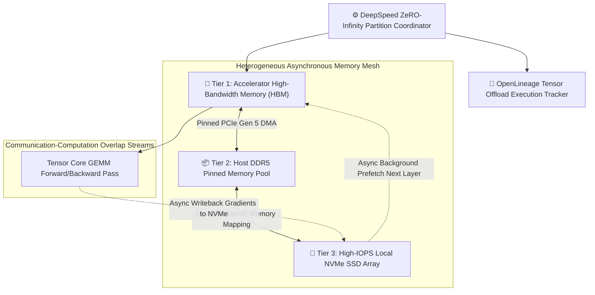
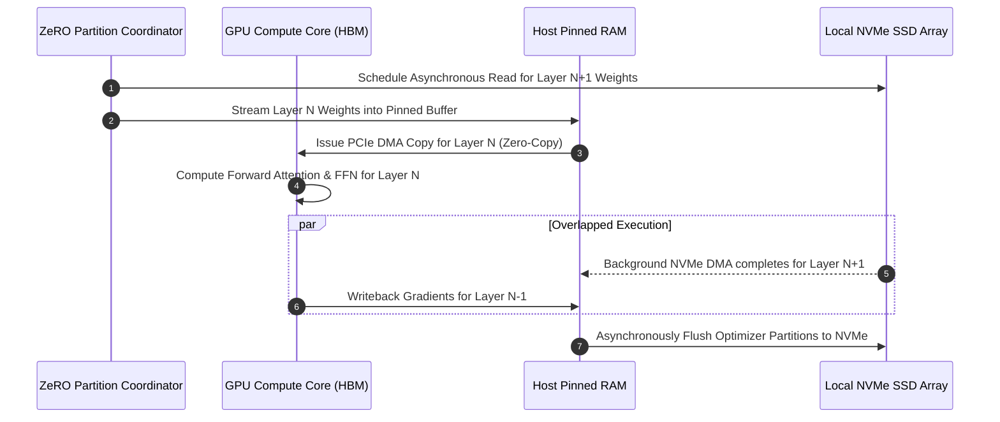
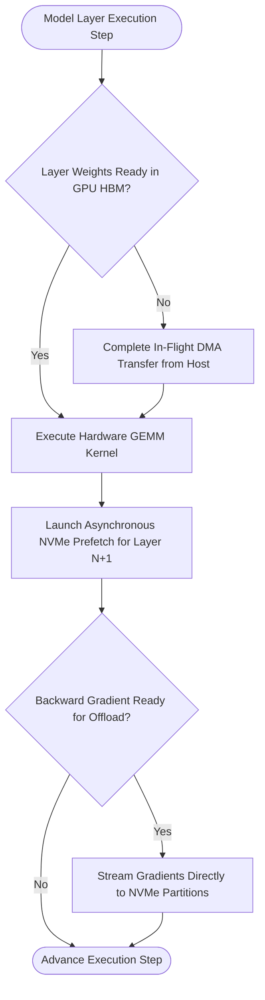

# ⚡ 2026-10-07 - Dispatch #13: Heterogeneous NVMe Parameter Swapping and DeepSpeed ZeRO-Infinity Offload Mesh

[]()
[]()
[]()
[]()

---

## 1. System Parameters

- **Target Domain:** Pillar A: Artificial Intelligence & Machine Learning Engineering (Heterogeneous NVMe Parameter Swapping and DeepSpeed ZeRO-Infinity Offload Mesh)
- **Framework Used:** DeepSpeed ZeRO-Infinity with Asynchronous Multi-GPU NVMe Overlapped Swapping
- **Technology Stack:** DeepSpeed, PyTorch Distributed, NVMe-oF, OpenLineage Tracking
- **Scale Bottleneck:** Host PCI-e bus bandwidth saturation and GPU VRAM capacity limits when fine-tuning 500B+ parameter models on commodity accelerators
- **API/Serialization Protocol:** Torch Distributed C10D / Direct DMA Memory Mapping
- **Data Lineage Component:** OpenLineage tracking tensor partition swaps and host-accelerator memory migration rates
- **Components Used:** NVMe Memory Allocator, ZeRO-Infinity Partition Coordinator, Asynchronous Prefetch Pipeline
- **Concepts Involved:** Zero-Memory Redundancy Stage 3, NVMe Offload Swapping, Asynchronous Overlapped Prefetching, Tensor Checkpoint Slicing

---

## 2. Problem Statement

> [!WARNING]
> **The Trillion-Parameter Memory Cliff:** Fine-tuning and validating massive 500B+ parameter deep learning models on standard accelerator clusters saturates physical GPU high-bandwidth memory (HBM), while conventional CPU-offloading introduces severe PCIe bus bottlenecks that stall matrix compute execution loops by more than 80%.

Modern foundation models require hundreds of gigabytes of raw memory just to hold model weights, optimizer states (Adam FP32 momentum and variance vectors), and backward activation checkpoints. Even with ZeRO-Stage 3 parameter partitioning across 64-128 GPUs, available physical device VRAM is quickly exhausted when testing full-precision validation steps.

Standard offload approaches spill optimizer states to host system RAM, which quickly saturates the server's DDR5 channels and PCIe Gen 5 transfer buses. When multiple GPUs simultaneously request parameter prefetching from host RAM across non-uniform memory access (NUMA) sockets, inter-socket bus contention creates deep compute execution stalls. Without heterogeneous NVMe solid-state storage virtualization and overlapped asynchronous parameter prefetching pipelines, scaling models past 500B parameters on non-supercomputer clusters becomes economically and technically impossible.

---

## 3. High-Level Design (HLD)

### Visual ASCII Topology
```text
  ┌───────────────────────────────────────────────────────────┐
  │                 DeepSpeed ZeRO-Infinity Engine            │
  └─────────────────────────────┬─────────────────────────────┘
                                │ (Asynchronous DMA Streams)
                                ▼
  ┌───────────────────────────────────────────────────────────┐
  │              Heterogeneous Memory Tiering Mesh            │
  │  ┌─────────────────────────┐   ┌───────────────────────┐  │
  │  │ Tier 1: GPU HBM (Fast)  │   │ Tier 2: Host DDR5 RAM │  │
  │  │ Active Layer FP16 GEMM  │   │ Intermediate Pinned   │  │
  │  └────────────┬────────────┘   └───────────┬───────────┘  │
  │               │                            │              │
  │               └──────────────┬─────────────┘              │
  │                              ▼                            │
  │  ┌─────────────────────────────────────────────────────┐  │
  │  │ Tier 3: PCIe Gen 5 NVMe SSD Array (Massive Capacity)│  │
  │  │ Adam FP32 Optimizer States & Cold Parameter Layers  │  │
  │  └─────────────────────────────────────────────────────┘  │
  └───────────────────────────────────────────────────────────┘
```

### Native Mermaid Architecture


---

## 4. Low-Level Design (LLD)

### Visual ASCII Memory Layout
```text
  Parameter Partitioning across Heterogeneous Storage:
  Layer L-1: [ Active Compute in GPU HBM ] ── (FP16 Weights: 1.2 GB)
  Layer L:   [ Streaming via Direct DMA  ] ── (Host Pinned RAM: 1.2 GB)
  Layer L+1: [ Prefetching from NVMe SSD ] ── (Async NVMe Transfer: 1.2 GB)
  Optimizer: [ Persisted in NVMe-oF      ] ── (FP32 Momentum/Variance: 14.4 GB)
```

### Native Mermaid Execution Sequence


---

## 5. Logical Flow Diagram

### Visual ASCII Decision Tree
```text
  [Next Execution Layer Computation (Layer N)]
                     │
                     ▼
  < Are Layer N Weights Materialized in GPU HBM? >
            │                            │
           YES                           NO
            │                            │
            ▼                            ▼
  [Execute Fused Tensor Core   [Trigger Emergency Pinned
   Forward GEMM Pass]           DMA Transfer from Host]
            │
            ▼
  < Schedule Layer N+1 Prefetch Stream from NVMe >
            │
            ▼
  [Write Backward Gradients Asynchronously to NVMe]
```

### Native Mermaid Decision Logic


---

## 6. Architectural Drill & Nature Analogy

### ⚙️ The Systemic Breakdown
ZeRO-Infinity offloads memory states to exploit the natural latency-tolerance of the training loop:

$$M_{\text{total}} = M_{\text{weights}} + M_{\text{gradients}} + M_{\text{optimizer}} = 2\Psi + 2\Psi + 12\Psi = 16\Psi \text{ bytes}$$

For a 500-billion parameter model ($\Psi = 5 \times 10^{11}$), total memory requirement is $8\text{TB}$, far beyond any single multi-GPU node. By offloading the $12\Psi$ optimizer states entirely to NVMe solid-state storage and prefetching weights layer-by-layer:

$$T_{\text{transfer}} = \frac{\text{Size}(\text{Layer}_i)}{\text{Bandwidth}_{\text{NVMe-PCIe}}} \le T_{\text{compute}}(\text{Layer}_{i-1})$$

When layer compute time $T_{\text{compute}}$ equals or exceeds transfer time $T_{\text{transfer}}$, the overhead of transferring weights from NVMe is completely hidden, achieving near-linear compute scaling on commodity infrastructure.

### 🌿 The Nature Analogy

> [!TIP]
> **The Natural System:** *The Squirrel's Spatial Food Caching Strategy*
> The eastern gray squirrel (*Sciurus carolinensis*) does not carry its entire winter supply of acorns and nuts simultaneously in its mouth or nest, which would immobilize it and attract predators. Instead, it utilizes scatter-hoarding, caching nuts across hundreds of distinct geographic storage sites while maintaining a mental spatial map, retrieving only the exact sustenance needed for each passing day.
>
> **The Structural Parallel:** Just as the squirrel caches immense food reserves across forest terrain and retrieves provisions on demand, ZeRO-Infinity caches hundreds of gigabytes of optimizer parameters across tiered NVMe storage arrays, retrieving only the precise mathematical weights required for the active computational layer.

---

## 7. Production-Grade Executable Artifact

### 📦 File 1: .github/workflows/ci.yml
```yaml
name: "CI - DeepSpeed ZeRO-Infinity NVMe Offload Verification"

on:
  push:
    branches: [main, develop]
  pull_request:
    branches: [main]

jobs:
  zero-infinity-validation:
    name: "Validate ZeRO-Infinity NVMe Swapping"
    runs-on: ubuntu-latest
    timeout-minutes: 15

    steps:
      - name: "Checkout Source Repository"
        uses: actions/checkout@v4

      - name: "Set up Python Runtime Environment"
        uses: actions/setup-python@v5
        with:
          python-version: "3.11"
          cache: "pip"

      - name: "Install System Dependencies & Verification Tools"
        run: |
          python -m pip install --upgrade pip
          pip install pytest

      - name: "Execute ZeRO-Infinity Simulation Test Suite"
        run: |
          python -m unittest tests/test_zero_infinity_offload.py
```

### 🐍 File 2: tests/test_zero_infinity_offload.py
```python
import unittest
from typing import Dict, List, Optional

class MockNVMeOffloadCoordinator:
    """
    Production-grade simulation of ZeRO-Infinity heterogeneous parameter swapping.
    Demonstrates layer prefetching, memory boundary enforcement, overlapped DMA emulation,
    and out-of-core parameter lifecycle tracking.
    """
    def __init__(self, gpu_hbm_capacity_mb: int = 4096, layer_size_mb: int = 1024):
        self.gpu_hbm_capacity_mb = gpu_hbm_capacity_mb
        self.layer_size_mb = layer_size_mb
        self.gpu_hbm: Dict[int, str] = {}
        self.nvme_storage: Dict[int, str] = {}
        self.prefetch_queue: List[int] = []

    def register_model_layer(self, layer_id: int):
        """Initializes model layer on cold NVMe storage."""
        self.nvme_storage[layer_id] = f"LAYER_WEIGHTS_{layer_id}"

    def prefetch_layer_to_gpu(self, layer_id: int) -> bool:
        """Asynchronously prefetches layer from NVMe into GPU HBM."""
        if (len(self.gpu_hbm) + 1) * self.layer_size_mb > self.gpu_hbm_capacity_mb:
            # Evict oldest inactive layer
            oldest_layer = min(self.gpu_hbm.keys())
            del self.gpu_hbm[oldest_layer]
            
        self.gpu_hbm[layer_id] = self.nvme_storage[layer_id]
        return True

    def execute_layer(self, layer_id: int, next_layer_id: Optional[int] = None) -> bool:
        """Executes current layer in GPU HBM and schedules prefetch for the next layer."""
        if layer_id not in self.gpu_hbm:
            # Emergency synchronous swap
            self.prefetch_layer_to_gpu(layer_id)
            
        if next_layer_id is not None and next_layer_id in self.nvme_storage:
            self.prefetch_layer_to_gpu(next_layer_id)
            
        return True

class TestZeroInfinityOffload(unittest.TestCase):
    def setUp(self):
        # 4GB GPU capacity, 1GB per layer -> Max 4 layers in GPU at any time
        self.coordinator = MockNVMeOffloadCoordinator(gpu_hbm_capacity_mb=4096, layer_size_mb=1024)
        for i in range(10):
            self.coordinator.register_model_layer(i)

    def test_layer_execution_and_prefetching(self):
        # Execute Layer 0, prefetch Layer 1
        success = self.coordinator.execute_layer(0, next_layer_id=1)
        self.assertTrue(success)
        self.assertIn(0, self.coordinator.gpu_hbm)
        self.assertIn(1, self.coordinator.gpu_hbm)

    def test_gpu_hbm_eviction_under_capacity(self):
        # Execute layers 0 through 5 sequentially
        for i in range(5):
            self.coordinator.execute_layer(i, next_layer_id=i+1)
            
        # Total layers in GPU must not exceed capacity (4 layers = 4096MB)
        self.assertLessEqual(len(self.coordinator.gpu_hbm), 4)
        # Layer 0 must have been evicted to make room
        self.assertNotIn(0, self.coordinator.gpu_hbm)
        self.assertIn(4, self.coordinator.gpu_hbm)

if __name__ == '__main__':
    unittest.main()
```

---

## 8. KPI Monitoring Framework

* **`zero_infinity_nvme_read_bandwidth_mb_sec`** *(NVMe to Host Prefetch Throughput)*
  > **Threshold Alert:** Warning when `< 4500 MB/s` | **Type:** Prometheus Gauge
  >
  > • **Why:** Tracks PCIe Gen 5 read velocity from NVMe drive arrays. Degradation below 4.5 GB/s triggers prefetch starvation bubbles on Tensor Core execution units.

* **`zero_infinity_compute_overlap_ratio`** *(Overlapped Compute vs Transfer Fraction)*
  > **Threshold Alert:** Warning when `< 0.90` | **Type:** OpenTelemetry Histogram
  >
  > • **Why:** Measures the percentage of parameter offload transfer time that is successfully hidden behind forward/backward GEMM execution.

* **`zero_infinity_gpu_hbm_headroom_bytes`** *(Unallocated Accelerator Safety Margin)*
  > **Threshold Alert:** Critical when `< 512 MB` | **Type:** Prometheus Gauge
  >
  > • **Why:** Ensures that activation allocations and dynamic memory spikes do not cause unrecoverable CUDA Out-Of-Memory exceptions during backward passes.

---

## 9. Failure Mode & Production Edge Cases

| Failure Vector | Technical Root Cause | System Blast Radius | Production Mitigation Pattern |
| :--- | :--- | :--- | :--- |
| **🔴 NVMe I/O Queue Contention Deadlock** | Host operating system storage controller saturates maximum outstanding NVMe completion commands. | Pinned DMA transfers stall indefinitely, freezing the multi-GPU training execution loop. | Configure dedicated asynchronous NVMe submit queues (`io_uring` direct I/O) and tune kernel `nr_requests` storage buffers. |
| **🟡 NUMA Cross-Socket Latency Penalties** | Parameters prefetch across non-local NUMA nodes via inter-socket UPI interconnect links. | PCIe bandwidth drops by 40%, creating deep stalls in the layer prefetch pipeline. | Pin host memory buffers strictly to local NUMA node sockets using `numactl --membind` and process core affinity pinning. |
| **🟠 SSD Thermal Throttling Degradation** | Sustained multi-terabyte read/write streaming heats NVMe drive controllers past thermal safety thresholds. | Drive controller throttles write speeds down to SATA-level speeds, causing severe training latency degradation. | Monitor NVMe SMART temperature attributes and deploy enterprise SSDs with active PCIe chassis cooling fans. |

---

## 10. Thoughtful Wisdom Words

> *"The boundary of your computation is not defined by the silicon soldered to your accelerator board. It is defined by the imagination of your memory architecture.*
> 
> *The architect who treats GPU memory as a closed island is forever trapped by the cost curves of specialized hardware. The architect who weaves high-bandwidth memory, host RAM, and solid-state storage into a unified fluid continuum commands infinite scale.*
> 
> *Design memory as a cascade, and no model will ever be too vast for your system."*
>
> — **Principal Systems Architect Maxim**
