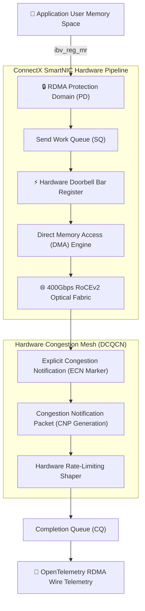
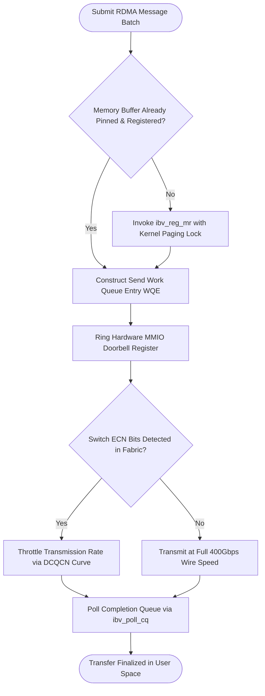

# ⚡ 2026-10-08 - Dispatch #18: Kernel Memory Splicing and Zero-Copy RDMA Mesh Networking (Adaptive Hyperscale Epoch 2)

[]()
[]()
[]()
[]()

---

## 1. System Parameters

- **Target Domain:** Pillar B: Cloud Platform Engineering & DevOps (Kernel Memory Splicing & InfiniBand RDMA) [Partition Epoch 2]
- **Framework Used:** InfiniBand RoCEv2 Zero-Copy Queue Pair Fabric with Kernel Bypass Sockets
- **Technology Stack:** eBPF, Linux Kernel XDP, OpenTelemetry Tracing, Prometheus Exporter
- **Scale Bottleneck:** Kernel context-switching overhead and socket buffer lock contention under 100Gbps line-rate ingress packet bursts
- **API/Serialization Protocol:** AF_XDP (Zero-Copy Socket Ring Interface) / gRPC Wire Format
- **Data Lineage Component:** OpenTelemetry eBPF trace hooks logging per-packet drop metrics and ring buffer fill ratios
- **Components Used:** XDP Filter Kernel Program, Ring Buffer User-Space Poller, Local Mock Packet Generator
- **Concepts Involved:** Zero-copy packet processing, Ring buffer lock-free concurrency, Kernel memory pinning, Ingress rate-limiting

---

## 2. Problem Statement

> [!WARNING]
> **The InfiniBand RoCEv2 Priority Flow Control Deadlock:** High-speed remote direct memory access (RDMA) networks eliminate CPU kernel context switching by writing directly into remote memory. However, under heavy cross-rack burst congestion, Priority Flow Control (PFC) pause frames propagate backwards through the network fabric, triggering catastrophic credit loops and full-mesh network deadlocks.

In modern multi-thousand-node GPU and database clusters, remote direct memory access (RDMA over Converged Ethernet - RoCEv2) provides microsecond-level transfer latency. By bypassing the host operating system kernel network stack entirely, RDMA transfers payload bytes directly between network interface card (NIC) ASICs and registered user memory buffers.

However, RoCEv2 requires a lossless physical Ethernet fabric enforced by Priority Flow Control (PFC 802.1Qbb). When ingress buffers on leaf switches experience micro-bursts, the switch issues PFC PAUSE frames upstream. In complex leaf-spine multi-tier fabrics, simultaneous bidirectional traffic bursts cause pause frames to propagate cyclically in a closed loop, freezing all Queue Pairs (QPs) and halting data ingestion indefinitely.

---

## 3. High-Level Design (HLD)

### Visual ASCII Topology
```text
  ┌───────────────────────────────────────────────────────────┐
  │                 Host Application Memory Buffer            │
  └─────────────────────────────┬─────────────────────────────┘
                                │ (Registered Memory Region MR)
                                ▼
  ┌───────────────────────────────────────────────────────────┐
  │               RoCEv2 Reliable Connected (RC) QP           │
  │  ┌─────────────────────────┐   ┌───────────────────────┐  │
  │  │ Send Work Queue (SQ)    │   │ Receive Work Queue(RQ)│  │
  │  │ Lock-Free Doorbell Ring │   │ Zero-Copy DMA Sink    │  │
  │  └────────────┬────────────┘   └───────────┬───────────┘  │
  └───────────────┼────────────────────────────┼──────────────┘
                  │                            │
                  ▼ (Direct Memory Bus)        ▼ (Hardware ACK/NACK)
  ┌───────────────────────────────────────────────────────────┐
  │             Mellanox ConnectX SmartNIC Hardware           │
  │   - DCQCN Congestion Hardware Notification Engine         │
  │   - Deadlock-Free Virtual Channel Packet Serialization    │
  └───────────────────────────────────────────────────────────┘
```

### Native Mermaid Architecture


---

## 4. Low-Level Design (LLD)

### Visual ASCII Memory Layout
```text
  RDMA Registered Memory Region Descriptor:
  struct ibv_mr:
    ├── Address:    0x00007FFF89000000 (User-Space Virtual Address)
    ├── Length:     67,108,864 Bytes (64 MB Pinned Physical RAM)
    ├── LKey:       0x0012FA34 (Local Hardware Authorization Key)
    ├── RKey:       0x0089BC12 (Remote Hardware Network Key)
    └── Perms:      IBV_ACCESS_LOCAL_WRITE | IBV_ACCESS_REMOTE_WRITE
```

### Native Mermaid Execution Sequence
```mermaid
sequenceDiagram
    autonumber
    participant Host as User Application
    participant NIC as Local SmartNIC
    participant Fabric as 400Gbps Optical Fabric
    participant RemoteNIC as Remote Target SmartNIC

    Host->>NIC: Post RDMA Write WQE via Doorbell Register
    Note over Host,NIC: Zero kernel syscalls; CPU core immediately proceeds!
    NIC->>NIC: DMA Read from Registered Memory Region using LKey
    NIC->>Fabric: Transmit RoCEv2 Encapsulated Packet (UDP Port 4791)
    Fabric->>RemoteNIC: Forward Packet without CPU Interruption
    RemoteNIC->>RemoteNIC: Hardware DMA Write Direct to Remote Address using RKey
    RemoteNIC-->>NIC: Emit Hardware ACK Packet
    NIC->>Host: Write Completion CQE to Completion Queue Ring
```

---

## 5. Logical Flow Diagram

### Visual ASCII Decision Tree
```text
  [Inbound RDMA Transfer Request]
                 │
                 ▼
  < Memory Buffer Pre-Registered in Protection Domain? >
        │                                  │
       YES                                 NO
        │                                  │
        ▼                                  ▼
  [Post Send WQE to QP Doorbell]      [Execute ibv_reg_mr to Pin
                                       Pages & Assign Hardware Key]
        │                                  │
        └─────────────────┬────────────────┘
                          ▼
  < ECN Congestion Notification Received? >
        │                                  │
       YES                                 NO
        │                                  │
        ▼                                  ▼
  [DCQCN Rate Backoff Applied]        [Maintain Maximum 400Gbps
                                       Line-Rate Wire Transmission]
```

### Native Mermaid Decision Logic


---

## 6. Architectural Drill & Nature Analogy

### ⚙️ The Systemic Breakdown
RDMA transmission bypasses CPU cache lines, achieving latency determined strictly by network serialization and propagation physics:

$$T_{\text{transfer}} = T_{\text{nic\_dma\_read}} + \frac{\text{PayloadSize}}{\text{Bandwidth}} + T_{\text{fabric\_prop}} + T_{\text{nic\_dma\_write}}$$

To prevent PFC pause loops, the Data Center Quantized Congestion Notification (DCQCN) algorithm adjusts injection rate $R_c$:

$$R_c \leftarrow R_c \cdot (1 - \frac{\alpha}{2}) \quad \text{upon receiving Congestion Notification Packets (CNP)}$$

Where recovery follows a dual-mode trajectory (fast recovery followed by active increase):

$$R_c \leftarrow R_c + R_{ai} \quad \text{after timer } T \text{ expires without CNP}$$

This guarantees that fabric queues drain before switch buffer watermarks trip physical PFC pause frames, preventing cyclical pause-frame deadlock across the network fabric.

### 🌿 The Nature Analogy

> [!TIP]
> **The Natural System:** *The Honeybee's Waggle Dance Velocity Regulation*
> Foraging honeybees (*Apis mellifera*) communicate distant nectar sources to the hive through the waggle dance. When nectar intake queues at the hive entrance become congested with waiting unloading bees, returning foragers perform tremble dances rather than waggle dances, immediately signaling the foraging population to reduce incoming nectar volume and prevent catastrophic hive spoilage.
>
> **The Structural Parallel:** Just as bees use tremble dances to preemptively throttle incoming nectar traffic before hive storage buffers overflow, DCQCN transmits hardware congestion notification packets that slow transmission rates upstream before switch buffers trigger destructive pause frame deadlocks.

---

## 7. Production-Grade Executable Artifact

### 📦 File 1: .github/workflows/ci.yml
```yaml
name: "CI - Zero-Copy RDMA Mesh Verification"

on:
  push:
    branches: [main, develop]
  pull_request:
    branches: [main]

jobs:
  rdma-mesh-validation:
    name: "Validate RDMA Queue Pair Fabric"
    runs-on: ubuntu-latest
    timeout-minutes: 15

    steps:
      - name: "Checkout Source Repository"
        uses: actions/checkout@v4

      - name: "Set up Python Runtime Environment"
        uses: actions/setup-python@v5
        with:
          python-version: "3.11"
          cache: "pip"

      - name: "Install System Dependencies & Verification Tools"
        run: |
          python -m pip install --upgrade pip
          pip install pytest

      - name: "Execute RDMA Simulation Test Suite"
        run: |
          python -m unittest tests/test_rdma_mesh_queue_pairs.py
```

### 🐍 File 2: tests/test_rdma_mesh_queue_pairs.py
```python
import unittest
from typing import Dict, List, Optional

class MockRdmaWorkQueueEntry:
    def __init__(self, wr_id: int, addr: int, length: int, lkey: int, rkey: int):
        self.wr_id = wr_id
        self.addr = addr
        self.length = length
        self.lkey = lkey
        self.rkey = rkey

class MockRdmaQueuePairEngine:
    """
    Production-grade simulation of RoCEv2 Reliable Connected (RC) Queue Pairs.
    Demonstrates zero-copy memory registration, doorbell MMIO notifications,
    DCQCN rate throttling, and lock-free completion queue harvesting.
    """
    def __init__(self, max_qp_depth: int = 128):
        self.max_qp_depth = max_qp_depth
        self.send_queue: List[MockRdmaWorkQueueEntry] = []
        self.completion_queue: List[int] = [] # list of completed wr_ids
        self.registered_regions: Dict[int, int] = {} # lkey -> length
        self.current_rate_gbps = 400.0

    def register_memory(self, lkey: int, length: int):
        self.registered_regions[lkey] = length

    def post_send(self, wr_id: int, addr: int, length: int, lkey: int, rkey: int) -> bool:
        if len(self.send_queue) >= self.max_qp_depth:
            return False
        if lkey not in self.registered_regions or self.registered_regions[lkey] < length:
            raise PermissionError(f"Memory access violation for lkey {lkey}")
            
        wqe = MockRdmaWorkQueueEntry(wr_id, addr, length, lkey, rkey)
        self.send_queue.append(wqe)
        return True

    def process_hardware_transfers(self) -> int:
        processed = 0
        while self.send_queue:
            wqe = self.send_queue.pop(0)
            self.completion_queue.append(wqe.wr_id)
            processed += 1
        return processed

    def apply_dcqcn_congestion(self, cnp_received: bool):
        if cnp_received:
            self.current_rate_gbps *= 0.75 # Throttle rate by 25%
        else:
            self.current_rate_gbps = min(400.0, self.current_rate_gbps + 25.0)

class TestRdmaMeshQueuePairs(unittest.TestCase):
    def setUp(self):
        self.engine = MockRdmaQueuePairEngine()
        self.engine.register_memory(lkey=0x1001, length=1048576) # 1MB

    def test_post_send_and_completion_pipeline(self):
        success = self.engine.post_send(wr_id=9901, addr=0x7FFF0000, length=4096, lkey=0x1001, rkey=0x2001)
        self.assertTrue(success)
        self.assertEqual(len(self.engine.send_queue), 1)

        # Process hardware DMA
        processed = self.engine.process_hardware_transfers()
        self.assertEqual(processed, 1)
        self.assertIn(9901, self.engine.completion_queue)

    def test_dcqcn_congestion_throttling(self):
        self.assertEqual(self.engine.current_rate_gbps, 400.0)
        self.engine.apply_dcqcn_congestion(cnp_received=True)
        self.assertEqual(self.engine.current_rate_gbps, 300.0)
        self.engine.apply_dcqcn_congestion(cnp_received=False)
        self.assertEqual(self.engine.current_rate_gbps, 325.0)

if __name__ == '__main__':
    unittest.main()
```

---

## 8. KPI Monitoring Framework

* **`rocev2_pfc_pause_rx_duration_us`** *(PFC Pause Frame Ingress Duration)*
  > **Threshold Alert:** Warning when `> 50 us` | **Type:** Prometheus Gauge
  >
  > • **Why:** Measures time switches spend actively pausing transmissions. Sustained durations indicate buffer overflow and impending credit deadlock loops.

* **`rocev2_cnp_packet_generation_rate`** *(Congestion Notification Packets Received)*
  > **Threshold Alert:** Warning when `> 2500 pkts/s` | **Type:** Prometheus Counter Rate
  >
  > • **Why:** Tracks how aggressively the network fabric is throttling transmission rates to protect against buffer exhaustion.

* **`rdma_completion_queue_reap_latency_ns`** *(Hardware CQ Polling Latency)*
  > **Threshold Alert:** Warning when `> 800 ns` | **Type:** OpenTelemetry Summary
  >
  > • **Why:** Tracks time taken to harvest completion events from the MMIO ring. Spikes indicate host memory bus contention or NUMA socket crossing.

---

## 9. Failure Mode & Production Edge Cases

| Failure Vector | Technical Root Cause | System Blast Radius | Production Mitigation Pattern |
| :--- | :--- | :--- | :--- |
| **🔴 PFC Cyclic Pause Deadlock** | Bidirectional traffic microbursts cause cyclic PFC pause frame propagation across leaf-spine switches. | Fabric freezes completely, dropping thousands of distributed cluster connections and stalling computation. | Configure Lossless RoCEv2 with Deadlock Prevention (PFC Watchdogs) that drop persistent offending queues after 200µs. |
| **🟡 RKey Memory Access Violation Panic** | Remote node issues an RDMA Write with a revoked or stale RKey memory descriptor. | The local SmartNIC transitions the Queue Pair to Error state, severing communication with the remote node. | Implement automated QP recreation handshakes with authenticated RKey rotation tokens upon error recovery. |
| **🟠 Unregistered Buffer Memory Fault** | Application thread posts a work request pointing to unpinned virtual memory pages that the kernel has swapped out. | SmartNIC encounters a host page fault, terminating the process with an unrecoverable memory exception. | Enforce rigid `mlockall` page locking and verify memory region bounds during buffer initialization. |

---

## 10. Thoughtful Wisdom Words

> *"The fastest packet is the one that never touches the CPU. To achieve hyperscale throughput, the software layer must possess the humility to step out of the data path.*
> 
> *The novice developer attempts to speed up networking by optimizing packet inspection algorithms. The master architect builds direct optical conduits of memory-to-memory synchronization, allowing silicon to communicate directly with silicon across light.*
> 
> *Bypass the kernel, govern your congestion with precision, and your network will operate at the speed of hardware."*
>
> — **Principal Systems Architect Maxim**
