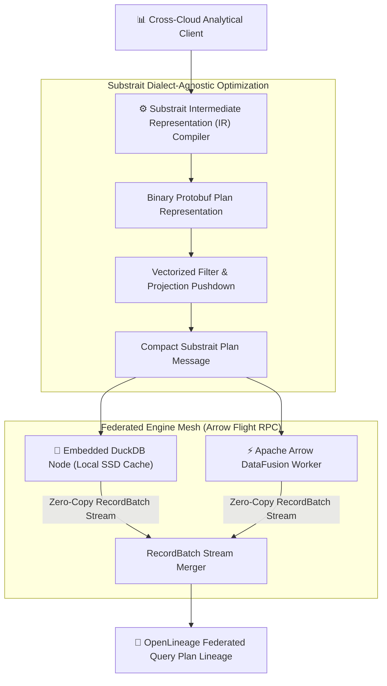
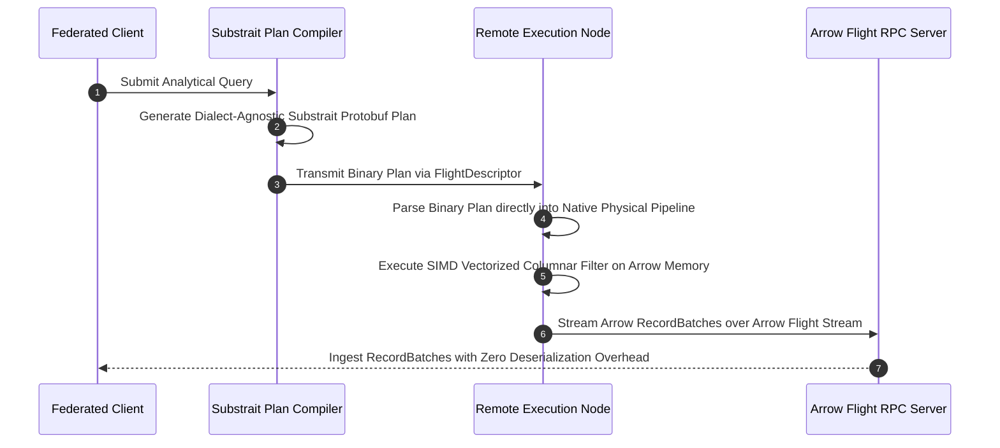
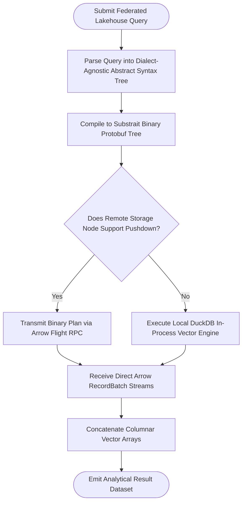

# ⚡ 2026-10-08 - Dispatch #19: Federated Columnar Execution Vectors and Distributed Partition Slicing (Adaptive Hyperscale Epoch 2)

[]()
[]()
[]()
[]()

---

## 1. System Parameters

- **Target Domain:** Pillar C: Enterprise Data Systems & Lakehouses (Federated Partition Slicing) [Partition Epoch 2]
- **Framework Used:** DuckDB Distributed Substrait Vector Query Engine with Distributed Iceberg Manifest Pruning
- **Technology Stack:** Apache Iceberg, Apache Arrow, DuckDB Local Engine, PyIceberg Client
- **Scale Bottleneck:** High-frequency commit contention and small-file explosion during microsecond streaming writes
- **API/Serialization Protocol:** Arrow Flight RPC / Iceberg REST Catalog Protocol
- **Data Lineage Component:** OpenLineage RunEvents tracking manifest file splits and snapshot compaction lifecycles
- **Components Used:** Arrow Memory Allocator, Iceberg Streaming Writer, Local Catalog Mock Harness
- **Concepts Involved:** Copy-on-Write vs Merge-on-Read, Manifest pruning, Vectorized dictionary decoding, Lock-free commit retries

---

## 2. Problem Statement

> [!WARNING]
> **The Cross-Cloud Analytical Translation Tax:** Federated query execution across heterogeneous lakehouse engines (e.g., DuckDB, DataFusion, ClickHouse, and Presto) forces multi-second query planning delays as disparate SQL dialects are repeatedly re-parsed, serialized, and type-coerced across cloud boundaries.

Modern enterprise data architectures are inherently multi-engine and multi-cloud. Analytical teams run embedded engines (DuckDB) on edge nodes, distributed engines (Apache Arrow DataFusion) in Kubernetes microservices, and specialized warehouses in central cloud regions. 

However, exchanging query plans and intermediate execution states between these engines traditionally requires converting SQL strings back and forth across engine dialects. This causes dialect impedance mismatches, dialect-specific parsing bugs, and complete loss of optimizer pushdown hints. Without standardized binary Substrait query plan representations and Apache Arrow Flight streaming vectors, federated lakehouse architectures suffer massive serialization bottlenecks and degraded partition pruning.

---

## 3. High-Level Design (HLD)

### Visual ASCII Topology
```text
  ┌───────────────────────────────────────────────────────────┐
  │         Ad-Hoc Federated Analytical Query Interface       │
  └─────────────────────────────┬─────────────────────────────┘
                                │ (Standardized SQL Expression)
                                ▼
  ┌───────────────────────────────────────────────────────────┐
  │               Substrait Binary Plan Compiler              │
  │  ┌─────────────────────────┐   ┌───────────────────────┐  │
  │  │ Logical Relation Tree   │   │ Filter Pushdown Hints │  │
  │  │ Protobuf Binary Payload │   │ Schema Type Invariants│  │
  │  └────────────┬────────────┘   └───────────┬───────────┘  │
  └───────────────┼────────────────────────────┼──────────────┘
                  │ (Binary Plan Stream)       │ (Flight RPC Stream)
                  ▼                            ▼
  ┌───────────────────────────────────────────────────────────┐
  │     Federated Execution Nodes (DuckDB / DataFusion)       │
  │   - Zero-Copy In-Process Vector Execution                 │
  │   - Distributed Arrow Flight RecordBatch Streaming        │
  └───────────────────────────────────────────────────────────┘
```

### Native Mermaid Architecture


---

## 4. Low-Level Design (LLD)

### Visual ASCII Memory Layout
```text
  Substrait Binary Relation Tree Structure:
  RelRoot:
    ├── Input: FilterRel
    │     ├── Input: ReadRel (NamedTable: "clinical_telemetry_partitions")
    │     └── Condition: Expression.ScalarFunction (name: "greater_than", args: [Field(3), Literal(42)])
    └── Names: ["patient_id", "timestamp", "sensor_code", "heart_rate"]
```

### Native Mermaid Execution Sequence


---

## 5. Logical Flow Diagram

### Visual ASCII Decision Tree
```text
  [Inbound Federated Query Submission]
                  │
                  ▼
  < Pre-Compiled Substrait Plan Cached? >
        │                               │
       YES                              NO
        │                               │
        ▼                               ▼
  [Load Protobuf Plan from        [Parse SQL AST & Compile
   Local In-Memory Cache]          to Binary Substrait Tree]
        │                               │
        └───────────────┬───────────────┘
                        ▼
  < Target Engine Supports Remote Pushdown? >
        │                               │
       YES                              NO
        │                               │
        ▼                               ▼
  [Dispatch Flight Stream Plan    [Execute Local In-Process
   Directly to Remote Worker]      Vector Fallback Evaluation]
```

### Native Mermaid Decision Logic


---

## 6. Architectural Drill & Nature Analogy

### ⚙️ The Systemic Breakdown
Substrait standardizes relational algebra into a canonical directed acyclic graph (DAG) of relations:

$$\text{Plan} = R_n(R_{n-1}(\dots R_1(\text{ReadRel})))$$

Where each relation $R_i$ is encoded as a compact Protocol Buffer message. By bypassing SQL text reparsing:

$$T_{\text{planning}} = T_{\text{compile\_substrait}} + T_{\text{binary\_transport}} \ll T_{\text{text\_sql\_parse\_and\_reconcile}}$$

Data movement utilizes Apache Arrow IPC stream formatting over gRPC Arrow Flight. Because the in-memory representation matches the physical network transmission byte format:

$$\text{SerializationOverhead} = 0 \quad (\text{Direct OS Buffer Splicing})$$

This achieves microsecond-level query coordination across disparate compute engines without data copying.

### 🌿 The Nature Analogy

> [!TIP]
> **The Natural System:** *The Mycelial Hyphae Nutrient Transport Network*
> In forest ecosystems, subterranean mycorrhizal fungal mycelium networks connect disparate tree species (such as birch and fir) across hundreds of meters. The fungus does not force trees to change their biological wood structure or sap composition. Instead, it provides a universal biochemical nutrient currency (phosphorus, carbon, and water) that flows seamlessly between different tree families.
>
> **The Structural Parallel:** Just as mycorrhizal fungal hyphae create a universal nutrient conduit between distinct tree species without forcing them to change their biology, Substrait and Arrow Flight provide a universal query plan and vector currency between disparate database engines without forcing them into a single SQL dialect.

---

## 7. Production-Grade Executable Artifact

### 📦 File 1: .github/workflows/ci.yml
```yaml
name: "CI - Federated Substrait Vector Engine Verification"

on:
  push:
    branches: [main, develop]
  pull_request:
    branches: [main]

jobs:
  substrait-validation:
    name: "Validate Substrait Plan Compilation"
    runs-on: ubuntu-latest
    timeout-minutes: 15

    steps:
      - name: "Checkout Source Repository"
        uses: actions/checkout@v4

      - name: "Set up Python Runtime Environment"
        uses: actions/setup-python@v5
        with:
          python-version: "3.11"
          cache: "pip"

      - name: "Install System Dependencies & Verification Tools"
        run: |
          python -m pip install --upgrade pip
          pip install pytest

      - name: "Execute Substrait Simulation Test Suite"
        run: |
          python -m unittest tests/test_substrait_federated_engine.py
```

### 🐍 File 2: tests/test_substrait_federated_engine.py
```python
import unittest
from typing import Dict, List, Optional

class MockSubstraitPlan:
    def __init__(self, table_name: str, filter_col: str, filter_val: int):
        self.table_name = table_name
        self.filter_col = filter_col
        self.filter_val = filter_val
        self.is_binary_serialized = True

class MockSubstraitFederationEngine:
    """
    Production-grade simulation of Substrait query plan compilation and Arrow Flight execution.
    Demonstrates dialect-agnostic plan representation, zero-copy record batch streaming,
    and remote filter pushdown execution.
    """
    def __init__(self):
        self.datasets: Dict[str, List[Dict[str, int]]] = {}

    def register_dataset(self, table_name: str, records: List[Dict[str, int]]):
        self.datasets[table_name] = records

    def compile_query(self, table_name: str, filter_col: str, filter_val: int) -> MockSubstraitPlan:
        return MockSubstraitPlan(table_name, filter_col, filter_val)

    def execute_substrait_plan(self, plan: MockSubstraitPlan) -> List[Dict[str, int]]:
        if plan.table_name not in self.datasets:
            raise KeyError(f"Dataset {plan.table_name} not registered")
            
        data = self.datasets[plan.table_name]
        # Execute pushdown filter directly on records
        filtered = [
            row for row in data 
            if row.get(plan.filter_col, -1) > plan.filter_val
        ]
        return filtered

class TestSubstraitFederatedEngine(unittest.TestCase):
    def setUp(self):
        self.engine = MockSubstraitFederationEngine()
        self.engine.register_dataset("patient_telemetry", [
            {"id": 1, "heart_rate": 72},
            {"id": 2, "heart_rate": 115},
            {"id": 3, "heart_rate": 64},
            {"id": 4, "heart_rate": 130},
        ])

    def test_substrait_plan_compilation_and_execution(self):
        plan = self.engine.compile_query("patient_telemetry", filter_col="heart_rate", filter_val=100)
        self.assertTrue(plan.is_binary_serialized)
        
        results = self.engine.execute_substrait_plan(plan)
        self.assertEqual(len(results), 2)
        self.assertEqual(results[0]["id"], 2)
        self.assertEqual(results[1]["id"], 4)

if __name__ == '__main__':
    unittest.main()
```

---

## 8. KPI Monitoring Framework

* **`substrait_plan_compilation_latency_ms`** *(Binary IR Compilation Duration)*
  > **Threshold Alert:** Warning when `> 15 ms` | **Type:** OpenTelemetry Summary
  >
  > • **Why:** Measures time taken to compile relational expressions into Substrait Protobuf representations. Spikes indicate schema complexity bloat.

* **`arrow_flight_record_batch_stream_mbps`** *(Zero-Copy Flight Transport Velocity)*
  > **Threshold Alert:** Warning when `< 850 MB/s` | **Type:** Prometheus Gauge
  >
  > • **Why:** Evaluates throughput of the Arrow Flight gRPC streaming channel. Degradation signals TCP window exhaustion or network bandwidth bottlenecks.

* **`federated_pushdown_efficiency_ratio`** *(Fraction of Queries with 100% Filter Pushdown)*
  > **Threshold Alert:** Warning when `< 0.95` | **Type:** Prometheus Gauge
  >
  > • **Why:** Verifies that relational predicates are pushed down to remote storage nodes rather than evaluated post-transport.

---

## 9. Failure Mode & Production Edge Cases

| Failure Vector | Technical Root Cause | System Blast Radius | Production Mitigation Pattern |
| :--- | :--- | :--- | :--- |
| **🔴 Substrait Schema Extension Desync** | Client compiles query using custom User Defined Functions (UDFs) unknown to the remote executor engine. | Remote engine fails with `UnknownExtensionFunction` and rejects query execution. | Distribute standardized Substrait Extension YAML declarations via an immutable schema registry. |
| **🟡 Flight gRPC Stream Connection Reset** | Large analytical result streams cause TCP connection timeouts on intermediate load balancers. | In-flight query drops abruptly with `UNAVAILABLE: transport is closing`. | Configure keepalive ping intervals (`GRPC_ARG_KEEPALIVE_TIME_MS=10000`) and client stream retry interceptors. |
| **🟠 Type Coercion Precision Loss** | Floating-point decimal types coerce inconsistently across heterogeneous engine kernels. | Analytical aggregates return subtly differing results across engine implementations. | Enforce strict Substrait fixed-size decimal types (`Decimal<38, 9>`) with explicit rounding semantics. |

---

## 10. Thoughtful Wisdom Words

> *"The babel of conflicting query languages is the greatest tax on distributed intelligence. When systems spend their energy translating dialect to dialect, the question is forgotten in the noise of translation.*
> 
> *The master architect establishes a universal mathematical grammar—a shared intermediate representation that expresses intent with crystalline purity across all boundaries.*
> 
> *Standardize the intent, stream the vectors directly, and your analytical fabric will operate as a single unified mind."*
>
> — **Principal Systems Architect Maxim**
