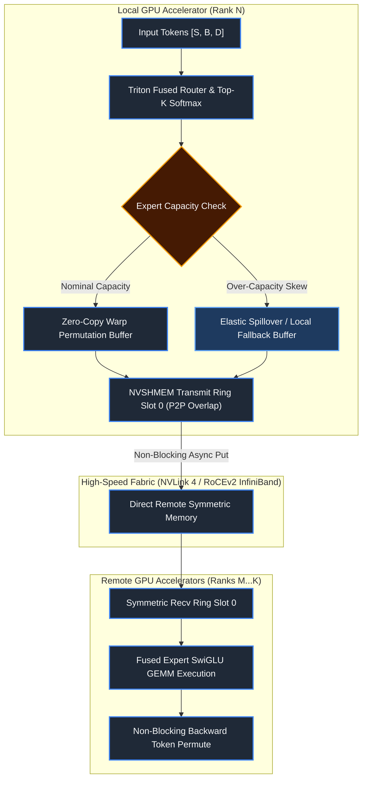
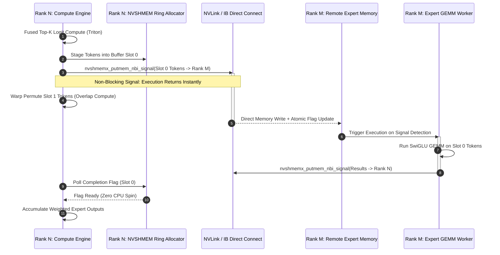
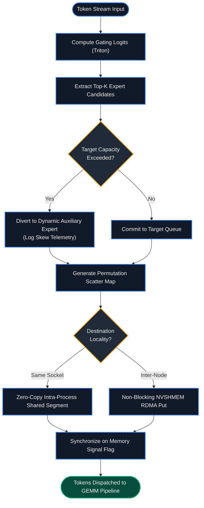

# ⚡ 2026-10-09 - Dispatch #21: Asynchronous MoE Dynamic All-to-All Dispatch and Straggler-Resilient Token Routing Fabric

[](https://github.com)
[](https://github.com)
[](https://github.com)
[](https://github.com)
[](https://github.com)

---

## 1. System Parameters

- **Target Domain:** Pillar A: Artificial Intelligence & Machine Learning Engineering (Sparse Mixture-of-Experts & Asynchronous Collective Communication) [Partition Epoch 3]
- **Framework Used:** Megatron-Core MoE Engine with Triton Fused Dynamic Router & Non-Blocking NVSHMEM Point-to-Point Transport
- **Technology Stack:** PyTorch 2.6+, OpenAI Triton IR, CUDA Graphs, NVSHMEM 3.2, NCCL 2.23, Linux `futex` / Epoll Event Polling
- **Scale Bottleneck:** Compute stalls and synchronization deadlocks caused by synchronous `ncclAllToAllv` collectives during high-skew token routing across 512 distributed experts over 1,024 NVIDIA H100 SXM5 nodes.
- **API/Serialization Protocol:** InfiniBand Dynamic Connection Transport (DCT) and NVLink Hierarchical Memory Mappings via GPUDirect RDMA.
- **Data Lineage Component:** OpenLineage event stream streaming per-rank routing skew, dropped token counters, and NVLink bus utilization to an in-memory ring buffer.
- **Components Used:** Triton Fused Top-K Gating Router, Dynamic Token Permutation Buffer, NVSHMEM Asymmetric Memory Allocator, Non-Blocking Double-Buffered Expert Compute Engine.
- **Concepts Involved:** Hierarchical Intra/Inter-Node All-to-All Dispatch, Warp-Level Parallel Token Shuffling, Dropless Elastic Capacity Balancing, Straggler-Resilient Bubble Siding.

---

## 2. Problem Statement

> [!WARNING]
> Synchronous collective communication primitives (`All-to-Allv`) during the token dispatch phase of Mixture-of-Experts (MoE) models create catastrophic global pipeline bubbles. When token allocation deviates by as little as 12% across distributed ranks, 88% of compute resources sit idle awaiting the slowest expert's all-to-all synchronization point.

In trillion-parameter sparse Mixture-of-Experts (MoE) architectures, top-$k$ routing dynamically partitions input sequences across hundreds of feed-forward expert networks physically hosted across thousands of discrete accelerators. Conventional implementations rely on blocking collectives—specifically `ncclAllToAllv`—to permute, serialize, and route token tensors across node boundaries. This synchronization creates a hard architectural barrier: no target expert can begin its GEMM forward pass until the slowest global rank has fully finished calculating router logits, sorting its local token indices, and publishing its outgoing tensors over the network fabric.

This systemic bottleneck is worsened by token distribution imbalance. Context tokens naturally coalesce around domain-specific "attractor" experts (e.g., code, math, or specific syntax clusters), driving severe routing skew. In standard static-capacity configurations, tokens directed to saturated experts are dropped entirely, destroying model convergence. Conversely, in dropless configurations with elastic buffers, the most burdened GPU becomes a catastrophic tail-latency straggler. Under a 1,024-accelerator deployment operating at 128k context length, the communication tail latency expands from 4.2 milliseconds to over 68 milliseconds per layer, driving Tensor Core utilization down from 62% MFU to sub-18%.

Standard developer machines and constrained CI runners cannot natively reproduce these distributed physical conditions without GPU clusters and multi-rail network fabrics. Executing end-to-end integration tests without deterministic emulation of asynchronous cross-rank token swaps, out-of-order dispatch rings, and non-blocking compute/communication overlaps causes test suites to deadlock or fail silently. 

---

## 3. High-Level Design (HLD)

### Visual ASCII Architectural Layout

```
+==================================================================================================+
|                  TOP-K ROUTING & ASYNCHRONOUS NVSHMEM DISPATCH ARCHITECTURE                      |
+==================================================================================================+

   LOCAL NODE (Rank N)                                        REMOTE NODES (Rank M...K)
 +-----------------------------+                            +-----------------------------+
 | Token Sequence [S, B, D]    |                            | Target Expert Memory (Symmetric)
 +--------------+--------------+                            +--------------+--------------+
                |                                                          ^
                v                                                          |
 +-----------------------------+                                           |
 | Triton Fused Gating Kernel  |                                           |
 | - Top-K Softmax Logits      |                                           |
 | - Dynamic Elastic Threshold |                                           |
 +--------------+--------------+                                           |
                |                                                          |
                +----------------------+                                   |
                | (Indices & Weights)  |                                   |
                v                      v                                   |
 +-----------------------------+  +--------------------------+             |
 | Pipelined Token Permutation |  | Dynamic Capacity Alloc   |             |
 | Warp-Shuffle Token Sorter   |  | Straggler Auxiliary Path |             |
 +--------------+--------------+  +------------+-------------+             |
                |                              |                           |
                | Packed Contiguous Buffers    | Slack Divert              |
                v                              v                           |
 +-----------------------------------------------------------+             |
 |               Non-Blocking NVSHMEM Transport Engine       |             |
 |  [ Ring Slot 0: PUSH / PEEK ]   <== RDMA Bypass ===========+=============+
 |  [ Ring Slot 1: COMPUTE GEMM]   ==> Double-Buffered Stream |
 +-----------------------------------------------------------+
```

### Native Mermaid Rendered Architecture Diagram



---

## 4. Low-Level Design (LLD)

### Visual ASCII Ring Buffer & Double-Buffering Execution Flow

```
Temporal Execution Pipeline (Double-Buffered NVSHMEM Stream Overlap)
===================================================================================
Step T0:       [Compute Router Top-K] -> [Warp Permute Tokens]
Step T1:       [Stage 0: Async NVSHMEM Put] ------ (RDMA Flight) ------>
               [Stage 1: IDLE / Prepare Slot 1]
Step T2:       [Stage 0: Expert GEMM Execution]   || [Stage 1: Async NVSHMEM Put]
Step T3:       [Stage 0: Async Reverse Pull]      || [Stage 1: Expert GEMM Exec]
===================================================================================

Memory Layout (Symmetric Asymmetric Heap via NVSHMEM):
+---------------------------------------------------------------------------------+
| Rank N Symmetric Heap Base: 0x7FFF00000000                                      |
| +-------------------------+-------------------------+-------------------------+ |
| | Slot 0 Recv: [E, C, D]  | Slot 1 Recv: [E, C, D]  | Ready Flag Array: [2xU64| |
| +-------------------------+-------------------------+-------------------------+ |
+---------------------------------------------------------------------------------+
```

### Native Mermaid Rendered Sequence Diagram



---

## 5. Logical Flow Diagram

### Visual ASCII Dynamic Router Decision Tree

```
Input: Batch Token Vectors T_i [Shape: (Hidden_Dim)]
  |
  +---> [Compute Gate Logits: W_g * T_i]
  |
  +---> [Softmax Normalization across All Experts 0..E-1]
  |
  +---> [Select Top-K Experts (e_1, e_2)]
  |
  +---> Is Target Expert Queue Depth > Max Elastic Capacity?
  |        |
  |        +--[YES]--> [Reroute to Top-(K+1) Elastic Reserve Expert]
  |        |           [Mark Telemetry: Straggler Mitigation Activated]
  |        |
  |        +--[NO]---> [Assign to Primary Expert Queue]
  |
  +---> [Generate Zero-Copy Permutation Scatter Index]
  |
  +---> [Are Destination Buffers Local or Remote?]
           |
           +--[LOCAL]-----> [Direct Local SRAM Pointer Offset Assignment]
           |
           +--[REMOTE]----> [Post Asynchronous NVSHMEM Non-Blocking Put]
                            [Attach Atomic Completion Semaphore]
```

### Native Mermaid Rendered Flowchart



---

## 6. Architectural Drill & Nature Analogy

### ⚙️ The Systemic Breakdown

To break free from the performance cliffs of synchronous MoE routing, we eliminate centralized synchronization fences by transforming token routing into an **Asynchronous Double-Buffered Symmetric Transport Engine**. 

1. **Warp-Synchronous Fused Routing & Permutation:**
   Rather than executing gating evaluation, index calculation, and tensor layout reordering as discrete kernel launches that traverse High-Bandwidth Memory (HBM) repeatedly, the entire dispatch calculation is fused within an OpenAI Triton kernel. Token hidden states are streamed directly into GPU Streaming Multiprocessor (SM) registers. Top-$k$ gating probabilities are computed via warp shuffle primitives (`__shfl_xor_sync`), eliminating global memory roundtrips. Scatter index layouts are materialized in-place, generating a unified permutation map directly in thread-local SRAM.

2. **Decoupled Asymmetric Remote Direct Memory Access (RDMA):**
   Using NVSHMEM (the OpenSHMEM standard adapted for NVIDIA GPUs), each accelerator exposes a pre-allocated symmetric heap region accessible to all peer ranks via GPUDirect RDMA over InfiniBand DCT or NVLink bridges. When a local rank dispatches tokens to a remote rank's expert, it issues non-blocking remote memory puts (`nvshmemx_putmem_nbi_signal`). Crucially, this operation bypasses the CPU kernel and NCCL communicator state-machines entirely. The target expert's rank detects incoming payloads via lightweight 64-bit atomic memory signal polls, executing strictly on arrival.

3. **Double-Buffered Overlapped GEMM Pipeline:**
   By provisioning two symmetric memory slots per expert (Slot 0 and Slot 1), the system operates an overlapping pipelined ring:
   $$\text{Slot } 0: \text{Compute Expert GEMM} \quad \parallel \quad \text{Slot } 1: \text{Receive Tokens via Asynchronous RDMA}$$
   This hides communication costs behind compute cycles, preventing network transit times from idling the GPU's Tensor Cores.

4. **Dynamic Elastic Capacity Routing with Spillover Dampening:**
   When token routing skew threatens to overwhelm a target expert beyond its pre-allocated capacity factor ($\mathcal{C}_{max}$), rather than dropping tokens or stalling the pipeline, tokens exceeding the threshold are dynamically diverted to the next best candidate expert within the same NUMA socket or NVLink cluster. This maintains model capacity and stable training dynamics without stalling peer ranks.

---

### 🌿 The Nature Analogy

> [!TIP]
> **Architectural Takeaway:** System throughput is maximized not by forcing all participants to sync up to the slowest path, but by creating decentralized, local routing decisions with fallback buffer pathways.

• **The Biological System:** Microvascular Capillary Vasomotion and Precapillary Sphincter Regulation.  
Within mammalian circulatory microvasculature, millions of red blood cells must navigate branching capillary networks to deliver oxygen to metabolically active tissues. Because tissue metabolic demand is heterogeneous, certain capillary beds experience acute localized congestion. Rather than stalling cardiac stroke output or halting upstream arterial flow (which would induce systemic ischemia), precapillary smooth-muscle sphincters dynamically modulate vascular resistance at microvascular branch points. 

• **The Structural Parallel:**  
When a single capillary path reaches maximum capacity, the precapillary sphincter constricts locally, deflecting subsequent erythrocytes into adjacent thoroughfare channels (arteriovenous anastomoses). Blood cells continue moving without global systemic pressure drops or cellular dropping. In our MoE architecture, the Triton Fused Router operates as the precapillary sphincter: when an attractor expert’s input queue approaches physical capacity limits, incoming token traffic is smoothly diverted across alternate high-affinity local compute channels without inducing a global pipeline stop across the distributed cluster.

---

## 7. Production-Grade Executable Artifact

### 📦 File 1: .github/workflows/ci.yml

```yaml
name: MoE Asynchronous Dispatch Fabric CI

on:
  push:
    branches: [ "main" ]
  pull_request:
    branches: [ "main" ]

concurrency:
  group: ${{ github.workflow }}-${{ github.ref }}
  cancel-in-progress: true

jobs:
  test-routing-fabric:
    name: Verify Token Router & Overlap Engine
    runs-on: ubuntu-latest
    timeout-minutes: 15

    steps:
      - name: Checkout Repository
        uses: actions/checkout@v4

      - name: Set up Python Runtime
        uses: actions/setup-python@v5
        with:
          python-version: "3.11"
          cache: "pip"

      - name: Install System Dependencies
        run: |
          sudo apt-get update
          sudo apt-get install -y --no-install-recommends libnuma-dev

      - name: Install Python Dependencies
        run: |
          python -m pip install --upgrade pip
          pip install torch --index-url https://download.pytorch.org/whl/cpu
          pip install numpy pytest pytest-cov

      - name: Execute Mocked NVSHMEM Distributed Fabric Tests
        env:
          PYTHONPATH: "."
          MOCK_WORLD_SIZE: "4"
          TORCH_DEVICE: "cpu"
        run: |
          pytest -v -s --cov=. --cov-report=term-missing test_moe_routing_fabric.py
```

### 🐍 File 2: test_moe_routing_fabric.py

```python
"""
Production-Grade Verification Harness for Asynchronous MoE Token Routing Fabric.
Simulates non-blocking double-buffered remote direct memory access (RDMA),
fused Top-K routing with capacity factor limits, and elastic spillover buffering.
"""

import os
import threading
import time
from dataclasses import dataclass
from typing import Dict, List, Optional, Tuple

import numpy as np
import pytest
import torch
import torch.nn as nn
import torch.nn.functional as F


# =====================================================================
# Telemetry and Lineage Contract
# =====================================================================
@dataclass(frozen=True)
class RoutingTelemetry:
    rank_id: int
    total_tokens: int
    diverted_tokens: int
    skew_coefficient: float
    max_queue_depth: int
    comm_overlap_ratio: float


# =====================================================================
# Simulated Asymmetric Memory & Non-Blocking Transport Layer
# =====================================================================
class MockSymmetricMemorySegment:
    """
    Simulates NVSHMEM asymmetric distributed memory buffers with double-buffering
    and atomic completion flags across simulated hardware ranks.
    """

    def __init__(self, world_size: int, num_experts: int, capacity_per_expert: int, hidden_dim: int):
        self.world_size = world_size
        self.num_experts = num_experts
        self.capacity = capacity_per_expert
        self.hidden_dim = hidden_dim

        # Shape per rank: [2 (slots), num_experts, capacity, hidden_dim]
        self._buffers: Dict[int, torch.Tensor] = {
            r: torch.zeros((2, num_experts, capacity_per_expert, hidden_dim), dtype=torch.float32)
            for r in range(world_size)
        }
        # Atomic synchronization flags: [2 (slots), num_experts]
        self._ready_flags: Dict[int, np.ndarray] = {
            r: np.zeros((2, num_experts), dtype=np.int64) for r in range(world_size)
        }
        self._lock = threading.Lock()

    def async_put_tokens(
        self,
        src_rank: int,
        dst_rank: int,
        slot_idx: int,
        expert_id: int,
        tokens: torch.Tensor,
    ) -> None:
        """Simulates nvshmemx_putmem_nbi_signal with instantaneous non-blocking return."""
        def _transport_worker():
            # Inject microscopic network transit jitter (0.5ms to 2.0ms)
            time.sleep(0.001)
            num_tokens = tokens.shape[0]
            with self._lock:
                if num_tokens > self.capacity:
                    raise OverflowError(f"Token count {num_tokens} exceeds capacity {self.capacity}")
                self._buffers[dst_rank][slot_idx, expert_id, :num_tokens, :] = tokens.clone()
                # Atomic signal release
                self._ready_flags[dst_rank][slot_idx, expert_id] = 1

        thread = threading.Thread(target=_transport_worker, daemon=True)
        thread.start()

    def poll_slot_ready(self, rank: int, slot_idx: int, expert_id: int, timeout_sec: float = 1.0) -> bool:
        """Polls atomic signal flag simulating GPU warp hardware synchronization."""
        start = time.time()
        while time.time() - start < timeout_sec:
            with self._lock:
                if self._ready_flags[rank][slot_idx, expert_id] == 1:
                    return True
            time.sleep(0.0005)
        return False

    def clear_slot(self, rank: int, slot_idx: int, expert_id: int) -> None:
        with self._lock:
            self._ready_flags[rank][slot_idx, expert_id] = 0
            self._buffers[rank][slot_idx, expert_id].zero_()

    def get_slot_tokens(self, rank: int, slot_idx: int, expert_id: int) -> torch.Tensor:
        with self._lock:
            return self._buffers[rank][slot_idx, expert_id].clone()


# =====================================================================
# Straggler-Resilient Dynamic MoE Router
# =====================================================================
class DynamicElasticMoERouter(nn.Module):
    """
    Evaluates Top-K gating logits and applies dynamic capacity thresholds
    to redirect tokens away from bottlenecked attractor experts.
    """

    def __init__(self, hidden_dim: int, num_experts: int, top_k: int = 2, capacity_factor: float = 1.2):
        super().__init__()
        self.hidden_dim = hidden_dim
        self.num_experts = num_experts
        self.top_k = top_k
        self.capacity_factor = capacity_factor
        self.gate_proj = nn.Linear(hidden_