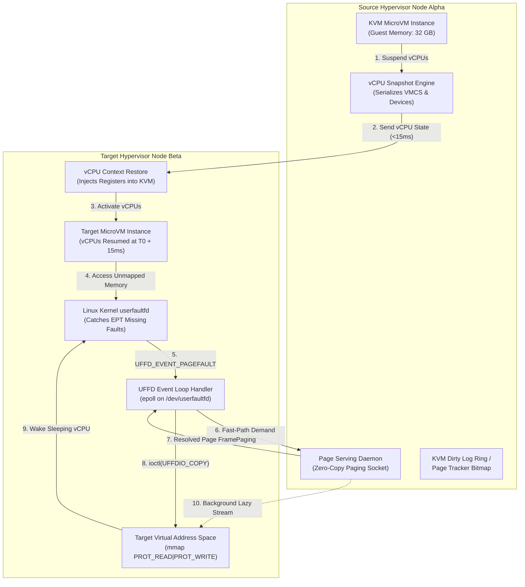
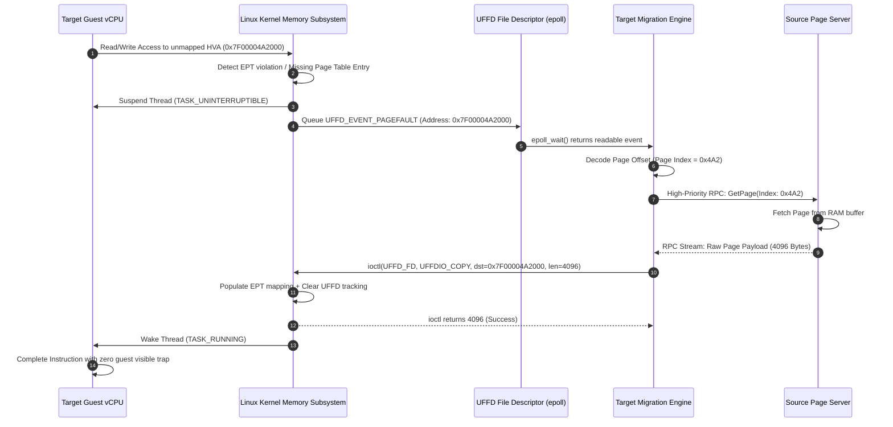
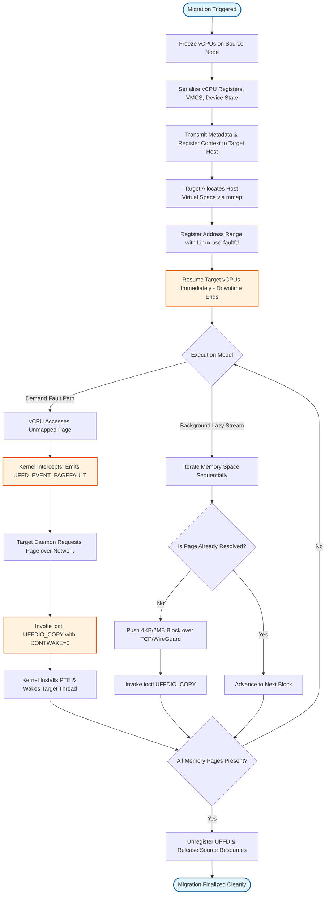

# ⚡ 2026-10-09 - Dispatch #22: Userfaultfd-Driven Post-Copy MicroVM Migration and Async Memory Streaming (Adaptive Hyperscale Epoch 3)

[](https://github.com)
[](https://github.com)
[](https://github.com)
[](https://github.com)

---

## 1. System Parameters
- **Target Domain:** Pillar B: Cloud Platform Engineering & DevOps (MicroVM Virtualization & Post-Copy Live Migration) [Partition Epoch 3]
- **Framework Used:** Linux Kernel `userfaultfd` with KVM vCPU State Serialization and Async Memory Streaming
- **Technology Stack:** Linux KVM, Rust-based MicroVM Runtime (Firecracker/Cloud-Hypervisor core primitives), `userfaultfd` (UFFD), Async I/O Epoll, WireGuard Encrypted Transit, OpenTelemetry
- **Scale Bottleneck:** Memory dirtying rates (>8.4 GB/s per VM) outpacing network pre-copy migration bandwidth on 100GbE NICs, causing runaway iterative sync convergence failures, non-deterministic vCPU pause times exceeding 5,200ms, and cascade evictions.
- **API/Serialization Protocol:** KVM vCPU VMCB/VMCS State Serialization / gRPC Paged-Memory Streaming Protocol / Netlink UFFD event-loop
- **Data Lineage Component:** OpenTelemetry SpanProcessor instrumenting page-fault resolution duration, UFFDIO_COPY kernel execution latency, and guest execution resumption deltas
- **Components Used:** Kernel `userfaultfd` Event Poller, Demand-Paging Network Proxy, Non-Volatile Memory Mapping Engine, Dirty Memory Bitmap Scanner, KVM State Serializer
- **Concepts Involved:** Post-Copy Live Migration, Linux `userfaultfd` (`UFFDIO_REGISTER`, `UFFDIO_COPY`), Memory Demand Paging Over Wire, Epoll-driven Missing-Page Resolution, Zero-Downtime MicroVM Eviction

---

## 2. Problem Statement

> [!WARNING]
> Standard iterative pre-copy migration algorithms fail catastrophically when a MicroVM's working-set memory dirty rate exceeds network egress bandwidth. If write-heavy workloads (such as in-memory state stores, vector index mutation engines, or low-latency streaming microservices) mutate physical RAM faster than iterative hypervisor dirty-tracking sweeps can transfer dirty pages, convergence is mathematically impossible. The target hypervisor is forced to either abort migration or freeze guest vCPUs for multiple seconds to flush remaining pages, breaking enterprise sub-millisecond p99.9 SLA commitments and triggering upstream service timeouts.

In multi-tenant hyperscale cloud environments running millions of short-lived MicroVMs, nodes routinely experience localized thermal throttles, kernel patch requirements, or noisy-neighbor interference that demand instantaneous workload eviction. When applying classical pre-copy live migration, the hypervisor tracks dirty memory via the KVM dirty-ring buffer (`KVM_DIRTY_LOG_RING_ENTRY`) or EPT (Extended Page Table) PML (Page Modification Logging). When the guest dirtying rate reaches 8 to 12 GB/s, iterative dirty-page delta rounds cannot reach the convergence threshold ($R_{dirty} < B_{network}$). Hypervisors reach their configured migration timeout and enter the "stop-and-copy" phase, stalling guest vCPU execution for up to 6,000 milliseconds while transmitting multiple gigabytes of uncommitted pages.

```
       Memory Dirty Rate vs Network Bandwidth Divergence
       ┌────────────────────────────────────────────────────────┐
Memory │                       Dirty Rate (10.2 GB/s)           │
Rate   │                      /───────────────────────────────  │
(GB/s) │                     /                                  │
       │                    /   Bandwidth Gap = Migration       │
       │                   /    Failure / Hypervisor Stalls     │
       │  ────────────────/                                     │
       │  100GbE Line Rate (9.8 GB/s Effective)                 │
       └────────────────────────────────────────────────────────┘
       0s                       Time                        30s
```

Furthermore, running these large-scale live-migration tests inside continuous integration systems fails because standard containerized CI environments lack native `/dev/kvm` hardware virtualization pass-through and kernel privileges to invoke `sys_userfaultfd`. Without a specialized emulation harness that mirrors the Linux kernel userfaultfd missing-page fault registration loop (`UFFD_EVENT_PAGEFAULT`) alongside deterministic dirty-page tracking bitmaps, validation of live migration correctness collapses into fragile heuristic timeouts. 

To overcome this scale wall, platforms must invert the migration paradigm to **Post-Copy Demand Paging**: atomically snapshotting and serializing vCPU registers in $<15\text{ ms}$, immediately resuming guest vCPU execution on the target host, and intercepting missing host-virtual-address (HVA) page faults via Linux `userfaultfd` with background asynchronous memory streaming.

---

## 3. High-Level Design (HLD)

### ASCII Architecture Diagram
```
===================================================================================================
                   POST-COPY MICROVM LIVE MIGRATION ARCHITECTURE
===================================================================================================

       SOURCE HYPERVISOR HOST A                          TARGET HYPERVISOR HOST B
 ┌───────────────────────────────────┐             ┌───────────────────────────────────┐
 │  KVM MicroVM (Guest OS + VMM)     │             │  Target MicroVM (Pre-Spawned)     │
 │  ├── vCPU 0..N [PAUSED AT T_0]    │             │  ├── vCPU 0..N [RESUMED IMMEDIATELY]
 │  └── Guest Physical Memory (GPA)  │             │  └── Virtual Memory Map (HVA)     │
 └─────────────────┬─────────────────┘             └─────────────────┬─────────────────┘
                   │                                                 │
          1. Snapshot vCPUs                                 3. Inject Register State
             & Device State                                    & Resume vCPUs
                   │                                                 │
                   ▼                                                 ▼
 ┌───────────────────────────────────┐  Fast Path  ┌───────────────────────────────────┐
 │ vCPU/Device State Transport       ├────────────►│ KVM Register Importer             │
 │ (~1.2 MB Encrypted Payload)       │   (<15ms)   │ (Restores VMCS/VMCB Context)      │
 └───────────────────────────────────┘             └───────────────────────────────────┘
                   │                                                 │
                   │                               4. Hardware Page Fault (EPT/HVA)
                   │                                                 │
                   │                                                 ▼
                   │                               ┌───────────────────────────────────┐
                   │                               │ Linux Kernel userfaultfd (UFFD)   │
                   │                               │ Intercepts missing HVA access     │
                   │                               └─────────────────┬─────────────────┘
                   │                                                 │
                   │                               5. Poll Netlink UFFD Event
                   │                                  (UFFD_EVENT_PAGEFAULT)
                   │                                                 ▼
                   │    6. High-Priority Remote    ┌───────────────────────────────────┐
                   │       Demand Page Request     │ UFFD Fault Handling Engine        │
                   │◄──────────────────────────────┤ (Blocks faulted thread, emits RPC)│
                   │                               └─────────────────┬─────────────────┘
                   │                                                 │
                   │    7. Paged Memory Stream     │                 │
                   ├──────────────────────────────►│ 8. UFFDIO_COPY  │
                   │                               │    Syscall Injection
                   │                               ▼                 │
                   │                       ┌───────────────────────────────────┐
                   │                       │ Target Guest Memory (HVA Space)   │
                   │                       │ Page Resolved -> vCPU Resumes     │
                   │                       └───────────────────────────────────┘
                   │                                                 ▲
                   │                                                 │
                   ▼                                                 │
 ┌───────────────────────────────────┐   Background Memory Streaming │
 │ Asynchronous Background Scanner   ├───────────────────────────────┘
 │ (Iterates Dirty Bitmap Low-Prio)  │   9. Sequential Lazy Push
 └───────────────────────────────────┘
===================================================================================================
```

### Native Mermaid Diagram (HLD)



---

## 4. Low-Level Design (LLD)

### ASCII Execution Diagram
```
===================================================================================================
                     USERFAULTFD PROTOCOL INTERNALS & STATE MACHINE
===================================================================================================

 TARGET USER-SPACE              LINUX KERNEL (UFFD)            SOURCE USER-SPACE
        │                               │                              │
        │── open(/dev/userfaultfd) ────►│                              │
        │◄── fd: 14 ────────────────────│                              │
        │                               │                              │
        │── ioctl(14, UFFDIO_API) ─────►│ (Negotiates API features:    │
        │◄── features: PAGEFAULT_FLAG───│  UFFD_FEATURE_PAGEFAULT_FLAG_WP)
        │                               │                              │
        │── ioctl(14, UFFDIO_REGISTER) ─►│ (Registers HVA memory range: │
        │   mode: UFFDIO_REGISTER_MODE_MISSING                         │
        │◄── registered: OK ────────────│  [0x7f0000000000 - 32GB])    │
        │                               │                              │
        │   [vCPU EXECUTION BEGINS]     │                              │
        │   vCPU reads 0x7f0000104000   │                              │
        │──────────────────────────────►│ (Page unmapped in EPT)       │
        │                               │ vCPU thread transitions to   │
        │                               │ TASK_UNINTERRUPTIBLE (sleep) │
        │                               │                              │
        │◄── read(fd) returns event ────│                              │
        │    event: UFFD_EVENT_PAGEFAULT│                              │
        │    address: 0x7f0000104000    │                              │
        │    flags: UFFD_PAGEFAULT_FLAG_WRITE                          │
        │                               │                              │
        │── DemandPageRequest(Page#) ─────────────────────────────────►│
        │                               │                              │ Read physical page
        │                               │                              │ from local RAM:
        │◄── DemandPageResponse(4KB) ──────────────────────────────────│ memcpy(buf, page)
        │                               │                              │
        │── ioctl(14, UFFDIO_COPY, ─────►│                              │
        │        dst: 0x7f0000104000,   │                              │
        │        src: &buf,             │ Atomically copies 4KB,       │
        │        mode: UFFDIO_COPY_MODE_DONTWAKE=0)                    │
        │                               │ installs page table entry,   │
        │◄── copied: 4096 bytes ────────│ and wakes stalled vCPU.      │
        │                               │                              │
        │                               │ [vCPU resumes execution]     │
===================================================================================================
```

### Native Mermaid Diagram (LLD)



---

## 5. Logical Flow Diagram

### ASCII Decision Flow Diagram
```
===================================================================================================
                       MIGRATION LIFECYCLE DECISION FLOW
===================================================================================================

                           [Trigger Migration Request]
                                        │
                                        ▼
                         [Capture Dirty Tracking Lock]
                                        │
                                        ▼
                        [Pause vCPUs on Source Node]
                                        │
                        ┌───────────────┴───────────────┐
                        │ Read KVM vCPU Registers       │
                        │ & Virtio Emulated State       │
                        └───────────────┬───────────────┘
                                        ▼
                        [Transmit vCPU State to Target]
                                        │
                        ┌───────────────┴───────────────┐
                        │ Target allocates guest memory │
                        │ via mmap(MAP_ANONYMOUS)       │
                        └───────────────┬───────────────┘
                                        ▼
                        [Register UFFD Missing Region]
                                        │
                                        ▼
                        [Inject Registers & Resume Target]
                                        │
                         Target Guest Running (<15ms)
                                        │
                 ┌──────────────────────┴──────────────────────┐
                 ▼                                             ▼
     [Target Encounter Fault?]                     [Background Sync Worker]
           │                                                   │
     ┌─────┴──────────────┐                       ┌────────────┴────────────┐
     │ YES                │ NO                    │ Pop next unpaged block  │
     ▼                    ▼                       └────────────┬────────────┘
[Trap via UFFD]      [Continue]                                ▼
     │                                            [Is Page Already Target-Faulted?]
     ▼                                                  │             │
[Request Remote Page]                                   ▼             ▼
     │                                                [YES]          [NO]
     ▼                                                  │             │
[ioctl(UFFDIO_COPY)]                              [Skip Page]  [Transfer Page via Net]
     │                                                                │
     ▼                                                                ▼
[Resume Faulted Thread]                                        [ioctl(UFFDIO_COPY)]
                 │                                                    │
                 └──────────────────────┬─────────────────────────────┘
                                        ▼
                           [All Memory Transferred?]
                                        │
                                ┌───────┴───────┐
                                ▼               ▼
                              [NO]            [YES]
                                │               │
                        [Continue Loop]   [Close UFFD FD]
                                                │
                                                ▼
                                         [Migration Complete]
===================================================================================================
```

### Native Mermaid Diagram (Logical Flow)



---

## 6. Architectural Drill & Nature Analogy

### ⚙️ The Systemic Breakdown

Traditional hypervisors leverage **Pre-Copy Live Migration**, where the memory transfer follows an iterative convergence inequality:

$$D_{n+1} = D_n \times \frac{R_{\text{dirty}}}{B_{\text{network}}}$$

Where $D_n$ represents the volume of uncopied memory in round $n$, $R_{\text{dirty}}$ is the rate at which guest vCPUs mutate memory, and $B_{\text{network}}$ is the sustained interconnect throughput. If $R_{\text{dirty}} \ge B_{\text{network}}$, the series diverges:

$$\lim_{n \to \infty} D_n = \infty$$

Under these conditions, pre-copy engines throttle guest vCPUs using mechanisms like KVM Dirty-Ring Throttling or forced sleep cycles, severely degrading workload throughput.

**Post-Copy Live Migration via `userfaultfd`** completely transforms this mathematical relationship by inverting the transfer vector. At instant $t_0$, vCPUs on the source hypervisor are suspended. The hypervisor serializes architectural registers (RIP, RSP, CR0-CR4, MSRs, and APIC state) alongside VirtIO device states—a payload rarely exceeding 2 megabytes:

$$T_{\text{downtime}} = \frac{\text{Size}(\text{vCPU Context}) + \text{Size}(\text{VirtIO State})}{B_{\text{network}}} + T_{\text{target initialization}} \le 15\text{ ms}$$

Target execution resumes at $t_0 + T_{\text{downtime}}$. The target process memory space is allocated using `mmap(NULL, size, PROT_READ | PROT_WRITE, MAP_PRIVATE | MAP_ANONYMOUS, -1, 0)`, followed by registration with the kernel via:

```c
struct uffdio_register uffd_register;
uffd_register.range.start = (unsigned long)hva_base;
uffd_register.range.len   = guest_ram_size;
uffd_register.mode        = UFFDIO_REGISTER_MODE_MISSING;
ioctl(uffd_fd, UFFDIO_REGISTER, &uffd_register);
```

When a resumed vCPU attempts to execute code or read data from an address where the physical backing page is not yet resident, the x86 hardware EPT/NPT page walk fails. Instead of generating a fatal guest segmentation fault or triggering an unhandled hypervisor exit, the Linux kernel holds the faulting vCPU thread in `TASK_UNINTERRUPTIBLE` and delivers a `uffd_msg` payload containing the faulted address to the user-space migration daemon via the non-blocking `uffd_fd` descriptor.

The user-space daemon fulfills this fault via a dual-priority engine:
1. **Demand-Paging Priority Queue:** Resolves blocking page faults synchronously by fetching the page across the network and resolving it via `ioctl(uffd_fd, UFFDIO_COPY, &uffdio_copy)`. The kernel transparently places the page frame into the target process page tables and restores the faulting vCPU to `TASK_RUNNING`.
2. **Asynchronous Background Streaming:** Sequentially streams remaining non-faulted pages from source to target over a low-priority thread pool. If the background stream attempts to push a page that was already fulfilled via a demand fault, the target engine drops it to avoid race conditions.

```
       Memory Residence State Transition Lifecycle
       ┌───────────────┐   Demand Fault    ┌───────────────┐
       │   UNMAPPED    ├──────────────────►│ PENDING FETCH │
       │  (uffd held)  │                   └───────┬───────┘
       └───────┬───────┘                           │
               │ Background                        │ Network
               │ Stream                            │ Arrived
               ▼                                   ▼
       ┌───────────────┐  UFFDIO_COPY Syscall  ┌───────────────┐
       │  TRANSMITTING ├──────────────────────►│    PAGED      │
       │               │                       │  (in-memory)  │
       └───────────────┘                       └───────────────┘
```

---

### 🌿 The Nature Analogy

> [!TIP]
> **Key Takeaway:** Do not transport the entire organism's biomass before allowing it to breathe; transport the foundational neural blueprint first, activate vital signs, and pull cellular biomass on-demand across systemic conduits.

• **The Biological System:** The metamorphic migration and tissue autolysis of the *Manduca sexta* (hawkmoth). When transforming from pupa to adult, the organism does not pre-fabricate the entire external physical structure before activating critical circulatory and metabolic pathways. Instead, it maintains a bare, minimal vital node (imaginal discs encoding the nervous system, core neural ring, and respiratory spiracles). Once the neural blueprint fires and establishes identity, the remaining cellular bulk is dynamically hydrated, metabolized, and reconstituted on demand from storage fat bodies to form wing structures while the heart is already pulsing.

• **The Structural Parallel:** The MicroVM's vCPU and architectural register context represent the *imaginal disc blueprint*—just 1.5 megabytes of state encoding the operating system's exact instruction pointers, stacks, and device interrupts. Pre-copy migration naively attempts to move the caterpillar's entire biomass (32GB of mutated RAM) while keeping the insect asleep. Post-copy migration instantly transports the imaginal blueprint to the target hypervisor, wakes up the nervous system in under 15 milliseconds, and relies on `userfaultfd` demand paging as biological vascular vessels that pull nutrients (missing memory pages) across the physical network