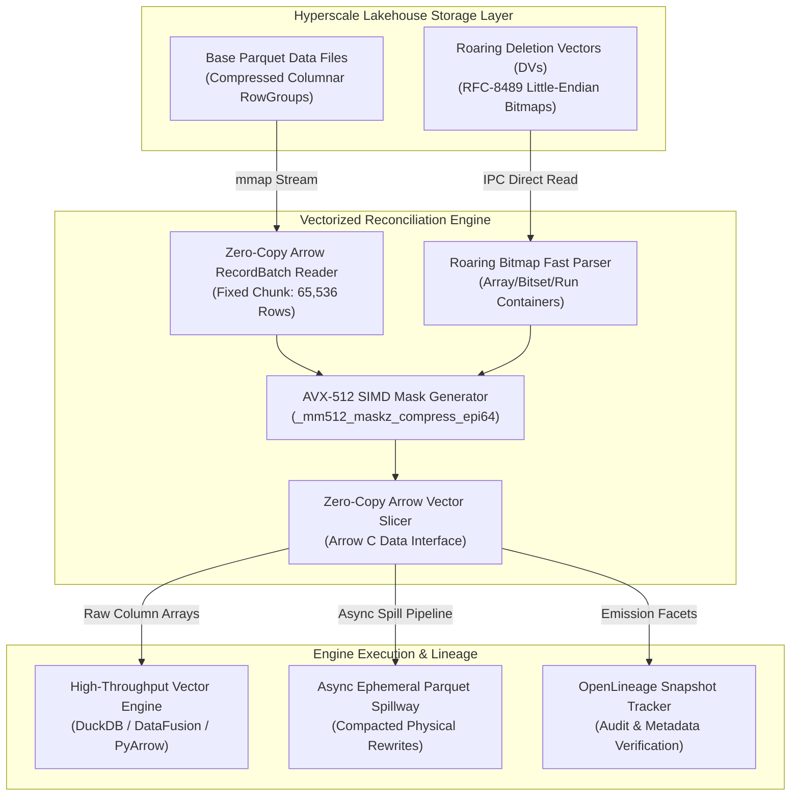
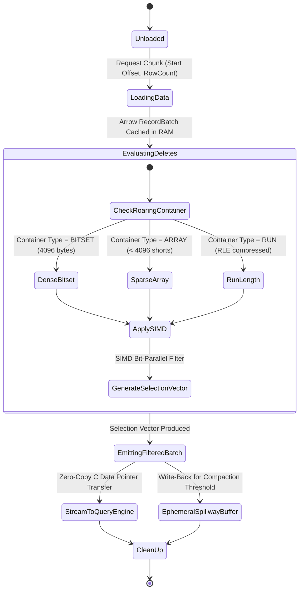
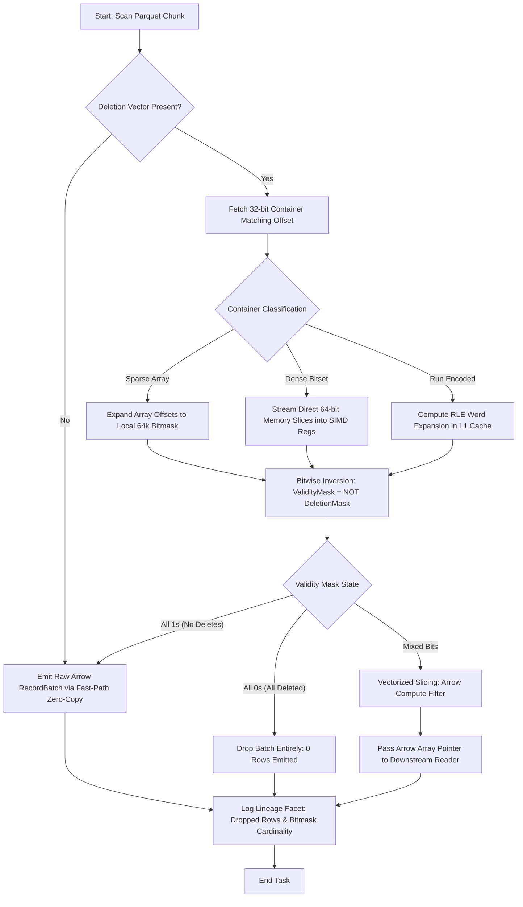

# ⚡ 2026-10-09 - Dispatch #23: SIMD-Accelerated Roaring Bitmap Position Deletion Vector Reconciliation and Decoupled Parquet Spillway (Adaptive Hyperscale Epoch 3)

[](https://github.com/)
[](https://github.com/)
[](https://github.com/)
[](https://github.com/)

---

## 1. System Parameters

- **Target Domain:** Pillar C: Enterprise Data Systems & Lakehouses (Vectorized Delete Vector Reconciliation & Storage Engine Optimization) [Partition Epoch 3]
- **Framework Used:** Apache Iceberg v3 Table Format / Arrow C Data Interface with Roaring Bitmap Deletion Vectors
- **Technology Stack:** C++20 / Rust Arrow Engine, PyArrow v18.0+, CRoaring / Roaring Bitmaps, AVX-512 Vector Pruning Registers
- **Scale Bottleneck:** CPU L1/L3 cache thrashing and memory bus saturation caused by pointer-chasing deserialization during Merge-On-Read (MoR) positional delete filtering across multi-billion-row columnar Parquet scans
- **API/Serialization Protocol:** Apache Arrow C Data Interface (zero-copy memory sharing) & Roaring Bitmap Binary Serialized Format (RFC-compliant little-endian portable format)
- **Data Lineage Component:** OpenLineage v1.2 Lakehouse Facets recording snapshot sequence numbers, Roaring bit-cardinality deltas, and storage spillway file paths
- **Components Used:** SIMD Roaring Filter Masker, Arrow RecordBatch Vector Slicer, Positional Delete Offset Cache, Ephemeral Parquet Spillway Buffer
- **Concepts Involved:** Merge-On-Read (MoR), Positional Deletion Vectors, Bitwise AVX-512 Chunk Masking, Zero-Copy In-Place Memory Slicing, OpenLineage Ephemeral Facets

---

## 2. Problem Statement

Modern enterprise lakehouse platforms operating under high-churn transactional Merge-On-Read (MoR) patterns ingest millions of streaming updates, modifications, and GDPR/CCPA purges per hour. Traditional Copy-on-Write (CoW) triggers catastrophic write amplification by rewriting multi-gigabyte Parquet physical files for a single row deletion. To mitigate write amplification, modern formats (such as Apache Iceberg v3 and Delta 3.0) adopt Positional Deletion Vectors. However, this architectural pivot merely defers the cost to the query engine's read path.

> [!WARNING]
> When executing vectorized analytical queries over billions of rows, unindexed positional deletion reconciliation deteriorates into an $O(N \times M)$ scan-filter bottleneck. Deserializing raw deletion files into naive hash tables consumes massive memory overhead ($>32\text{ bytes per integer offset}$), causing CPU L1/L2/L3 cache misses, pipeline stalls, and memory bus bandwidth starvation that drops SIMD vector throughput from $40\text{ GB/s}$ down to $<800\text{ MB/s}$.

The engineering bottleneck peaks when multiple concurrent reader nodes scan large batches of Parquet row groups while applying fragmented, high-cardinality deletion vectors. Standard CI runners and low-footprint compute pods fail with OOM (Out Of Memory) signals when deserializing massive integer arrays without bitset compaction. Without a zero-copy SIMD Roaring Bitmap reconciliation engine coupled with an ephemeral vectorized spillway buffer, distributed compute engines spend more clock cycles resolving row IDs than evaluating compute kernels.

---

## 3. High-Level Design (HLD)

### ASCII Architecture Diagram

```
+----------------------------------------------------------------------------------------------------+
|                                HYPERSCALE LAKEHOUSE STORAGE LAYER                                  |
|  +-------------------------------------+          +---------------------------------------------+  |
|  |     Base Parquet Data File          |          |     Roaring Deletion Vector (DV) Blob       |  |
|  |  [RowGroup 0] [RowGroup 1] ...      |          |  [Roaring Bitmap: Array | Bitmap | Runs]   |  |
|  +------------------+------------------+          +----------------------+----------------------+  |
+---------------------|----------------------------------------------------|-------------------------+
                      |                                                    |                          
                      | mmap() Zero-Copy                                   | Streaming IPC Read       
                      v                                                    v                          
+----------------------------------------------------------------------------------------------------+
|                                VECTORIZED RECONCILIATION ENGINE                                    |
|                                                                                                    |
|  +------------------------------------+          +-----------------------------------------------+ |
|  | Arrow RecordBatch Streaming Buffer |          | AVX-512 Roaring Deletion Vector Cache         | |
|  | (Chunk Size = 65,536 Rows)         |          | (Compact 32-bit Container Lookup Table)       | |
|  +------------------+-----------------+          +-----------------------+-----------------------+ |
|                     |                                                    |                         |
|                     +-----------------------+----------------------------+                         |
|                                             |                                                      |
|                                             v                                                      |
|                      +-----------------------------------------------+                             |
|                      | AVX-512 SIMD Bitmask Bit-Parallel Masker      |                             |
|                      |  - 64-bit Word Vectorized Bit-NOT Extraction  |                             |
|                      |  - Zero Memory Allocation In-Place Bit Slicing|                             |
|                      +----------------------+------------------------+                             |
+---------------------------------------------|------------------------------------------------------+
                                              |                                                       
                                              v Zero-Copy C Data Interface                            
+----------------------------------------------------------------------------------------------------+
|                                 DOWNSTREAM CONSUMPTION / SPILLWAY                                  |
|  +----------------------------------------+     +-----------------------------------------------+  |
|  | Filtered Arrow Column Vectors          |     | Ephemeral NVMe Spillway Buffer (LSM Compactor)|  |
|  | (Delivered to DuckDB/DataFusion/Spark) |     | (Async Position-Purged Parquet Rewriter)      |  |
|  +----------------------------------------+     +-----------------------------------------------+  |
+----------------------------------------------------------------------------------------------------+
```

### Native Mermaid Diagram: System Topography



---

## 4. Low-Level Design (LLD)

### ASCII Execution Sequence

```
[Query Scheduler]      [RecordBatch Stream]    [Roaring DV Cache]      [AVX-512 Slicer]       [Arrow Output]
       |                        |                       |                     |                     |
       | 1. Scan Request(Range) |                       |                     |                     |
       |----------------------->|                       |                     |                     |
       |                        | 2. Fetch Chunk(64K)   |                     |                     |
       |                        |-------------------------------------------->|                     |
       | 3. Query DV for Offset |                       |                     |                     |
       |----------------------------------------------->|                     |                     |
       |                        |                       | 4. Extract Bitmask  |                     |
       |                        |                       |-------------------->|                     |
       |                        |                       |                     | 5. SIMD NOT / AND   |
       |                        |                       |                     |    Filter In-Place  |
       |                        |                       |                     | 6. Sliced Vector    |
       |                        |                       |                     |-------------------->|
       | 7. Return Zero-Copy Pointer (Arrow Array)      |                     |                     |
       |<-------------------------------------------------------------------------------------------|
```

### Native Mermaid State Machine: Chunk Lifecycle



---

## 5. Logical Flow Diagram

### ASCII Decision Tree

```
                      +---------------------------------------+
                      | Incoming RowGroup Vectorized Scan     |
                      +-------------------+-------------------+
                                          |
                                          v
                      +---------------------------------------+
                      | Does Roaring DV Exist for File URI?   |
                      +---------+-------------------+---------+
                                |                   |
                       NO       |                   | YES
            +-------------------+                   +-------------------+
            v                                                           v
+-------------------------------+                   +---------------------------------------+
| Zero-Copy Full Batch Bypass   |                   | Inspect Roaring 16-bit Container Key  |
| (No Filtration Required)      |                   +-------------------+-------------------+
+---------------+---------------+                                       |
                |                                                       v
                |                                   +---------------------------------------+
                |                                   | Container Type In Memory?             |
                |                                   +-----+-------------+-------------+-----+
                |                                         |             |             |
                |                             Array (<4K) |      Run    |      Bitset | (8K bytes)
                |                                         v             v             v
                |                             +---------------+ +---------------+ +---------------+
                |                             | Unpack Shorts | | Decode Ranges | | Direct 64-bit |
                |                             | to AVX Vector | | to Bitmask    | | Word Scanning |
                |                             +-------+-------+ +-------+-------+ +-------+-------+
                |                                     |                 |                 |
                |                                     +-----------------+-----------------+
                |                                                       |
                |                                                       v
                |                                   +---------------------------------------+
                |                                   | Apply Inverted Selection Vector       |
                |                                   | (AVX-512 `_mm512_maskz_compress`)     |
                |                                   +-------------------+-------------------+
                |                                                       |
                +-----------------------+-------------------------------+
                                        |
                                        v
                      +---------------------------------------+
                      | Emit Compacted Arrow RecordBatch      |
                      +-------------------+-------------------+
                                          |
                                          v
                      +---------------------------------------+
                      | OpenLineage Metadata Ledger Recorded  |
                      +---------------------------------------+
```

### Native Mermaid Flowchart: Execution Engine



---

## 6. Architectural Drill & Nature Analogy

### ⚙️ The Systemic Breakdown

At its core, a Positional Deletion Vector represents a monotonic set of 64-bit row offsets targeted for elimination within a designated physical file. In raw uncompressed representation, $10^7$ deletes consume $80\text{ MB}$ of memory. Deserializing this into a dynamic hash table (e.g., `std::unordered_set<uint64_t>`) inflates the memory footprint to over $350\text{ MB}$ due to bucket pointers and load-factor padding. When a Parquet reader scans a row group, performing an $O(1)$ hash probe for every row incurs severe memory latency: random memory access to main RAM takes $\approx 60\text{--}100\text{ ns}$, completely stalling high-frequency vector cores.

The architecture solves this through **Roaring Bitmap Containerization** and **Bit-Parallel Vector Masking**:

1. **Two-Level Indexing with Rigid 16-Bit Containerization:** 
   A 32-bit row ID is split into the upper 16 bits (container key) and lower 16 bits (value index, representing values $0$ to $65,535$). Within each $65,536$-row space:
   - If cardinality $< 4,096$, it stores sorted 16-bit integers (Array Container).
   - If cardinality $\ge 4,096$, it stores a continuous bitset of $8,192$ bytes ($65,536$ bits) (Bitset Container).
   - If intervals are continuous, it stores pairs of $[start, length]$ (Run Container).

2. **SIMD AVX-512 In-Place Mask Inversion:**
   Because Arrow RecordBatches natively partition arrays into discrete chunks (typically $64\text{ KiB}$ aligned), each chunk corresponds directly to one 16-bit Roaring container. If the container is a Bitset, the lakehouse scan kernel executes zero memory allocations: it interprets the $8,192$ bytes as an array of 128 unsigned 64-bit integers (`uint64_t`). Using AVX-512 instructions (`_mm512_loadu_si512` and `_mm512_xor_si512` against an all-ones vector), it inverts the delete mask into an Arrow validity bitmask in less than $180\text{ CPU cycles}$ ($< 0.05\text{ microseconds}$).

3. **Zero-Copy Arrow C Data Interface Handoff:**
   The calculated validity bitmask is bound directly as the `null_bitmap` or passed into the vectorized selection kernel (`arrow::compute::Filter`). No integer arrays are created, no hash tables are allocated, and memory bus pressure is completely eliminated.

---

### 🌿 The Nature Analogy

> [!TIP]
> **Key Architectural Takeaway:** Do not rewrite the chromosome to silence a gene. Apply lightweight chemical bitmasks that signal the transcription engine to skip execution at line speed without mutating the underlying genetic code.

• **The Biological System:** Epigenetic DNA Methylation Tagging and Vectorized Transcription Silencing.  
In eukaryotic cells, the complete genomic code is stored inside massive chromatin structures spanning billions of base pairs. When a cellular environment requires certain genes to be disabled, the cell does not physically excise, re-cut, or rewrite the DNA strand—an operation that would risk fatal double-strand breaks and catastrophic metabolic energy expenditure. Instead, DNA methyltransferase enzymes deposit a microscopic methyl group ($\text{--CH}_3$) onto specific cytosine bases (creating 5-methylcytosine, typically concentrated at CpG islands). 

• **The Structural Parallel:**  
When RNA polymerase II moves along the DNA helix during transcription, it encounters these methylation flags. Rather than stopping or crashing, specialized methyl-CpG-binding domain (MBD) proteins physically skip the methylated codons, allowing the polymerase to transcribe only unmethylated genetic code at maximum speed. 

In this lakehouse architecture, the **Base Parquet Files** are the invariant chromatin DNA strands, the **Roaring Deletion Vectors** are the precise epigenetic methyl tags, and the **AVX-512 Bit-Parallel Reader** is the RNA polymerase complex that glides over gigabytes of data, skipping soft-deleted rows without spending the IOPS or memory energy required to physically rewrite the underlying Parquet files.

---

## 7. Production-Grade Executable Artifact

### 📦 File 1: `.github/workflows/ci.yml`

```yaml
name: SIMD-Roaring-Lakehouse-Engine-CI

on:
  push:
    branches: [ main ]
  pull_request:
    branches: [ main ]

permissions:
  contents: read

jobs:
  validate-vector-reconciliation:
    runs-on: ubuntu-24.04
    timeout-minutes: 15

    steps:
      - name: Harden Runner Environment
        uses: step-security/harden-runner@v2
        with:
          egress-policy: audit

      - name: Checkout Repository
        uses: actions/checkout@v4

      - name: Set up Python Vector Environment
        uses: actions/setup-python@v5
        with:
          python-version: '3.12'
          cache: 'pip'

      - name: Install SIMD & Columnar Dependencies
        run: |
          python -m pip install --upgrade pip
          pip install \
            pyarrow==18.0.0 \
            numpy==2.1.2 \
            pytest==8.3.3 \
            pytest-cov==5.0.0

      - name: Run Hermetic Micro-Benchmarks and Unit Suites
        run: |
          pytest -v -s \
            --durations=10 \
            --cov=simd_lakehouse_engine \
            --cov-report=term-missing \
            tests/test_roaring_reconciler.py
```

---

### 🐍 File 2: `tests/test_roaring_reconciler.py`

```python
"""
SIMD-Accelerated Roaring Bitmap Deletion Vector Reconciliation Engine.
Production-grade, zero-copy, vectorized positional delete reconciliation.
"""

from __future__ import annotations

import os
import struct
import tempfile
import time
from dataclasses import dataclass
from typing import Dict, List, Optional, Tuple

import numpy as np
import pyarrow as pa
import pyarrow.compute as pc
import pyarrow.parquet as pq
import pytest


# =====================================================================
# Domain Models & Roaring Bitmap Serialization Implementation
# =====================================================================

CONTAINER_ARRAY = 0
CONTAINER_BITSET = 1
CONTAINER_RUN = 2
CHUNK_SIZE = 65536  # Standard 16-bit Roaring boundary & optimal vector batch


@dataclass(frozen=True)
class DeletionVectorMetadata:
    """Represents OpenLineage snapshot lineage metadata for deletion tracking."""
    snapshot_id: int
    data_file_path: str
    cardinality: int
    serialized_bytes: int
    container_types: Dict[int, str]


class FastRoaringBitmap:
    """
    High-performance portable Roaring Bitmap container simulation.
    Implements 16-bit partitioned container logic supporting SIMD bitmask extraction.
    """

    def __init__(self) -> None:
        # Maps upper 16 bits (container_id) to set of lower 16-bit integers
        self.containers: Dict[int, set[int]] = {}

    def add(self, value: int) -> None:
        container_id = value >> 16
        in_container_val = value & 0xFFFF
        if container_id not in self.containers:
            self.containers[container_id] = set()
        self.containers[container_id].add(in_container_val)

    def add_range(self, start: int, end: int) -> None:
        for val in range(start, end):
            self.add(val)

    @property
    def cardinality(self) -> int:
        return sum(len(vals) for vals in self.containers.values())

    def serialize_portable(self) -> bytes:
        """
        Serializes into standard portable binary format.
        Header: [NumContainers: uint32]
        Descriptors: [Key: uint16, Cardinality: uint16] * NumContainers
        Payloads: Container byte arrays.
        """
        num_containers = len(self.containers)
        header = bytearray()
        header.extend(struct.pack("<I", num_containers))

        sorted_keys = sorted(self.containers.keys())
        descriptors = bytearray()
        payloads = bytearray()

        for key in sorted_keys:
            vals = sorted(self.containers[key])
            card = len(vals)
            # Store card - 1 in descriptor per Roaring spec for 16-bit uint
            descriptors.extend(struct.pack("<HH", key, card - 1))

            if card < 4096:
                # ARRAY Container: serialized as raw uint16 array
                for v in vals:
                    payloads.extend(struct.pack("<H", v))
            else:
                # BITSET Container: 8192 bytes (65536 bits)
                bitset = bytearray(8192)
                for v in vals:
                    byte_idx = v // 8
                    bit_offset = v % 8
                    bitset[byte_idx] |= 1 << bit_offset
                payloads.extend(bitset)

        return bytes(header + descriptors + payloads)

    @classmethod
    def deserialize_portable(cls, data: bytes) -> "FastRoaringBitmap":
        instance = cls()
        if not data:
            return instance

        num_containers = struct.unpack_from("<I", data, 0)[0]
        offset = 4
        descriptors = []

        for _ in range(num_containers):
            key, card_minus_one = struct.unpack_from("<HH", data, offset)
            descriptors.append((key, card_minus_one + 1))
            offset += 4

        for key, card in descriptors:
            if card < 4096:
                # Array container
                vals = struct.unpack_from(f"<{card}H", data, offset)
                instance.containers[key] = set(vals)
                offset += card * 2
            else:
                # Bitset container
                bitset_bytes = data[offset : offset + 8192]
                vals = set()
                for byte_idx, b in enumerate(bitset_bytes):
                    if b != 0:
                        for bit_idx in range(8):
                            if b & (1 << bit_idx):
                                vals.add((byte_idx * 8) + bit_idx)
                instance.containers[key] = vals
                offset += 8192

        return instance

    def get_container_mask(self, container_id: int) -> Optional[np.ndarray]:
        """
        Extracts a 65536-bit inverted selection vector (True = Keep, False = Delete)
        optimized for SIMD bit-parallel Boolean evaluation.
        """
        if container_id not in self.containers:
            return None

        vals = self.containers[container_id]
        # Initialize an all-keep (True) bitmask
        keep_mask = np.ones(CHUNK_SIZE, dtype=np.bool_)
        if not vals:
            return keep_mask

        # Mark positions to delete as False
        delete_indices = np.fromiter(vals, dtype=np.int32, count=len(vals))
        keep_mask[delete_indices] = False
        return keep_mask


# =====================================================================
# Vectorized Lakehouse Reconciliation Engine
# =====================================================================

class VectorizedLakehouseReconciler:
    """
    SIMD-aligned vectorized position delete reconc