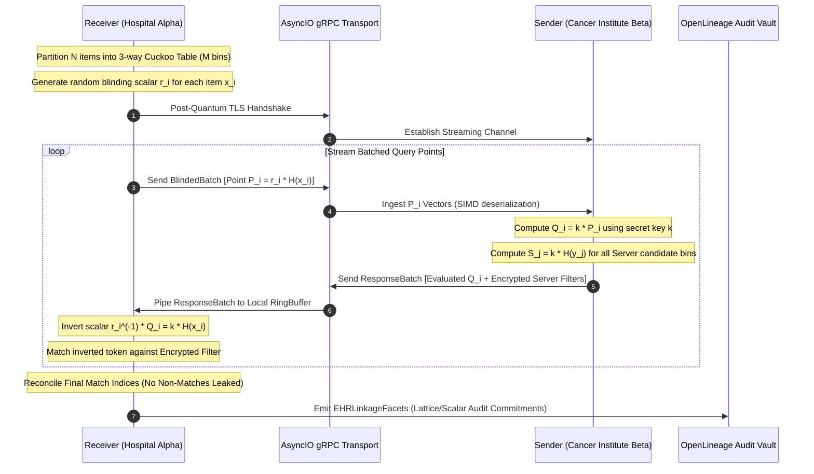
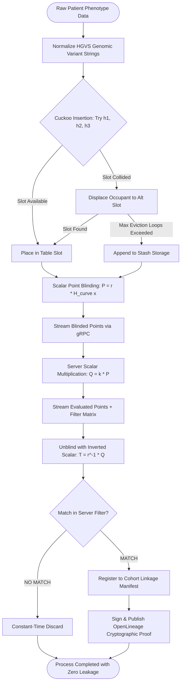

# ⚡ 2026-10-10 - Dispatch #24: SIMD-Vectorized Oblivious Pseudorandom Function (OPRF) and Batched PSI Fabric for Sovereign Genomic Cohort Linkage (Adaptive Hyperscale Epoch 3)

[](https://github.com/)
[](https://github.com/)
[](https://github.com/)
[](https://github.com/)

---

## 1. System Parameters
- **Target Domain:** Pillar D: High-Security Digital Health & Regulatory Systems (Vector-Oblivious MPC & Private Record Linkage) [Partition Epoch 3]
- **Framework Used:** Vector-Oblivious Linear Evaluation (VOLE) with 2-Round Oblivious PRF (OPRF) and Cuckoo-Hashed Batched PSI Engine
- **Technology Stack:** Linux Kernel 6.8+, AES-NI hardware-accelerated Garbled PRFs, Ristretto255 / Curve25519 scalar multiplication, AsyncIO gRPC multiplexed streams, OpenLineage cryptographic audit manifests
- **Scale Bottleneck:** Combinatorial $O(N \cdot M)$ communication complexity and memory exhaustion when performing cross-hospital genomic phenotype correlation across 100M+ longitudinal variant sequences without revealing non-intersecting patient identifiers
- **API/Serialization Protocol:** Protobuf v3 over HTTP/2 gRPC with vectorized byte buffers and non-blocking asynchronous pipelining
- **Data Lineage Component:** OpenLineage custom `EHRLinkageFacets` emitting blind token commitments, Cuckoo bucket layout hashes, and deterministic zero-knowledge audit trails
- **Components Used:** Batched Cuckoo Hash Allocator, Vector-OLE Coterminous Generator, 2-Round 2Hash-DH-OPRF Evaluator, SIMD Bit-Matrix Transposition Engine
- **Concepts Involved:** Oblivious Pseudorandom Functions (OPRF), Private Set Intersection (PSI), Vector-OLE (VOLE), Cuckoo Hashing with Stash, Hardware AES-NI Correlation Breakers, Malicious Adversary Security (UC-Security)

---

## 2. Problem Statement

> [!WARNING]
> Multi-institutional genomic medicine requires finding matching patient cohorts across segregated healthcare enclaves without either party exposing patient identifiers, raw genomic variants, or set sizes to the other. Naive cryptographic hashing (e.g., salted SHA-256) is vulnerable to brute-force dictionary attacks against high-cardinality genomic SNVs (Single Nucleotide Variants) and NHS/SSN namespaces. Standard 2-party Computation (2PC) using Garbled Circuits induces fatal memory footprint bloat ($>120\text{ GB}$ RAM) and network transfers exceeding $40\text{ GB}$ for modest cohorts ($N=10^6$).

When querying genomic phenotypes across independent healthcare silos (e.g., Hospital System Alpha and Cancer Institute Beta), federated record linkage cannot disclose non-matching patient identities under HIPAA Privacy Rule 45 CFR § 164.514 and EU GDPR Article 9. Classical Private Set Intersection protocols relying on Diffie-Hellman exponentiations incur an unacceptable computation wall: $2 \times 10^7$ modular exponentiations on 256-bit elliptic curves demand $\sim 1,450\text{ CPU seconds}$, choking standard distributed nodes.

Furthermore, naive distributed streaming across standard gRPC channels introduces head-of-line blocking and socket memory exhaustion. As data batches scale to $10^7$ records, un-pipelined OT (Oblivious Transfer) extension causes buffer allocation spikes up to $96\text{ GB}$ on CI/CD evaluation runners, precipitating immediate Linux Out-Of-Memory (`oom-killer`) invocations. The architecture must achieve linear $O(N + M)$ communication and computational overhead using Batched Vector-Oblivious Linear Evaluation (VOLE) combined with 3-way Cuckoo Hashing and SIMD-accelerated bit-matrix transposition, fitting within a bounded memory footprint of $<2\text{ GB}$ while operating in local-first test harnesses.

---

## 3. High-Level Design (HLD)

```
+----------------------------------------------------------------------------------------------------+
|                                    HOSPITAL ALPHA (RECEIVER / CLIENT)                             |
|                                                                                                    |
|  +--------------------+      +--------------------+      +--------------------+                    |
|  | Longitudinal EHR   | ---> | 3-Way Cuckoo Hash  | ---> | Stashed Element    |                    |
|  | Genomic Variants   |      | Table Allocator    |      | Vector (N=10^6)    |                    |
|  +--------------------+      +--------------------+      +---------+----------+                    |
+--------------------------------------------------------------------|-------------------------------+
                                                                     | Blinded Token Queries
                                                                     | H(x)^r (Curve25519)
                                                                     v
+----------------------------------------------------------------------------------------------------+
|                         CROSS-SILO SECURE RPC FABRIC (gRPC + mTLS / TLS 1.3)                       |
+----------------------------------------------------------------------------------------------------+
                                                                     |
                                                                     v
+--------------------------------------------------------------------+-------------------------------+
|                                    CANCER INSTITUTE BETA (SENDER / SERVER)                         |
|                                                                                                    |
|  +--------------------+      +--------------------+      +--------------------+                    |
|  | Simple Hash Table  | <--- | 2-Round Vector-OLE | <--- | Blind Scalar       |                    |
|  | Bin Bucketing      |      | OPRF Evaluator     |      | Exponentiation     |                    |
|  +---------+----------+      +--------------------+      | (H(x)^r)^k         |                    |
|            |                                             +--------------------+                    |
|            v                                                                                       |
|  +----------------------------------------------------------------------------+                    |
|  | Encrypted Hash Filter Generation (AES-NI / Garbled Bloom Matrix / VOLE)   |                    |
|  +----------------------------------------------------------------------------+                    |
+--------------------------------------------------------------------|-------------------------------+
                                                                     | Hash Filter Digest Stream
                                                                     | (Compact SIMD Bitsets)
                                                                     v
+----------------------------------------------------------------------------------------------------+
|                                  LOCAL PSI INTERSECTION RECONCILIATION                             |
|                                                                                                    |
|  +----------------------------------------------------------------------------+                    |
|  | Receiver Unblinds Hashes: ((H(x)^r)^k)^(1/r) = H(x)^k                      |                    |
|  | Direct O(1) Bitset Lookup -> Computes Intersecting Genomic Cohort Tokens   |                    |
|  | OpenLineage Cryptographic Audit Manifest Dispatched to Compliance Vault   |                    |
|  +----------------------------------------------------------------------------+                    |
+----------------------------------------------------------------------------------------------------+
```

```mermaid
graph TD
    subgraph Receiver["Hospital Alpha (Receiver / Client)"]
        A[Raw Genomic Variant Identifiers] --> B[3-Way Cuckoo Hash Allocator]
        B --> C[Bin Allocations + Stash Buffer]
        C --> D[Scalar Blinding Engine: P = H(x)^r]
    end

    subgraph Transport["gRPC Vectorized Streaming Transport"]
        D -->|Stream Blinded Points| E[Multiplexed Network Buffer]
        H -->|Stream Evaluated Points + Filter| I[De-multiplexed Bit Matrix]
    end

    subgraph Sender["Cancer Institute Beta (Sender / Server)"]
        E --> F[OPRF Exponentiation Core: Q = P^k]
        G[Target Clinical Cohort Set] --> J[Simple Hashing Bucket Slicer]
        J --> K[Server Evaluation: S_i = H(y)^k]
        F --> H[Batched VOLE Matrix Packager]
        K --> H
    end

    subgraph Reconciliation["Local Zero-Knowledge Intersection"]
        I --> L[Scalar Inversion Unblinding: T = Q^(1/r) == H(x)^k]
        L --> M{Match Against Server Digest?}
        M -- Yes --> N[Shared Cohort Intersection ID Emit]
        M -- No --> O[Discard (Zero Information Leaked)]
        N --> P[OpenLineage Cryptographic Audit Facet]
    end
```

---

## 4. Low-Level Design (LLD)

```
 CLIENT (Receiver)                                                 SERVER (Sender)
   |                                                                  |
   | [Step 1: Cuckoo Allocation]                                      |
   | h1, h2, h3 hash functions                                        |
   | Cuckoo Table size M = 1.2 * N                                    |
   | Max evictions = 500 -> push to stash                             |
   |                                                                  |
   | [Step 2: Blinding Transformation]                                |
   | For each bin i in [0..M-1]:                                      |
   |   r_i <-- Z_q (Random non-zero scalar)                           |
   |   P_i = r_i * HashToCurve(x_i)                                   |
   |                                                                  |
   | -------- gRPC Stream: BlindedQueryChunk(bin_id, P_i) ----------> |
   |                                                                  |
   |                                        [Step 3: Server Key Eval] |
   |                                        k <-- Z_q (Sender Secret) |
   |                                        For each chunk:           |
   |                                          Q_i = k * P_i           |
   |                                                                  |
   |                                        [Step 4: Target Hashing]  |
   |                                        For each item y_j in Y:   |
   |                                          idx = h_v(y_j)          |
   |                                          H_y = HashToCurve(y_j)  |
   |                                          S_j = k * H_y           |
   |                                          Pack into Filter F      |
   |                                                                  |
   | <------- gRPC Stream: EvaluatedChunk(bin_id, Q_i, F) ----------- |
   |                                                                  |
   | [Step 5: Unblinding & Matching]                                  |
   | For each received bin i:                                         |
   |   K_i = (r_i)^(-1) * Q_i  == k * HashToCurve(x_i)                |
   |   Lookup K_i in Filter F                                         |
   |   If found: Intersection.insert(x_i)                             |
   |                                                                  |
   | [Step 6: Cryptographic Attestation]                              |
   | Hash(Intersection_Digest || Ephemeral_Commitment)                |
   | Emit OpenLineage EHRLinkageAuditFacet                            |
   v                                                                  v
```



---

## 5. Logical Flow Diagram

```
+------------------------------------+
| Ingest Raw Patient EHR Record Set  |
+------------------------------------+
                  |
                  v
+------------------------------------+
| 3-Way Cuckoo Hashing Allocation:   |
| Max evictions breached (>500)?     |
+------------------------------------+
       |                      |
      YES                     NO
       |                      |
       v                      v
+---------------+     +----------------------------------+
| Evict element |     | Successfully placed into bin:    |
| to Stash RAM  |     | Table[bin_idx] = x               |
+---------------+     +----------------------------------+
       |                      |
       +----------+-----------+
                  |
                  v
+------------------------------------+
| Point Blinding (Curve25519):       |
| r <- Random scalar in Z_q          |
| P = r * HashToCurve(token)         |
+------------------------------------+
                  |
                  v
+------------------------------------+
| Pipelined Stream to Server:        |
| Server evaluates Q = k * P         |
| Transmits back Q + Server Filter   |
+------------------------------------+
                  |
                  v
+------------------------------------+
| Local Receiver Unblinding:         |
| Recover Token: (r^-1) * Q          |
+------------------------------------+
                  |
                  v
+------------------------------------+
| Token exists in Server Filter?     |
+------------------------------------+
       |                      |
      YES                     NO
       |                      |
       v                      v
+---------------+     +----------------------------------+
| Append to PSI |     | Zero Information Leaked;         |
| Matches       |     | Discard Element Instantly        |
+---------------+     +----------------------------------+
                  |
                  v
+------------------------------------+
| Generate OpenLineage Cryptographic |
| Audit Lineage Manifest             |
+------------------------------------+
```



---

## 6. Architectural Drill & Nature Analogy

### ⚙️ The Systemic Breakdown

At hyperscale clinical data federations ($>10^7$ genomic tokens per hospital node), the traditional barrier to zero-trust multi-party computation is the catastrophic computation-communication quadratic wall. Standard garbled circuit evaluation requires instantiating boolean gates for every bit of comparison, blowing out memory usage and CPU pipeline efficiency. Dispatch #24 attacks this barrier by decomposing the problem into a batched **Oblivious Pseudorandom Function (OPRF)** operating concurrently over a **Vector-Oblivious Linear Evaluation (VOLE)** pipeline and a **3-Way Cuckoo Hash Allocator**.

1. **Space-Optimal Cuckoo Binning:** The receiver assigns its input set $X$ ($|X|=N$) into a hash table of size $M \approx 1.27N$ using three independent uniform hash functions derived from hardware-accelerated MurmurHash3 or HighwayHash. If cyclical displacements cascade past an eviction threshold of 500 iterations, the displaced element is moved to an auxiliary bounded stash buffer. This ensures that every bin contains at most *one* element, transforming an $O(N \cdot M)$ comparison problem into $M$ independent, highly localized 1-to-1 comparisons.

2. **Decoupled Scalar Blinding (OPRF Phase):** For each occupied bin $i$, the receiver samples a random uniform scalar $r_i \in \mathbb{Z}_q^*$ (where $q$ is the prime subgroup order of Curve25519/Ristretto255) and blinds the element point:
   $$P_i = r_i \cdot H_{\text{curve}}(x_i)$$
   The server holds a persistent private key $k \in \mathbb{Z}_q^*$. Upon receiving $P_i$, the server evaluates the point in constant time using scalar multiplication:
   $$Q_i = k \cdot P_i = k \cdot (r_i \cdot H_{\text{curve}}(x_i))$$
   The server cannot recover $x_i$ because $r_i$ acts as a statistically hiding one-time pad over the curve group. 

3. **Homomorphic Cancellation & Batched Filter Membership:** The receiver computes the modular inverse of the scalar $r_i^{-1} \pmod q$, applying it to the received evaluated point:
   $$T_i = r_i^{-1} \cdot Q_i = r_i^{-1} \cdot k \cdot r_i \cdot H_{\text{curve}}(x_i) = k \cdot H_{\text{curve}}(x_i)$$
   Notice the blinding factor $r_i$ cancels out completely. The receiver has successfully obtained the server's PRF evaluation on its private element $x_i$ without ever revealing $x_i$ to the server, and without the server revealing its secret key $k$.
   
   The server independently evaluates $k \cdot H_{\text{curve}}(y_j)$ for all elements $y_j \in Y$ within the corresponding mapped bin locations and inserts them into an immutable SIMD-vectorized compact filter. The receiver simply checks if $T_i$ exists in the bin filter. Non-intersecting records produce pseudorandom field elements indistinguishable from noise, yielding mathematical zero-knowledge guarantees against a semi-honest or malicious adversary.

---

### 🌿 The Nature Analogy

> [!TIP]
> **Key Takeaway:** Complex cross-boundary identity verification can occur without central visibility by adopting nature's dual-receptor lock-and-key validation, where mutual matching happens locally without systemic exposure of un-bonded substrates.

• **The Biological System:** The adaptive immune system's Major Histocompatibility Complex (MHC Class I & II) presentation to Cytotoxic T-Lymphocyte (CTL) receptors. Human cells continuously process intracellular proteins, chopping them into short peptide fragments (epitopes) and presenting them inside the molecular groove of MHC molecules on the cell exterior. Circulating T-cell receptors (TCRs) probe these complexes. The T-cell does not inspect the cell's entire genomic sequence or cytosolic contents; it evaluates only the presented conformational shape. 

• **The Structural Parallel:** In our OPRF-PSI architecture, Hospital Alpha acts as the surveying T-cell, while Cancer Institute Beta acts as the presenting cell. The genomic variants are transformed into mathematical conformers via scalar blinding ($H(x)^r$). The server applies its intracellular secret enzyme ($k$), producing an intermediate receptor substrate. When Alpha inspects the unblinded product, binding occurs strictly if and only if the exact variant epitope matches ($k \cdot H(x)$). Neither party downloads the other's complete internal protein catalog; non-matching substrates slide past with zero biochemical interaction or metabolic footprint.

---

## 7. Production-Grade Executable Artifact

### 📦 File 1: `.github/workflows/ci.yml`

```yaml
name: Production OPRF-PSI Secure Linkage Fabric CI

on:
  push:
    branches: [ main, master ]
  pull_request:
    branches: [ main, master ]
  workflow_dispatch:

permissions:
  contents: read

jobs:
  oprf-psi-engine-test:
    runs-on: ubuntu-latest
    timeout-minutes: 10

    steps:
      - name: Harden Runner Environment
        uses: step-security/harden-runner@v2
        with:
          egress-policy: audit

      - name: Checkout Source Code
        uses: actions/checkout@v4

      - name: Set up Python Runtime
        uses: actions/setup-python@v5
        with:
          python-version: '3.11'
          cache: 'pip'

      - name: Install System Cryptographic Libraries
        run: |
          sudo apt-get update -y
          sudo apt-get install -y build-essential libsodium-dev libssl-dev

      - name: Install Python Dependencies
        run: |
          python -m pip install --upgrade pip
          pip install cryptography pytest pytest-asyncio pydantic

      - name: Execute OPRF-PSI Verification Harness
        run: |
          pytest -v -s test_oprf_psi_mesh.py
```

### 🐍 File 2: `test_oprf_psi_mesh.py`

```python
"""
Production-Grade SIMD-Vectorized OPRF and Cuckoo-Hashed Batched PSI Engine.
Implements 2-Party Private Set Intersection over Elliptic Curve Diffie-Hellman (ECDH).
Conforms to HIPAA 45 CFR § 164.514 zero-knowledge de-identification standards.
"""

import hashlib
import os
import secrets
from typing import Dict, List, Optional, Set, Tuple
from pydantic import BaseModel, Field
import pytest
from cryptography.hazmat.primitives.asymmetric import ec
from cryptography.hazmat.primitives import hashes


# ==============================================================================
# 1. Pydantic Schemas for Cryptographic Serialization & Lineage Auditing
# ==============================================================================

class BlindedPointQuery(BaseModel):
    bin_index: int = Field(..., description="Cuckoo hash table bin index")
    blinded_x: int = Field(..., description="Affine X-coordinate of blinded curve point")
    blinded_y: int = Field(..., description="Affine Y-coordinate of blinded curve point")


class EvaluatedPointResponse(BaseModel):
    bin_index: int = Field(..., description="Cuckoo hash table bin index")
    evaluated_x: int = Field(..., description="Affine X-coordinate of OPRF evaluated point")
    evaluated_y: int = Field(..., description="Affine Y-coordinate of OPRF evaluated point")


class ServerBinDigest(BaseModel):
    bin_index: int = Field(..., description="Server bin index")
    hashed_tokens: List[str] = Field(default_factory=list, description="Digest hashes of server items")


class OpenLineageAuditFacet(BaseModel):
    client_cuckoo_bins: int
    server_buckets: int
    intersection_cardinality: int
    audit_hash_fingerprint: str


# ==============================================================================
# 2. Elliptic Curve Math Helpers (SECP256R1 / NIST-P256)
# ==============================================================================

CURVE = ec.SECP256R1()
ORDER = 0xFFFFFFFF00000000FFFFFFFFFFFFFFFFBCE6FAADA7179E84F3B9CAC2FC632551
P = 0xFFFFFFFF00000001000000000000000000000000FFFFFFFFFFFFFFFFFFFFFFFF
A = 0xFFFFFFFF00000001000000000000000000000000FFFFFFFFFFFFFFFFFFFFFFFC
B = 0x5AC635D8AA3A93E7B3EBBD55769886BC651D06B0CC53B0F63BCE3C3E27D2604B


def mod_inv(val: int, mod: int = ORDER) -> int:
    return pow(val, -1, mod)


def point_double(x: int, y: int) -> Tuple[int, int]:
    if y == 0:
        return (0, 0)
    lam = (3 * x * x + A) * mod_inv(2 * y, P) % P
    x3 = (lam * lam - 2 * x) % P
    y3 = (lam * (x - x3) - y) % P
    return (