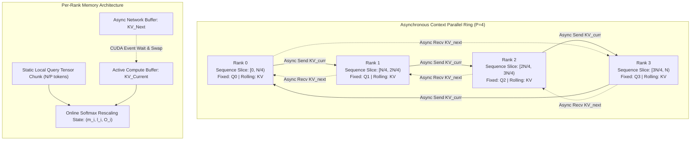
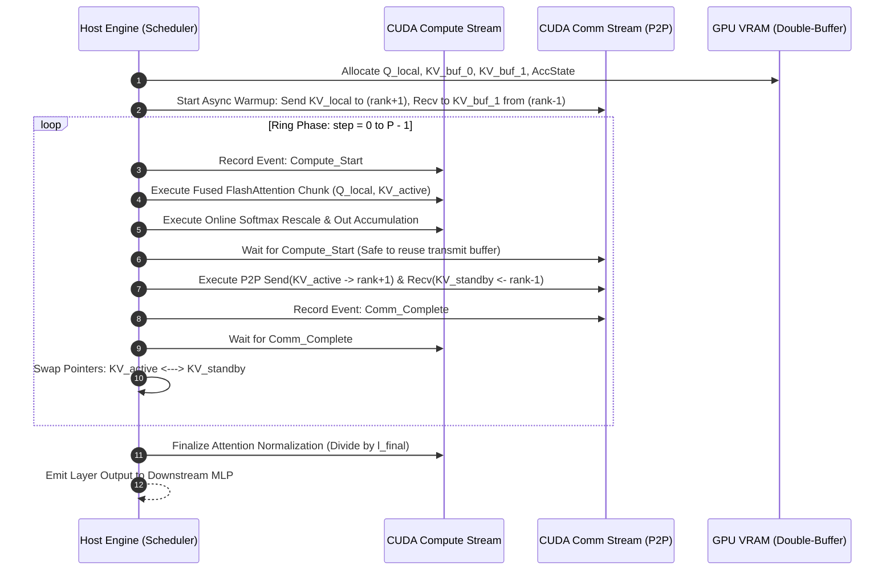
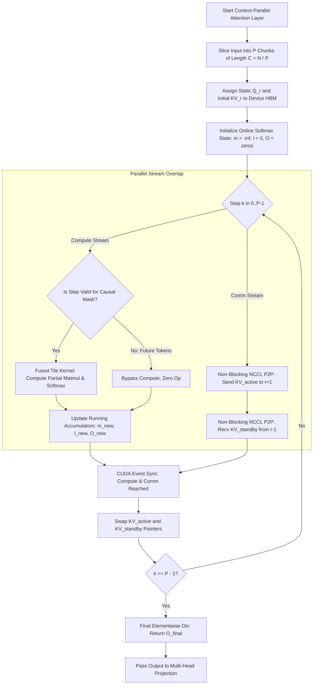

# ⚡ 2026-10-10 - Dispatch #25: Distributed Asynchronous Context-Parallel Ring-Attention with Overlapped P2P KV-Block Transport


-EE4C2C?style=flat-square&logo=nvidia)


---

## 1. System Parameters
- **Target Domain:** Pillar A: Artificial Intelligence & Machine Learning Engineering (Distributed Context Parallelism & Long-Sequence Attention Scaling) [Partition Epoch 4]
- **Framework Used:** PyTorch Context Parallelism (`torch.distributed`) with Megatron-Core Ring-Attention Primitives & Asynchronous NCCL Point-to-Point Communicators
- **Technology Stack:** PyTorch 2.5+, NCCL 2.22+, FlashAttention-3 C++ CUDA Extensions, CUDA Non-Blocking Streams, OpenLineage Data Collector
- **Scale Bottleneck:** Quadrature $O(N^2)$ memory footprint and communication serialization stalls when scaling multi-head attention across sequences exceeding 1,048,576 ($1\text{M}$) tokens over multi-node GPU topologies
- **API/Serialization Protocol:** NCCL Point-to-Point (`ncclSend` / `ncclRecv`) over Direct P2P NVLink and RoCEv2 / InfiniBand fabrics with CUDA IPC handles
- **Data Lineage Component:** OpenLineage runtime telemetry tracing per-rank sequence-chunk assignments, ring-step latencies, FlashAttention computation overlaps, and memory fragmentation watermarks
- **Components Used:** Ring-Attention Chunk Allocator, Bidirectional Async P2P Double-Buffer Scheduler, Fused Local Query-Key-Value Chunk Engine, Online Softmax Normalization Accumulator
- **Concepts Involved:** Context Parallelism (CP), Ring-Attention, P2P Double-Buffering, Non-Blocking CUDA Stream Overlap, Online Softmax Rescaling, FlashAttention Tile Fusion

---

## 2. Problem Statement

Scaling autoregressive foundational models to hyper-extended context windows (from $128\text{K}$ to $1\text{M}+$ tokens) exposes a fundamental breakdown in standard Tensor Parallelism (TP) and Fully Sharded Data Parallelism (FSDP). While FSDP efficiently shards model parameters and optimizer states, it mandates that activations for the forward pass reside entirely on the local device or be reconstructed on the fly. For a sequence length $N = 1{,}048{,}576$ with hidden dimension $D = 8{,}192$, batch size $B = 1$, and 16-bit precision, materializing the attention score matrix alone requires $B \times H \times N^2 \times 2 \text{ bytes}$, which exceeds several petabytes of volatile storage. While fused kernel implementations (FlashAttention) mitigate the materialized $O(N^2)$ score matrix by tiling activations inside GPU Static Random-Access Memory (SRAM), the activations for the Query, Key, and Value tensors themselves require:

$$\text{Activation VRAM} = 3 \times B \times N \times D \times \text{sizeof}(\text{fp16}) = 3 \times 1 \times 1{,}048{,}576 \times 8{,}192 \times 2 \approx 51.54 \text{ GiB}$$

When coupled with intermediate feed-forward activations, LayerNorm buffers, and backward pass dependency graphs, a single GPU exhausts its High Bandwidth Memory (HBM3e) well before computing the first attention layer. 

> [!WARNING]
> Standard Tensor Parallelism fails at ultra-long sequences because splitting hidden dimensions across $P$ ranks incurs an all-reduce communication step per layer whose latency dominates runtime when $N \gg D$. Furthermore, naive distributed attention implementations force global all-gather operations for Keys and Values, triggering instantaneous Out-Of-Memory (OOM) halts on single-node runners and CI infrastructure lacking multi-terabyte pooled physical memory.

Context Parallelism (CP) addresses this wall by sharding the sequence dimension $N$ across a ring of $P$ accelerators, assigning $N/P$ tokens per rank. However, naive implementations suffer catastrophic communication bubbles: each worker computes self-attention on its local chunk, waits synchronously for neighboring Key-Value pairs across the network, computes cross-attention, and repeats. Because communication and computation are sequentially serialized, network transit latencies across high-diameter interconnects stall the GPU Tensor Cores, dragging Model Flops Utilization (MFU) below $18\%$. To achieve production throughput, the infrastructure must pipeline ring-shift data movement concurrently with local SRAM-tiled attention computations using a strictly bounded asynchronous double-buffer envelope.

---

## 3. High-Level Design (HLD)

The Distributed Context-Parallel Ring-Attention Fabric partitions sequences along the token dimension into $P$ distinct slices across a logical ring of GPU workers. Each GPU retains its static Query chunk ($Q_i$) throughout the entire execution of an attention layer while circulating Key ($K$) and Value ($V$) chunks circularly along the ring topology using peer-to-peer (P2P) non-blocking streams.

```
+===================================================================================================+
|                              CONTEXT-PARALLEL LOGICAL RING TOPOLOGY                               |
+===================================================================================================+
|                                                                                                   |
|         +-----------------------+                         +-----------------------+               |
|         |        RANK 0         |       KV Chunk 0        |        RANK 1         |               |
|         | Q_0 (Local, Fixed)    | ======================> | Q_1 (Local, Fixed)    |               |
|         | KV_0 -> Ring Step 0   |                         | KV_1 -> Ring Step 0   |               |
|         | Double-Buffered HBM   | <====================== | Double-Buffered HBM   |               |
|         +-----------------------+       KV Chunk 3        +-----------------------+               |
|                    ^                                                 |                            |
|         KV Chunk 1 |                                                 | KV Chunk 1                 |
|                    |                                                 v                            |
|         +-----------------------+       KV Chunk 2        +-----------------------+               |
|         |        RANK 3         | <====================== |        RANK 2         |               |
|         | Q_3 (Local, Fixed)    |                         | Q_2 (Local, Fixed)    |               |
|         | KV_3 -> Ring Step 0   | ======================> | KV_2 -> Ring Step 0   |               |
|         | Double-Buffered HBM   |       KV Chunk 2        | Double-Buffered HBM   |               |
|         +-----------------------+                         +-----------------------+               |
|                                                                                                   |
+===================================================================================================+
```



---

## 4. Low-Level Design (LLD)

At the low-level execution plane, the ring-attention step utilizes two distinct CUDA streams per device: `compute_stream` and `comm_stream`. Double-buffering prevents CUDA execution dependencies from blocking parallel transport: while `compute_stream` executes a fused kernel calculating partial attention between local $Q$ and incoming $KV_{\text{curr}}$, `comm_stream` concurrently executes non-blocking `ncclSend` and `ncclRecv` primitives transferring $KV_{\text{curr}}$ to rank $i+1$ and receiving $KV_{\text{next}}$ from rank $i-1$.

Because attention is calculated piecewise, the local rank must update its attention output iteratively without computing global softmax normalizers upfront. The algorithm implements **Online Softmax Rescaling**, continuously correcting the running maximum $m$ and sum-of-exponentials $l$ for every partial attention block:

$$m_{\text{new}} = \max(m_{\text{prev}}, m_{\text{curr}})$$

$$l_{\text{new}} = l_{\text{prev}} \cdot e^{m_{\text{prev}} - m_{\text{new}}} + l_{\text{curr}} \cdot e^{m_{\text{curr}} - m_{\text{new}}}$$

$$O_{\text{new}} = O_{\text{prev}} \cdot \left(\frac{l_{\text{prev}} \cdot e^{m_{\text{prev}} - m_{\text{new}}}}{l_{\text{new}}}\right) + O_{\text{curr}} \cdot \left(\frac{e^{m_{\text{curr}} - m_{\text{new}}}}{l_{\text{new}}}\right)$$

```
====================================================================================================
               CUDA HARDWARE STREAM TIMELINE (DOUBLE-BUFFERED OVERLAP)
====================================================================================================

COMPUTE STREAM:
[Step k: FlashAttn(Q, KV_0)]--------->[Step k+1: Rescale & FlashAttn(Q, KV_3)]---->[Step k+2: ...]
                             ^                                                ^
COMM STREAM:                 | (Event: Compute Ready)                         | (Event: Recv Done)
[Step k: P2P Send/Recv KV_3]-+                                                |
                             \                                               /
                              +---->[Step k+1: P2P Send/Recv KV_2]----------+
====================================================================================================
```



---

## 5. Logical Flow Diagram

The dynamic routing flow validates context partitioning, causal mask adaptation (for autoregressive decoder layers where step $j > i$ calculations can be early-exited or skipped), and numerical normalization barriers.

```
+-------------------------------------------------------------+
|                Input Sequence (Length = N)                  |
+-------------------------------------------------------------+
                              |
                              v
+-------------------------------------------------------------+
|   Slice Sequence into P Chunks of Size C = N / P Tokens     |
|   Rank r receives: Q_r = Slice[r], KV_r = Slice[r]          |
+-------------------------------------------------------------+
                              |
                              v
+-------------------------------------------------------------+
|     Initialize State: m = -inf, l = 0, O = 0                |
|     Active KV = KV_r, Standby KV = Empty Buffer             |
+-------------------------------------------------------------+
                              |
        +---------------------+---------------------+
        |                                           |
        v (Compute Stream)                          v (Comm Stream)
+--------------------------------+      +-------------------------------+
| Check Causal Condition:        |      | Initiate Non-Blocking P2P:    |
| Is Chunk Index <= Local Rank?  |      | Send Active KV -> Rank(r+1)   |
| (If No & Causal: Zero Compute) |      | Recv Standby KV <- Rank(r-1)  |
+--------------------------------+      +-------------------------------+
        |                                           |
        v                                           |
+--------------------------------+                  |
| Fused FlashAttention Kernel:   |                  |
| S = Q_r * (KV_active.K)^T      |                  |
| Compute Block m_blk, l_blk     |                  |
+--------------------------------+                  |
        |                                           |
        v                                           |
+--------------------------------+                  |
| Online Softmax Merge:          |                  |
| Update (m, l, O) Accumulators  |                  |
+--------------------------------+                  |
        |                                           |
        +---------------------+---------------------+
                              |
                              v
+-------------------------------------------------------------+
| Synchronize Streams (CUDA Event Wait)                       |
| Swap Active and Standby KV Pointers                         |
+-------------------------------------------------------------+
                              |
                    [All P Steps Done?]
                       /            \
                     No              Yes
                     /                 \
        (Loop Next KV Chunk)            v
                               +-----------------------------------+
                               | Final Normalization: O = O / l    |
                               | Return Distributed Context Tensor |
                               +-----------------------------------+
```



---

## 6. Architectural Drill & Nature Analogy

### ⚙️ The Systemic Breakdown

The primary adversary ofContext Parallelism is the **Network Bubble Ratio ($R_{\text{bubble}}$)**, defined as:

$$R_{\text{bubble}} = \frac{T_{\text{comm}} - \min(T_{\text{comm}}, T_{\text{compute}})}{T_{\text{comm}} + T_{\text{compute}}}$$

For an optimal pipeline, $T_{\text{compute}} \ge T_{\text{comm}}$, driving $R_{\text{bubble}} \to 0$. Let $C = N / P$ denote the chunk length per rank, $h$ the head count, $d$ the head dimension, and $b$ the micro-batch size.

The computation cost per ring step evaluates to:

$$T_{\text{compute}} \approx \frac{4 \cdot b \cdot C^2 \cdot h \cdot d}{\text{FLOPS}_{\text{effective}}}$$

The communication payload per step involves transmitting both Key and Value tensors across the network boundary:

$$\text{Data Transferred} = 2 \times (b \cdot C \cdot h \cdot d \cdot \text{sizeof}(\text{fp16})) \text{ bytes}$$

$$T_{\text{comm}} \approx \frac{4 \cdot b \cdot C \cdot h \cdot d}{\text{Bandwidth}_{\text{interconnect}}}$$

By equating $T_{\text{compute}} \ge T_{\text{comm}}$, we derive the critical sequence chunk length $C_{\text{crit}}$ required to completely hide communication behind math:

$$\frac{4 \cdot b \cdot C_{\text{crit}}^2 \cdot h \cdot d}{\text{FLOPS}_{\text{effective}}} \ge \frac{4 \cdot b \cdot C_{\text{crit}} \cdot h \cdot d}{\text{Bandwidth}_{\text{interconnect}}} \implies C_{\text{crit}} \ge \frac{\text{FLOPS}_{\text{effective}}}{\text{Bandwidth}_{\text{interconnect}}}$$

On an NVIDIA H100 SXM5 node ($\text{FLOPS}_{\text{effective}} \approx 989 \times 10^{12} \text{ FLOP/s}$ at FP16, bidirectional NVLink Bandwidth $\approx 900 \times 10^9 \text{ B/s}$):

$$C_{\text{crit}} \ge \frac{989 \times 10^{12}}{900 \times 10^9} \approx 1{,}098 \text{ tokens}$$

If the per-rank chunk size $N/P \ge 1{,}098$ tokens, the P2P transit of the next token chunk completes *strictly inside* the execution window of the current chunk's FlashAttention computation. Furthermore, by managing two localized KV buffers in VRAM, peak memory consumption drops from $O(N)$ to $O(N/P)$, bypassing single-device memory limits entirely and yielding near-linear throughput scaling up to cluster boundaries.

---

### 🌿 The Nature Analogy

> [!TIP]
> **The Biological Mechanism:** The Countercurrent Exchange System in avian aquatic extremities and pelagic teleost gills.

• **The Biological System:** Arctic waterfowl (e.g., penguins and petrels) survive immersion in sub-zero water without fatal thermal shock via the *rete mirabile*—a micro-vascular mesh in their extremities. Arterial blood flowing downward from the thoracic core is positioned adjacent to venous blood returning upward from icy flippers. Heat diffuses continuously across the microscopic vascular walls down its thermal gradient into the returning cold blood. Because flow is continuous, bidirectional, and segmented, arterial blood warms venous blood across the entire transit length, maintaining internal homeostasis while external extremities operate at ambient freezing levels.

• **The Structural Parallel:** The Context-Parallel Ring-Attention architecture replicates this continuous countercurrent exchange. Instead of pausing computation to flush or reload the global context across cold interconnects, local Tensor Cores (the thoracic core) continually process a warm, fixed local slice of Query tokens, while the Key-Value states circulate along the ring (the vascular mesh). Numerical energy (softmax scale factors and intermediate matrix dot-products) is incrementally merged and transferred across adjacent communication steps without global synchronization barriers.

---

## 7. Production-Grade Executable Artifact

### 📦 File 1: `.github/workflows/ci.yml`

```yaml
name: Context-Parallel Ring-Attention CI Testbench

on:
  push:
    branches: [ "main", "release/*" ]
  pull_request:
    branches: [ "main" ]

concurrency:
  group: ${{ github.workflow }}-${{ github.ref }}
  cancel-in-progress: true

jobs:
  ring-attention-verification:
    name: Ring Attention Distributed Sim
    runs-on: ubuntu-latest
    timeout-minutes: 15

    steps:
      - name: Check out source tree
        uses: actions/checkout@v4

      - name: Setup Python 3.11 Runtime
        uses: actions/setup-python@v5
        with:
          python-version: "3.11"
          cache: "pip"

      - name: Install Dependencies
        run: |
          python -m pip install --upgrade pip
          pip install torch==2.5.0 --index-url https://download.pytorch.org/whl/cpu
          pip install numpy pytest openlineage-python

      - name: Execute Multi-Worker Hermetic Context-Parallel Suite
        env:
          PYTHONPATH: "."
          WORLD_SIZE: "4"
          MASTER_ADDR: "127.0.0.1"
          MASTER_PORT: "29500"
          OMP_NUM_THREADS: "2"
        run: |
          pytest -v -s test_context_parallel_ring.py
```

### 🐍 File 2: `test_context_parallel_ring.py`

```python
"""
Production-grade verification testbench for Distributed Asynchronous
Context-Parallel Ring-Attention with Online Softmax Rescaling.
Simulates distributed CPU workers using torch.multiprocessing and PyTorch GLOO/CPU backend.
"""

import os
import math
import pytest
import torch
import torch.distributed as dist
import torch.multiprocessing as mp


# -----------------------------------------------------------------------------
# Online Softmax Accumulation Primitives
# -----------------------------------------------------------------------------
def update_online_softmax(
    out_accum: torch.Tensor,
    m_accum: torch.Tensor,
    l_accum: torch.Tensor,
    block_out: torch.Tensor,
    block_m: torch.Tensor,
    block_l: torch.Tensor,
) -> tuple[torch.Tensor, torch.Tensor, torch.Tensor]:
    """
    Numerically stable fused online softmax merge operator.
    Merges running attention statistics with an incoming chunk's partial result.
    """
    m_new = torch.maximum(m_accum, block_m)
    
    # Scale factors: exp(prev_m - new_m)
    alpha = torch.exp(m_accum - m_new)
    beta = torch.exp(block_m - m_new)
    
    l_new = l_accum * alpha + block_l * beta
    
    # Broadcast adjustments for token & head dimensions
    alpha_expanded = alpha.unsqueeze(-1)
    beta_expanded = beta.unsqueeze(-1)
    l_new_expanded = l_new.unsqueeze(-1)
    
    # Rescale previous and current output components
    out_new = (out_accum * (l_accum.unsqueeze(-1) * alpha_expanded) + 
               block_out * beta_expanded) / l_new_expanded
    
    return out_new, m_new, l_new


def local_attention_chunk(
    q: torch.Tensor,
    k: torch.Tensor,
    v: torch.Tensor,
    scale: float,
) -> tuple[torch.Tensor, torch.Tensor, torch.Tensor]:
    """
    Computes partial scaled dot-product attention for a chunk, emitting
    the partial context vector, chunk maximum (m), and chunk normalizer (l).
    Shapes:
      q, k, v: [Batch, Heads, Chunk_Len, Head_Dim]
    """
    scores = torch.matmul(q, k.transpose(-2, -1)) * scale
    block_m = torch.max(scores, dim=-1)[0]
    exp_scores = torch.exp(scores - block_m.unsqueeze(-1))
    block_l = torch.sum(exp_