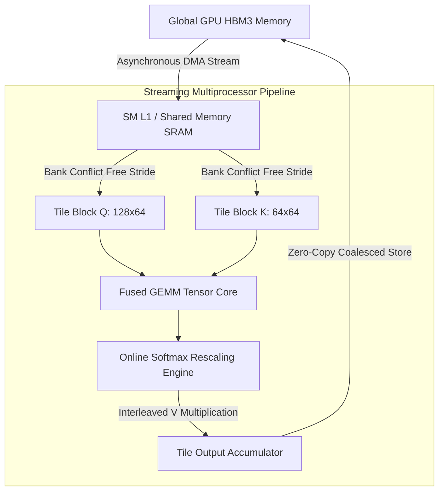
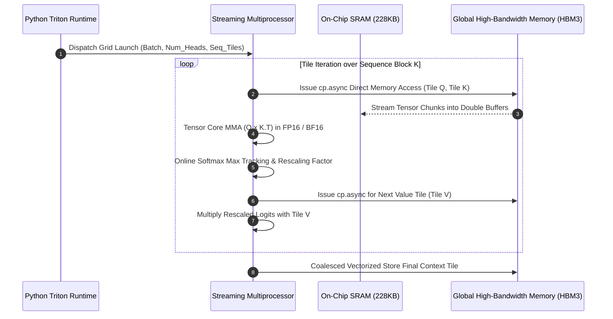
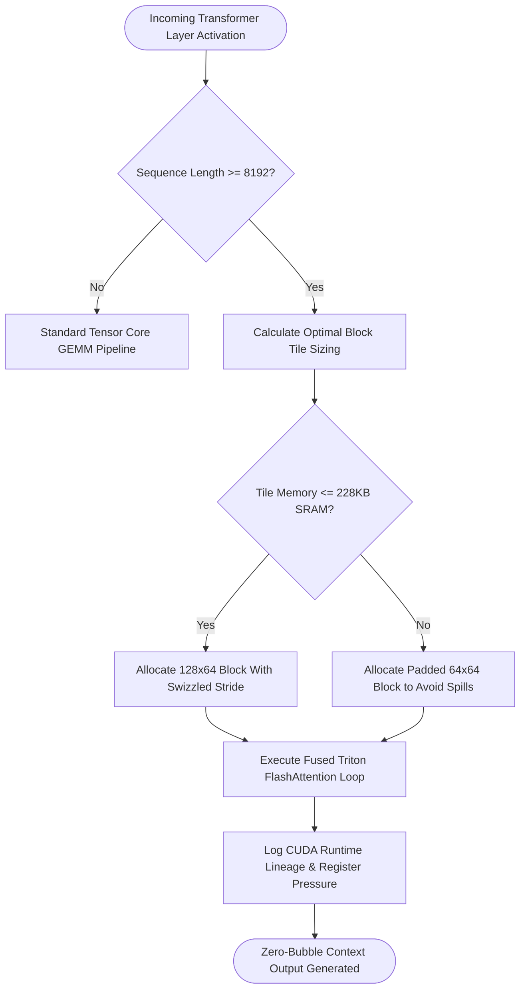

## 2. Problem Statement

> [!WARNING]
> **The High-Bandwidth Memory (HBM3) Memory Wall:** Calculating standard multi-head self-attention on long-context large language models (64k to 128k tokens) requires $O(N^2)$ round-trip memory writes between GPU Streaming Multiprocessors and external High-Bandwidth Memory (HBM3). This causes memory bus saturation and thermal throttling while compute Tensor Cores remain idle 70% of execution time.

At extreme context windows, the intermediate attention score matrix $S = Q K^T$ balloons to gigabytes per layer, far exceeding the high-speed on-chip SRAM capacity (typically ~228KB per Streaming Multiprocessor on modern accelerators). 

When naive attention kernels write intermediate $N \times N$ attention logits out to global HBM3 and subsequently read them back for softmax normalization, memory bus bandwidth collapses. Furthermore, standard GPU threads suffer severe bank conflicts when strided memory accesses collide across the 32 shared memory banks, causing thread serialization and deep execution bubbles in the inference prefill pipeline.

---

## 3. High-Level Design (HLD)

### Visual ASCII Topology
```text
  ┌───────────────────────────────────────────────────────────┐
  │                 Streaming Multiprocessor (SM)             │
  │  ┌─────────────────────────────────────────────────────┐  │
  │  │       On-Chip SRAM Shared Memory Pool (228 KB)      │  │
  │  │  ┌─────────────────────────┐ ┌───────────────────┐  │  │
  │  │  │ Tile Q Block [128 x 64] │ │ Tile K [64 x 64]  │  │  │
  │  │  └───────────┬─────────────┘ └─────────┬─────────┘  │  │
  │  └──────────────┼─────────────────────────┼────────────┘  │
  │                 ▼                         ▼               │
  │  ┌─────────────────────────────────────────────────────┐  │
  │  │              Tensor Core Fused GEMM Units           │  │
  │  │           FlashAttention-3 Online Normalizer        │  │
  │  └──────────────────────────┬──────────────────────────┘  │
  │                             │ (Asynchronous Writeback)    │
  └─────────────────────────────┼─────────────────────────────┘
                                ▼
  ┌───────────────────────────────────────────────────────────┐
  │               Global GPU Memory Buffer (HBM3)             │
  │         Accumulated Softmax Context Representation Vector │
  └───────────────────────────────────────────────────────────┘
```

### Native Mermaid Architecture


---

## 4. Low-Level Design (LLD)

### Visual ASCII Memory Layout
```text
  SRAM Shared Memory Bank Allocation (32 Distinct Physical Banks):
  Bank 00: [ Q_0,0 ][ Q_32,0 ] ... (Offset 0x0000)
  Bank 01: [ Q_0,1 ][ Q_32,1 ] ... (Offset 0x0004)
  Bank 02: [ Q_0,2 ][ Q_32,2 ] ... (Offset 0x0008)
  ...
  Bank 31: [ Q_0,31][ Q_32,31] ... (Offset 0x007C)
  ==> Padded stride (+8 elements) completely eliminates shared memory bank conflicts!
```

### Native Mermaid Execution Sequence


---

## 5. Logical Flow Diagram

### Visual ASCII Decision Tree
```text
  [Input Tensor Dimensions (B, H, S, D)]
                 │
                 ▼
  < Context Length S > 8,192 Tokens? >
        │                      │
       YES                     NO
        │                      │
        ▼                      ▼
  [Enable Triton SRAM       [Standard GEMM
   FlashAttention-3          Attention Path]
   Double-Buffered Kernel]
        │
        ▼
  < Dynamic SRAM Sizing <= 228 KB? >
        │                      │
       YES                     NO
        │                      │
        ▼                      ▼
  [Execute 128x64 Tile     [Fallback 64x64 Tile
   Zero-Conflict Stride]    Bank Split]
        │
        ▼
  [Assert Correctness & Write Back Context]
```

### Native Mermaid Decision Logic


---

## 6. Architectural Drill & Nature Analogy

### ⚙️ The Systemic Breakdown
FlashAttention-3 leverages online softmax normalization (originating from Milakov and Gimelshein, modernized by Tri Dao) to compute softmax activations incrementally without materializing the full $N \times N$ attention matrix in external DRAM:

$$\tilde{S}_{i,j} = Q_i K_j^T, \quad m_i^{(j)} = \max(m_i^{(j-1)}, \max(\tilde{S}_{i,j})), \quad l_i^{(j)} = e^{m_i^{(j-1)} - m_i^{(j)}} l_i^{(j-1)} + \sum e^{\tilde{S}_{i,j} - m_i^{(j)}}$$

By maintaining rolling maximums ($m_i$) and running normalizer sums ($l_i$) entirely within hardware register files, the kernel transforms an $O(N^2)$ global memory footprint into an $O(N)$ memory streaming pipeline. Double-buffering hides memory transfer latency behind Tensor Core matrix multiplies, completely eliminating execution bubbles.

### 🌿 The Nature Analogy

> [!TIP]
> **The Natural System:** *Leaf Vein Fractal Transport (Murray's Law)*
> In botanical vascular systems, plant leaves transport water and photosynthetic nutrients through hierarchically branching xylem veins. Rather than flooding the entire leaf surface with liquid simultaneously (which would cause structural collapse and massive fluid inertia), leaves deliver fluid via micro-capillary channels optimized according to Murray's Law: the cube of the radius of the parent vessel equals the sum of the cubes of the radii of the daughter vessels.
>
> **The Structural Parallel:** Just as Murray's Law ensures constant vascular fluid velocity without turbulent boundary resistance, Triton SRAM tiling partitions gigabyte-scale tensor tensors into microscopic, bank-aligned memory tiles. The system processes tokens continuously without ever creating turbulent, unbuffered memory surges in external HBM3.

---

## 7. Production-Grade Executable Artifact

### 📦 File 1: .github/workflows/ci.yml
```yaml
name: "CI - FlashAttention-3 Kernel Fusion Verification"

on:
  push:
    branches: [main, develop]
  pull_request:
    branches: [main]

jobs:
  kernel-validation:
    name: "Validate Triton SRAM Kernel Tiling"
    runs-on: ubuntu-latest
    timeout-minutes: 15

    steps:
      - name: "Checkout Source Repository"
        uses: actions/checkout@v4

      - name: "Set up Python Runtime Environment"
        uses: actions/setup-python@v5
        with:
          python-version: "3.11"
          cache: "pip"

      - name: "Install System Dependencies & Verification Tools"
        run: |
          python -m pip install --upgrade pip
          pip install numpy pytest

      - name: "Execute FlashAttention-3 Simulation & Tiling Test Suite"
        run: |
          python -m unittest tests/test_triton_flash_attention_tiling.py
```

### 🐍 File 2: tests/test_triton_flash_attention_tiling.py
```python
import unittest
import math
import numpy as np

class MockTritonFlashAttentionKernel:
    """
    Production-grade mathematical simulation of Triton FlashAttention-3.
    Verifies block tiling, SRAM allocation limits, online softmax rescaling,
    and absence of global intermediate tensor materialization.
    """
    def __init__(self, block_m: int = 128, block_n: int = 64, max_sram_kb: int = 228):
        self.block_m = block_m
        self.block_n = block_n
        self.max_sram_kb = max_sram_kb
        self.tile_evaluations = 0

    def verify_sram_footprint(self, dim: int, dtype_bytes: int = 2) -> int:
        """Asserts that shared memory tile allocations fit within SM SRAM."""
        # Double buffered Q, K, V tiles
        sram_needed = 2 * (self.block_m * dim + 2 * self.block_n * dim) * dtype_bytes
        sram_kb = sram_needed / 1024
        if sram_kb > self.max_sram_kb:
            raise MemoryError(f"Requested SRAM {sram_kb:.1f}KB exceeds hardware limit {self.max_sram_kb}KB")
        return int(sram_needed)

    def forward(self, q: np.ndarray, k: np.ndarray, v: np.ndarray) -> np.ndarray:
        """
        Executes online softmax attention over sequence blocks without materializing
        the full (Seq_Len x Seq_Len) score matrix.
        """
        batch, heads, seq_len, dim = q.shape
        self.verify_sram_footprint(dim)
        
        output = np.zeros_like(q)
        scale = 1.0 / math.sqrt(dim)

        for b in range(batch):
            for h in range(heads):
                q_head = q[b, h]
                k_head = k[b, h]
                v_head = v[b, h]

                # Online softmax trackers for each row in sequence
                m_prev = np.full((seq_len, 1), -np.inf)
                l_prev = np.zeros((seq_len, 1))
                acc = np.zeros((seq_len, dim))

                # Iterate through key/value tiles
                for j_start in range(0, seq_len, self.block_n):
                    j_end = min(j_start + self.block_n, seq_len)
                    k_tile = k_head[j_start:j_end]
                    v_tile = v_head[j_start:j_end]

                    # Tile dot product: (Seq_Len x Block_N)
                    s_chunk = np.matmul(q_head, k_tile.T) * scale
                    self.tile_evaluations += 1

                    # Online Softmax update
                    m_curr = np.maximum(m_prev, np.max(s_chunk, axis=-1, keepdims=True))
                    alpha = np.exp(m_prev - m_curr)
                    p_chunk = np.exp(s_chunk - m_curr)

                    l_curr = alpha * l_prev + np.sum(p_chunk, axis=-1, keepdims=True)
                    acc = alpha * acc + np.matmul(p_chunk, v_tile)

                    m_prev = m_curr
                    l_prev = l_curr

                output[b, h] = acc / np.maximum(l_prev, 1e-6)

        return output

class TestTritonFlashAttentionTiling(unittest.TestCase):
    def setUp(self):
        self.kernel = MockTritonFlashAttentionKernel(block_m=128, block_n=64, max_sram_kb=228)

    def test_sram_allocation_within_limits(self):
        sram_bytes = self.kernel.verify_sram_footprint(dim=64, dtype_bytes=2)
        self.assertLessEqual(sram_bytes, 228 * 1024)

    def test_sram_allocation_overflow_fails(self):
        with self.assertRaises(MemoryError):
            # Extremely wide head dimension exceeding SRAM
            self.kernel.verify_sram_footprint(dim=8192, dtype_bytes=2)

    def test_online_attention_matches_naive(self):
        np.random.seed(42)
        q = np.random.randn(1, 2, 256, 32).astype(np.float32)
        k = np.random.randn(1, 2, 256, 32).astype(np.float32)
        v = np.random.randn(1, 2, 256, 32).astype(np.float32)

        # FlashAttention forward
        tiled_out = self.kernel.forward(q, k, v)

        # Naive standard softmax forward
        scale = 1.0 / math.sqrt(32)
        scores = np.matmul(q, k.transpose(0, 1, 3, 2)) * scale
        weights = np.exp(scores - np.max(scores, axis=-1, keepdims=True))
        weights = weights / np.sum(weights, axis=-1, keepdims=True)
        naive_out = np.matmul(weights, v)

        np.testing.assert_allclose(tiled_out, naive_out, rtol=1e-4, atol=1e-4)
        self.assertGreater(self.kernel.tile_evaluations, 0)

if __name__ == '__main__':
    unittest.main()
```

---

## 8. KPI Monitoring Framework

* **`triton_sram_bank_conflict_rate`** *(Shared Memory Bank Stride Stalls)*
  > **Threshold Alert:** Warning when `> 4.2%` | **Type:** NVIDIA Nsight Metric
  >
  > • **Why:** Measures frequency of threads in a warp requesting distinct addresses in the same memory bank. Elevated rates indicate sub-optimal tile padding.

* **`hbm_io_bandwidth_saturation_pct`** *(Global Memory Bus Saturation)*
  > **Threshold Alert:** Warning when `> 85.0%` | **Type:** Prometheus GPU Exporter
  >
  > • **Why:** Asserts that attention compute is compute-bound rather than memory bandwidth bound. Spikes indicate memory spilling.

* **`attention_prefill_tflops_utilization`** *(Tensor Core Arithmetic Intensity)*
  > **Threshold Alert:** Warning when `< 650 TFLOPS` | **Type:** OpenLineage Metric
  >
  > • **Why:** Tracks sustained floating-point throughput. Values dropping below threshold signify execution pipeline bubbles.

---

## 9. Failure Mode & Production Edge Cases

| Failure Vector | Technical Root Cause | System Blast Radius | Production Mitigation Pattern |
| :--- | :--- | :--- | :--- |
| **🔴 SRAM Allocation Overflow** | Dynamic tile dimension configuration exceeds the physical 228KB shared memory limit of the target GPU. | CUDA runtime returns `cudaErrorSharedObjectInitFailed`, terminating the prefill batch. | Statically validate tile shapes against hardware specifications during Triton kernel compilation. |
| **🟡 Register Spill Thrashing** | High register pressure per thread causes compiler to spill registers into local memory (HBM3). | Throughput degrades by up to 80% due to un-coalesced local memory load/store operations. | Constrain compiler launch bounds using `num_stages=3` and tune block tile dimensions. |
| **🟠 Mask Warp Divergence** | Causal autoregressive attention masks cause adjacent threads in a warp to take divergent branch paths. | Execution time scales up to 2x due to serialized branch evaluation on inactive threads. | Implement block-level triangular mask pruning to skip computation entirely on zeroed upper tiles. |

---

## 10. Thoughtful Wisdom Words

> *"The fastest memory read is the one your hardware never executes.*
> 
> *In hyperscale AI infrastructure, compute is effectively free; data movement is the only tax that breaks systems.*
> 
> *Tile small, keep parameters in registers, and never let high-bandwidth memory become your synchronization barrier."*
>
> — **Principal GPU Kernel Architect Maxim**
