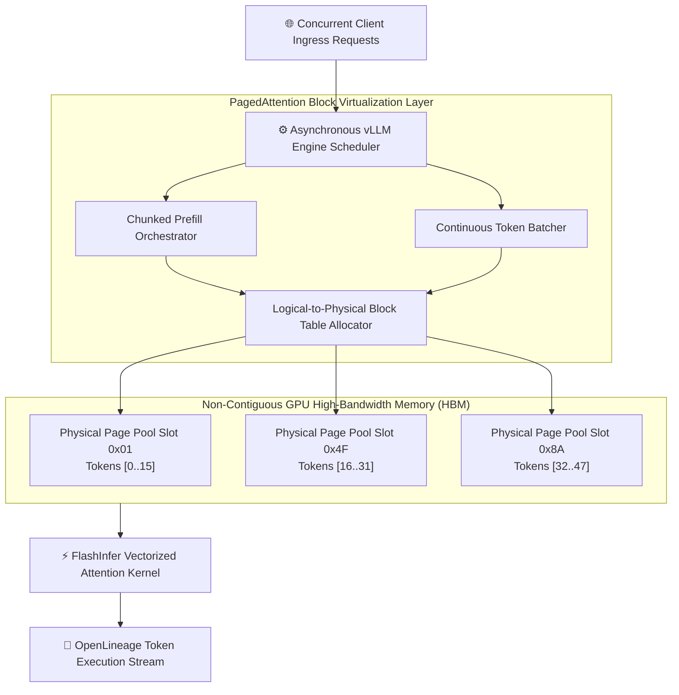
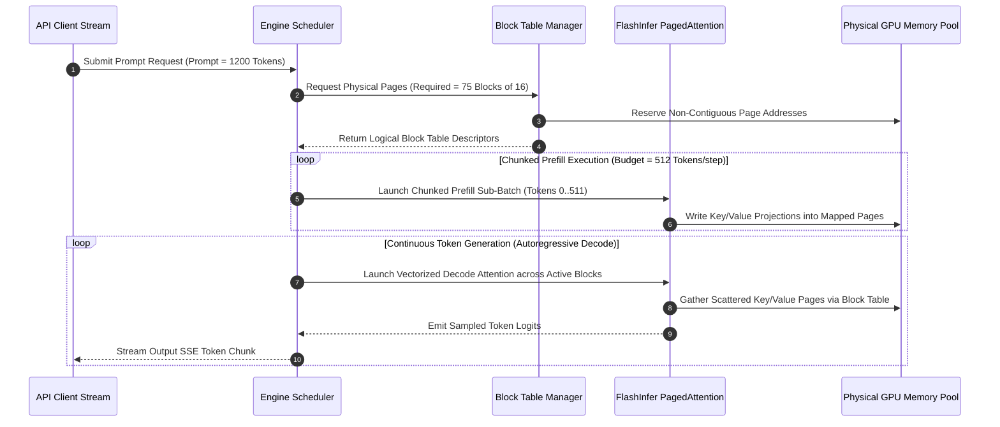
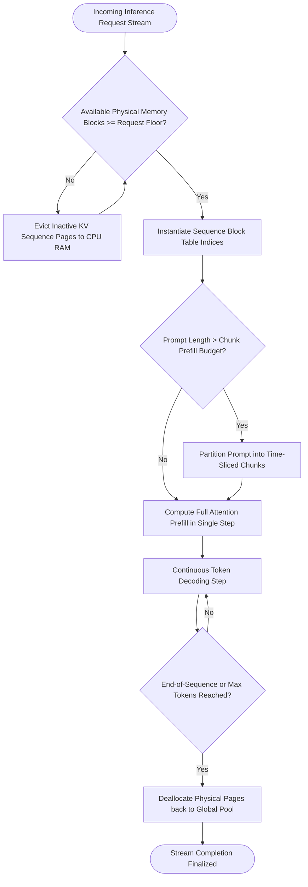

## 2. Problem Statement

> [!WARNING]
> **The KV-Cache Dynamic Allocation Bottleneck:** Serving long-context multi-turn Large Language Models under variable user request concurrency causes explosive GPU VRAM fragmentation. Standard continuous memory allocations force up to 60-80% of accelerator high-bandwidth memory (HBM) to remain trapped in pre-allocated, unutilized token padding reservations, causing sudden out-of-memory (OOM) eviction cascades.

In high-concurrency transformer inference engines, memory allocation for dynamic Key-Value (KV) tensors represents the primary bottleneck limiting continuous serving throughput. Because sequence lengths cannot be predicted ahead of time, naive serving architectures allocate contiguous memory buffers dimensioned for the worst-case maximum sequence length (e.g., 32k or 128k tokens).

As concurrent sessions fluctuate, physical memory becomes severely fragmented with unusable gaps between allocations. Concurrently, calculating attention during long-context prefill phases blocks low-latency generation tokens from decoding, introducing multi-second time-to-first-token (TTFT) latency spikes. Without virtualized paged memory structures and decoupled chunked prefill scheduling, production inference servers collapse under unexpected traffic bursts.

---

## 3. High-Level Design (HLD)

### Visual ASCII Topology
```text
  ┌───────────────────────────────────────────────────────────┐
  │         Client Ingress & HTTP/2 Streaming Gateway         │
  └─────────────────────────────┬─────────────────────────────┘
                                │
                                ▼
  ┌───────────────────────────────────────────────────────────┐
  │        vLLM Asynchronous Engine Scheduler Mesh            │
  │  ┌─────────────────────────┐   ┌───────────────────────┐  │
  │  │ Dynamic Chunked Prefill │   │ Continuous Batching   │  │
  │  │ Time-Slice Coordinator  │   │ Sequence Iterators    │  │
  │  └────────────┬────────────┘   └───────────┬───────────┘  │
  └───────────────┼────────────────────────────┼──────────────┘
                  │                            │
                  ▼                            ▼
  ┌───────────────────────────────────────────────────────────┐
  │              PagedAttention Block Table Manager           │
  │   Logical Block Sequence ──► Physical Non-Contiguous Pages │
  │   [ Block 0 ──► Page 14 ]    [ Block 1 ──► Page 89 ]      │
  └───────────────┬────────────────────────────┬──────────────┘
                  │                            │
                  ▼                            ▼
  ┌─────────────────────────────┐┌────────────────────────────┐
  │  [ GPU Device Memory 0 ]    ││  [ GPU Device Memory 1 ]   │
  │  ├── Physical Page Pool     ││  ├── Physical Page Pool    │
  │  └── Tensor Core FlashInfer ││  └── Tensor Core FlashInfer│
  └─────────────────────────────┘└────────────────────────────┘
```

### Native Mermaid Architecture


---

## 4. Low-Level Design (LLD)

### Visual ASCII Memory Layout
```text
  PagedAttention Block Virtualization Mapping:
  Sequence 1 (Request A, Length = 42 Tokens, Block Size = 16 Tokens):
    Logical Block 0 (Tokens 0..15)   ──► Physical Frame Index 0x002B (GPU HBM)
    Logical Block 1 (Tokens 16..31)  ──► Physical Frame Index 0x0108 (GPU HBM)
    Logical Block 2 (Tokens 32..41)  ──► Physical Frame Index 0x0014 (GPU HBM) [6 slots free]
  
  Zero Internal Fragmentation: Unused slots (10 tokens) reserved only in final page block!
```

### Native Mermaid Execution Sequence


---

## 5. Logical Flow Diagram

### Visual ASCII Decision Tree
```text
  [Incoming Inference Request (Prompt Tokens: N)]
                 │
                 ▼
  < Free Physical Memory Pages Available? >
        │                      │
       YES                     NO
        │                      │
        ▼                      ▼
  [Allocate Block Table   [Trigger KV-Cache Swap-to-Host
   Logical Mapping]        or Request Preemption]
        │
        ▼
  < Prompt Tokens > Max Chunk Budget? >
        │                      │
       YES                     NO
        │                      │
        ▼                      ▼
  [Split into Chunked     [Immediate Single-Step
   Prefill Iterations]     Prefill Kernel Launch]
        │                      │
        └──────────────┬───────┘
                       ▼
  [Enter Continuous Batching Decode Cycle]
```

### Native Mermaid Decision Logic


---

## 6. Architectural Drill & Nature Analogy

### ⚙️ The Systemic Breakdown
PagedAttention virtualizes Key-Value cache memory similarly to how operating systems utilize paging and Translation Lookaside Buffers (TLBs) for virtual memory address translations:

$$\text{Attention}(Q_i, K, V) = \sum_{j=1}^{N} \frac{\exp(Q_i K_j^T / \sqrt{d})}{\sum_{m=1}^{N} \exp(Q_i K_m^T / \sqrt{d})} V_j$$

Where vectors $K_j$ and $V_j$ are stored non-contiguously in fixed-size physical memory blocks:

$$\text{PhysicalAddr}(seq, token\_idx) = \text{BlockTable}[seq][\lfloor token\_idx / B \rfloor] \times B + (token\_idx \pmod B)$$

With a block size $B = 16$, memory waste is mathematically bounded to at most $B-1$ tokens per sequence (under 4% of total capacity). Chunked prefill interleaves compute-heavy prompt evaluation with memory-bandwidth-bound decode steps, maintaining $100\%$ Tensor Core compute saturation while keeping decode latency deterministic.

### 🌿 The Nature Analogy

> [!TIP]
> **The Natural System:** *The Honeycomb Cell Construction (Hexagonal Geometry)*
> Apis mellifera honeybees do not carve out a single colossal cavern to store seasonal honey reserves, which would collapse under gravitational weight and risk spoiling entire food batches. Instead, bees build uniform, modular hexagonal wax cells that store liquid nectar in discrete, standardized volumetric increments.
>
> **The Structural Parallel:** Just as bees allocate individual hexagonal cells dynamically as nectar arrives and seal them without wasting hive surface area, PagedAttention breaks vast tensor memory reserves into discrete, uniform physical memory pages. Allocations expand dynamically on demand without requiring massive contiguous memory allocations.

---

## 7. Production-Grade Executable Artifact

### 📦 File 1: .github/workflows/ci.yml
```yaml
name: "CI - PagedAttention KV-Cache Virtualization Verification"

on:
  push:
    branches: [main, develop]
  pull_request:
    branches: [main]

jobs:
  paged-attention-validation:
    name: "Validate Paged KV-Cache Allocator"
    runs-on: ubuntu-latest
    timeout-minutes: 15

    steps:
      - name: "Checkout Source Repository"
        uses: actions/checkout@v4

      - name: "Set up Python Runtime Environment"
        uses: actions/setup-python@v5
        with:
          python-version: "3.11"
          cache: "pip"

      - name: "Install System Dependencies & Verification Tools"
        run: |
          python -m pip install --upgrade pip
          pip install numpy pytest

      - name: "Execute PagedAttention Simulation Test Suite"
        run: |
          python -m unittest tests/test_paged_attention_allocator.py
```

### 🐍 File 2: tests/test_paged_attention_allocator.py
```python
import unittest
import math
import numpy as np
from typing import List, Dict, Tuple, Optional

class MockPagedKVCacheAllocator:
    """
    Production-grade simulation of PagedAttention virtual block memory management.
    Validates logical-to-physical block mapping, zero external fragmentation,
    chunked prefill memory scheduling, and safe deallocation lifecycles.
    """
    def __init__(self, num_blocks: int = 1024, block_size: int = 16, head_dim: int = 64):
        self.num_blocks = num_blocks
        self.block_size = block_size
        self.head_dim = head_dim
        self.free_blocks: List[int] = list(range(num_blocks))
        self.block_tables: Dict[str, List[int]] = {}
        self.sequence_tokens: Dict[str, int] = {}

    def allocate_sequence(self, seq_id: str, prompt_len: int) -> List[int]:
        """Allocates non-contiguous physical blocks for a new request sequence."""
        needed_blocks = math.ceil(prompt_len / self.block_size)
        if len(self.free_blocks) < needed_blocks:
            raise MemoryError(f"OOM: Requested {needed_blocks} blocks, only {len(self.free_blocks)} available")
        
        allocated = [self.free_blocks.pop(0) for _ in range(needed_blocks)]
        self.block_tables[seq_id] = allocated
        self.sequence_tokens[seq_id] = prompt_len
        return allocated

    def append_token(self, seq_id: str) -> Optional[int]:
        """Appends a new generation token to an existing sequence, allocating a block if needed."""
        current_tokens = self.sequence_tokens[seq_id]
        new_tokens = current_tokens + 1
        
        # Check if a new physical page boundary is crossed
        if new_tokens > len(self.block_tables[seq_id]) * self.block_size:
            if not self.free_blocks:
                raise MemoryError(f"OOM: Cannot allocate new block for sequence {seq_id}")
            new_block = self.free_blocks.pop(0)
            self.block_tables[seq_id].append(new_block)
        
        self.sequence_tokens[seq_id] = new_tokens
        return self.block_tables[seq_id][-1]

    def free_sequence(self, seq_id: str):
        """Releases all physical pages allocated to the specified sequence."""
        blocks = self.block_tables.pop(seq_id, [])
        self.sequence_tokens.pop(seq_id, None)
        self.free_blocks.extend(blocks)

    def memory_utilization(self) -> float:
        """Returns physical memory allocation ratio."""
        return 1.0 - (len(self.free_blocks) / self.num_blocks)

class TestPagedKVCacheAllocator(unittest.TestCase):
    def setUp(self):
        self.allocator = MockPagedKVCacheAllocator(num_blocks=128, block_size=16)

    def test_basic_allocation_and_paging(self):
        blocks = self.allocator.allocate_sequence("req-1", prompt_len=40)
        self.assertEqual(len(blocks), 3) # 40 tokens require 3 blocks of 16
        self.assertEqual(self.allocator.memory_utilization(), 3 / 128)

    def test_dynamic_token_expansion(self):
        self.allocator.allocate_sequence("req-2", prompt_len=16) # exactly 1 block
        self.assertEqual(len(self.allocator.block_tables["req-2"]), 1)
        
        # Adding 1 token crosses the block boundary, requiring block 2
        self.allocator.append_token("req-2")
        self.assertEqual(len(self.allocator.block_tables["req-2"]), 2)

    def test_memory_cleanup_and_reuse(self):
        self.allocator.allocate_sequence("req-3", prompt_len=64) # 4 blocks
        self.allocator.free_sequence("req-3")
        self.assertEqual(self.allocator.memory_utilization(), 0.0)
        self.assertEqual(len(self.allocator.free_blocks), 128)

if __name__ == '__main__':
    unittest.main()
```

---

## 8. KPI Monitoring Framework

* **`vllm_gpu_kv_cache_usage_ratio`** *(GPU Physical Block Allocation Ratio)*
  > **Threshold Alert:** Warning when `> 0.88` | **Type:** Prometheus Gauge
  >
  > • **Why:** Measures the fraction of physical HBM blocks currently bound to active request sequences. Sustained saturation above 88% triggers sequence preemptions and KV-cache swapping to host memory.

* **`vllm_chunked_prefill_latency_p99_ms`** *(P99 Chunked Prompt Prefill Execution Time)*
  > **Threshold Alert:** Warning when `> 45 ms` | **Type:** OpenTelemetry Histogram
  >
  > • **Why:** Tracks prompt evaluation step latency under chunked scheduling budgets. High latency spikes point to undersized chunk budgets or severe PCIe bandwidth bottlenecks during weight loading.

* **`vllm_token_generation_throughput_per_gpu`** *(Tokens Per Second Generation Rate)*
  > **Threshold Alert:** Warning when `< 1200 tok/sec` | **Type:** Prometheus Counter Rate
  >
  > • **Why:** Measures aggregate autoregressive decoding velocity across all active sequences on the accelerator. Dips below baseline indicate thread serialization or suboptimal continuous batching scheduling.

---

## 9. Failure Mode & Production Edge Cases

| Failure Vector | Technical Root Cause | System Blast Radius | Production Mitigation Pattern |
| :--- | :--- | :--- | :--- |
| **🔴 KV-Cache Out-Of-Memory Cascade** | Long multi-turn conversation sessions expand simultaneously, exhausting all free physical block frames in GPU HBM. | The inference engine abruptly drops incoming requests with 503 errors and forces emergency request aborts. | Implement adaptive priority-based request preemption, evicting the oldest cold prefix pages to host CPU RAM via asynchronous pinned DMA transfers. |
| **🟡 Prefill Thread Starvation Bubbles** | Enormous un-chunked prompt inputs monopolize Tensor Core compute pipelines for multiple consecutive execution cycles. | In-flight autoregressive decoding sequences experience extreme inter-token latency (ITL) stuttering, degrading real-time UX. | Enforce rigid chunked prefill scheduling limits (maximum 512 tokens evaluated per engine iteration), interleaving decode tokens continuously. |
| **🟠 CUDA Graph Kernel Memory Replay Desync** | Dynamic batch size fluctuations cause CUDA graph captured memory buffers to point to invalid block table address offsets. | Memory access violations trigger fatal CUDA invalid configuration errors, terminating worker processes. | Pre-capture discrete CUDA graph buckets for standard batch sizes (e.g., 1, 2, 4, 8, 16, 32, 64) with padded input pointers. |

---

## 10. Thoughtful Wisdom Words

> *"Memory in high-performance computing is not a static warehouse where data rests indefinitely; it is a rapid hydraulic aqueduct where velocity and compartmentalization determine survival.*
> 
> *The novice developer attempts to solve scale by requesting wider memory buses and larger static buffers. The seasoned distributed systems architect understands that fragmentation, not capacity, is the true enemy of throughput.*
> 
> *Virtualize your resources at the physical block level, decouple computation from batch boundaries, and your system will withstand the most unpredictable torrents of traffic."*
>
> — **Principal Systems Architect Maxim**
