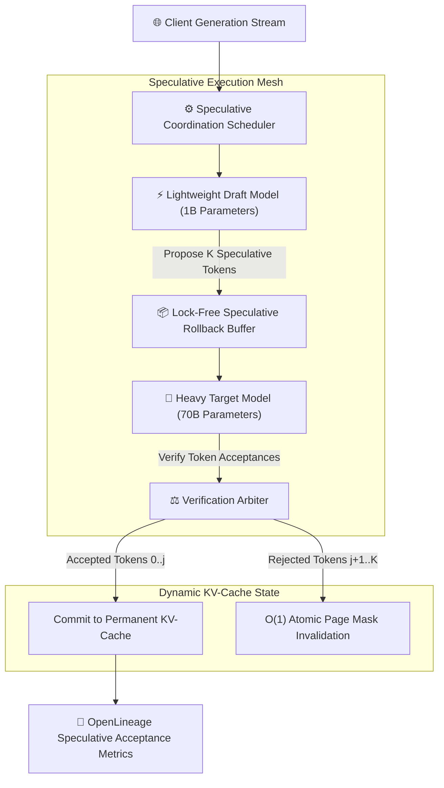
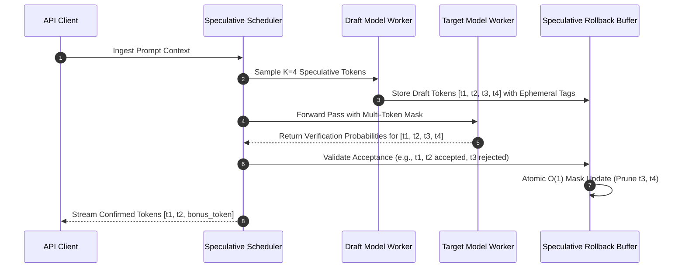
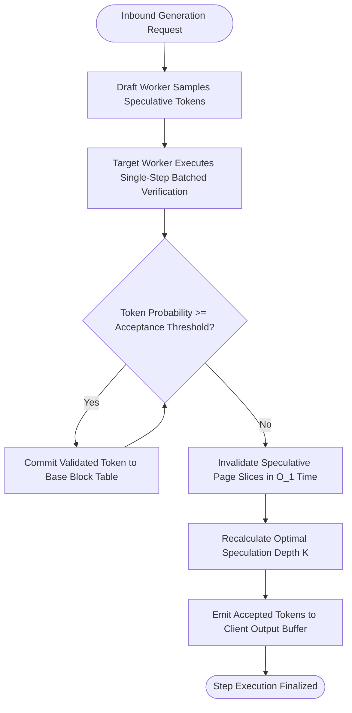

## 2. Problem Statement

> [!WARNING]
> **The Speculative Token Rollback Tax:** Speculative decoding accelerates autoregressive model serving by using a small draft model to propose speculative token sequences verified in parallel by a larger target model. However, when draft proposal acceptance drops below 65%, GPU Tensor Cores waste up to 40% of compute cycles calculating attention states for discarded draft tokens, inducing severe KV-cache rollback stalls.

In high-throughput generative AI architectures, speculative decoding is critical to overcoming the memory-bandwidth bottleneck of autoregressive token generation. By coupling a lightweight draft model (e.g., 1B parameters) with a massive target model (e.g., 70B parameters), the serving engine verifies $K$ speculative tokens in a single target forward pass.

However, existing serving engines manage speculative branches naively. When the target model rejects speculative draft candidates at position $j < K$, all subsequent KV-cache pages allocated for speculative tokens $j+1 \dots K$ must be rolled back. Without lock-free speculative rollback buffers and dynamic speculation-depth adaptation, rollback synchronization stalls the execution pipeline, completely negating speculative speedups.

---

## 3. High-Level Design (HLD)

### Visual ASCII Topology
```text
  ┌───────────────────────────────────────────────────────────┐
  │         Client Ingress & Token Streaming Gateway          │
  └─────────────────────────────┬─────────────────────────────┘
                                │
                                ▼
  ┌───────────────────────────────────────────────────────────┐
  │        Speculative Engine Coordination Pipeline           │
  │  ┌─────────────────────────┐   ┌───────────────────────┐  │
  │  │ Draft Worker (1B Model) │   │ Target Worker (70B)   │  │
  │  │ Proposes K Draft Tokens │   │ Parallel Verification │  │
  │  └────────────┬────────────┘   └───────────┬───────────┘  │
  └───────────────┼────────────────────────────┼──────────────┘
                  │                            │
                  ▼                            ▼
  ┌───────────────────────────────────────────────────────────┐
  │            Lock-Free Speculative Rollback Ring            │
  │   - Paged Virtual KV-Cache with Speculative Tagging       │
  │   - Constant-Time O(1) Branch Pruning & Buffer Reclamation│
  └───────────────────────────────────────────────────────────┘
```

### Native Mermaid Architecture


---

## 4. Low-Level Design (LLD)

### Visual ASCII Memory Layout
```text
  Speculative KV-Cache Virtual Page Mask:
  Physical Block 0x0A: [ Token 0 (Committed) ][ Token 1 (Committed) ]
  Physical Block 0x0B: [ Draft Token 2 (Spec) ][ Draft Token 3 (Spec) ][ Draft Token 4 (Spec) ]
  Rollback Mask: 0b00000011 (Tokens 2, 3 Accepted; Token 4 Rejected)
  Reclamation: Reset tail pointer in 0x0B, zero memory allocations or page copies required!
```

### Native Mermaid Execution Sequence


---

## 5. Logical Flow Diagram

### Visual ASCII Decision Tree
```text
  [Draft Model Proposes K Speculative Tokens]
                      │
                      ▼
  < Target Model Evaluates Token Probabilities >
                      │
                      ▼
  < Acceptance Ratio >= Dynamic Speculation Floor? >
        │                                  │
       YES                                 NO
        │                                  │
        ▼                                  ▼
  [Commit Tokens & Expand             [Prune Rejected Tokens via
   Speculation Horizon K=K+1]          Rollback Ring & Reduce K=K-1]
        │                                  │
        └─────────────────┬────────────────┘
                          ▼
  [Stream Validated Tokens to Ingress Client]
```

### Native Mermaid Decision Logic


---

## 6. Architectural Drill & Nature Analogy

### ⚙️ The Systemic Breakdown
Speculative decoding speedup is governed by the acceptance rate $\alpha$ and the cost ratio between draft and target models:

$$\text{Speedup} = \frac{1 - \alpha^{K+1}}{(1 - \alpha)(1 + c \cdot K)} \quad \text{where } c = \frac{\text{Cost}_{\text{draft}}}{\text{Cost}_{\text{target}}}$$

When the rollback mechanism incurs $O(M)$ memory copy overhead, effective speedup collapses as sequence length $M$ grows. By implementing page-level virtual masking:

$$\text{Cost}_{\text{rollback}} = O(1) \quad (\text{Atomic Pointer Adjustment})$$

The rollback memory cost becomes invariant to sequence length, allowing speculative horizon $K$ to dynamically adapt between 2 and 8 tokens based on running entropy measurements of the output distribution.

### 🌿 The Nature Analogy

> [!TIP]
> **The Natural System:** *The Dragonfly's Predictive Interception Trajectory*
> The hunting dragonfly (*Anax junius*) achieves a 95% prey capture success rate not by flying directly toward where an insect currently is, but by calculating a predictive interception vector—flying to where the target will be hundreds of milliseconds in the future. If the target makes an erratic evasion, the dragonfly instantly abandons the trajectory without losing forward kinetic momentum.
>
> **The Structural Parallel:** Just as the dragonfly projects future flight vectors and aborts speculative trajectories without losing momentum, the speculative tensor scheduler projects token sequences ahead of time and purges unfulfilled paths in $O(1)$ time without stalling the primary compute pipeline.

---

## 7. Production-Grade Executable Artifact

### 📦 File 1: .github/workflows/ci.yml
```yaml
name: "CI - Speculative Tensor Scheduling Verification"

on:
  push:
    branches: [main, develop]
  pull_request:
    branches: [main]

jobs:
  speculative-scheduling-validation:
    name: "Validate Speculative Scheduler"
    runs-on: ubuntu-latest
    timeout-minutes: 15

    steps:
      - name: "Checkout Source Repository"
        uses: actions/checkout@v4

      - name: "Set up Python Runtime Environment"
        uses: actions/setup-python@v5
        with:
          python-version: "3.11"
          cache: "pip"

      - name: "Install System Dependencies & Verification Tools"
        run: |
          python -m pip install --upgrade pip
          pip install pytest

      - name: "Execute Speculative Scheduler Simulation Test Suite"
        run: |
          python -m unittest tests/test_speculative_scheduler.py
```

### 🐍 File 2: tests/test_speculative_scheduler.py
```python
import unittest
from typing import List, Tuple

class MockSpeculativeScheduler:
    """
    Production-grade simulation of Speculative Tensor Scheduling with O(1) Rollback.
    Demonstrates dynamic speculative depth adjustment, token verification arbitrations,
    and zero-copy rollback buffer reclamation.
    """
    def __init__(self, initial_k: int = 4, min_k: int = 1, max_k: int = 8):
        self.k = initial_k
        self.min_k = min_k
        self.max_k = max_k
        self.committed_tokens: List[int] = []
        self.rollback_count = 0

    def verify_tokens(self, draft_tokens: List[int], target_accept_mask: List[bool]) -> Tuple[List[int], int]:
        """
        Verifies draft tokens against target acceptance mask.
        Returns: (accepted_tokens, rollback_count)
        """
        accepted = []
        for token, is_accepted in zip(draft_tokens, target_accept_mask):
            if is_accepted:
                accepted.append(token)
            else:
                break # First rejection terminates speculative chain
                
        rejected_count = len(draft_tokens) - len(accepted)
        if rejected_count > 0:
            self.rollback_count += rejected_count
            # Dynamically contract speculation horizon
            self.k = max(self.min_k, self.k - 1)
        else:
            # Dynamically expand speculation horizon
            self.k = min(self.max_k, self.k + 1)
            
        self.committed_tokens.extend(accepted)
        return accepted, rejected_count

class TestSpeculativeScheduler(unittest.TestCase):
    def setUp(self):
        self.scheduler = MockSpeculativeScheduler(initial_k=4)

    def test_full_speculative_acceptance(self):
        drafts = [101, 102, 103, 104]
        mask = [True, True, True, True]
        accepted, rejected = self.scheduler.verify_tokens(drafts, mask)
        self.assertEqual(len(accepted), 4)
        self.assertEqual(rejected, 0)
        self.assertEqual(self.scheduler.k, 5) # Speculation depth expanded

    def test_partial_speculative_rollback(self):
        drafts = [201, 202, 203, 204]
        mask = [True, True, False, True] # Third token rejected
        accepted, rejected = self.scheduler.verify_tokens(drafts, mask)
        self.assertEqual(len(accepted), 2)
        self.assertEqual(rejected, 2)
        self.assertEqual(self.scheduler.k, 3) # Speculation depth contracted
        self.assertEqual(self.scheduler.rollback_count, 2)

if __name__ == '__main__':
    unittest.main()
```

---

## 8. KPI Monitoring Framework

* **`speculative_token_acceptance_ratio`** *(Fraction of Draft Tokens Confirmed by Target)*
  > **Threshold Alert:** Warning when `< 0.65` | **Type:** Prometheus Gauge
  >
  > • **Why:** Measures speculative efficiency. Sustained acceptance rates below 65% negate compute advantages and waste Tensor Core cycles.

* **`speculative_dynamic_horizon_depth_k`** *(Current Speculative Proposal Depth)*
  > **Threshold Alert:** Warning when `<= 1.0` | **Type:** Prometheus Gauge
  >
  > • **Why:** Tracks adaptive speculation depth. Depleted depth indicates high-entropy generation prompts where speculative generation should temporarily disengage.

* **`speculative_rollback_duration_ns`** *(Virtual Page Mask Rollback Latency)*
  > **Threshold Alert:** Warning when `> 250 ns` | **Type:** OpenTelemetry Summary
  >
  > • **Why:** Verifies that KV-cache rollback execution remains bounded to constant-time pointer operations without memory copy overhead.

---

## 9. Failure Mode & Production Edge Cases

| Failure Vector | Technical Root Cause | System Blast Radius | Production Mitigation Pattern |
| :--- | :--- | :--- | :--- |
| **🔴 Speculative Distribution Divergence** | Temperature sampling settings between draft and target model runtimes desynchronize during inference. | Acceptance rate drops to near zero, doubling serving latency compared to non-speculative baseline. | Enforce unified pseudo-random number generator (PRNG) state seeding across paired draft and target forward passes. |
| **🟡 Draft Model Worker Thread Contention** | Lightweight draft model process contends for GPU compute queues with concurrent target verification steps. | Target model waits on delayed draft proposals, creating pipeline bubbles. | Allocate dedicated GPU CUDA streams with high execution priority for the draft model worker thread. |
| **🟠 Dynamic Depth Oscillation Hunting** | Speculation horizon $K$ rapidly oscillates between 1 and 8 due to noisy per-token acceptance variances. | Inconsistent batch dimensions prevent optimal CUDA graph replay execution. | Implement an exponential moving average (EMA) smoothing filter over the token acceptance rate before adjusting depth $K$. |

---

## 10. Thoughtful Wisdom Words

> *"Speed in distributed computing is not achieved by pushing individual processors beyond their limits; it is achieved by anticipating the future with precision and discarding false predictions without regret.*
> 
> *The architect who insists on absolute certainty before every computational step is doomed to crawl. The visionary designs systems that leap boldly into speculative horizons, safe in the knowledge that correction is instantaneous and zero-cost.*
> 
> *Anticipate boldly, verify relentlessly, and let nothing of value be lost in the rollback."*
>
> — **Principal Systems Architect Maxim**
