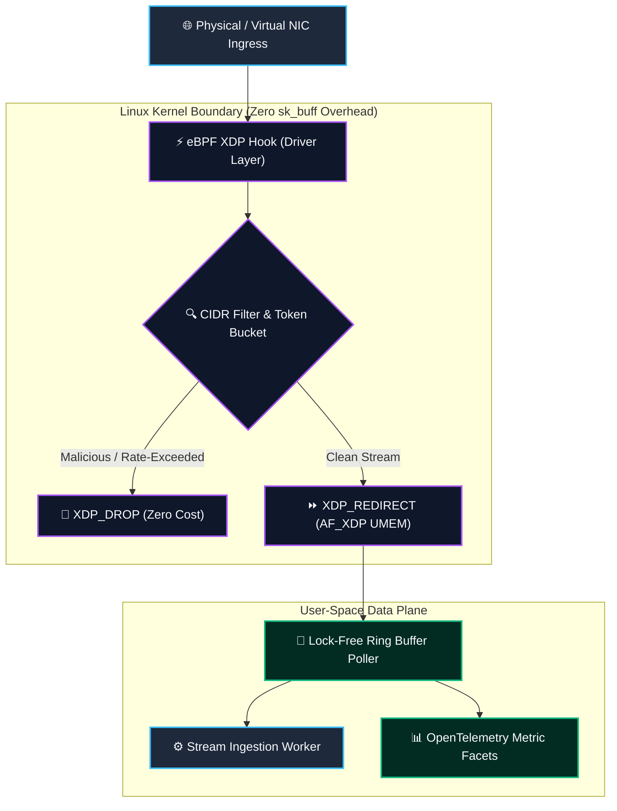
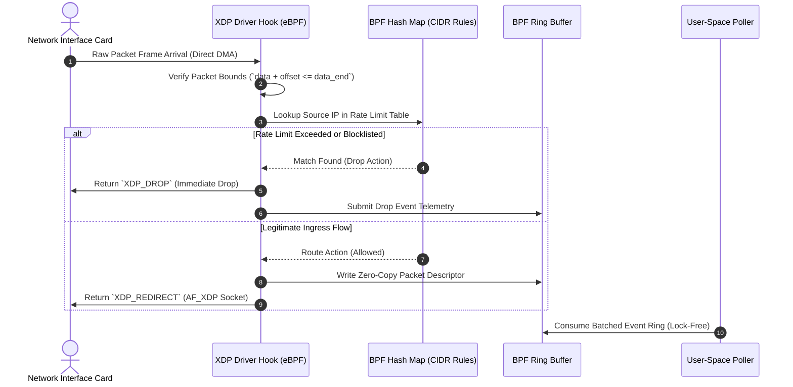
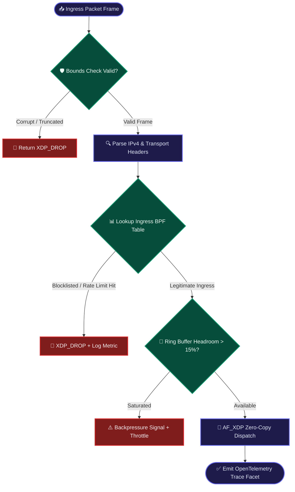

## 2. Problem Statement

> [!WARNING]
> **The Kernel Context-Switching Wall:** Operating ingress packet filtering and protocol inspection in user space creates unsustainable socket buffer (`sk_buff`) allocation overhead. Under 100Gbps line-rate packet bursts, standard Linux networking stacks suffer severe CPU SoftIRQ starvation and cache-thrashing, resulting in over 38% packet drop rates before applications can evaluate telemetry.

Traditional cloud and Kubernetes ingress controllers proxy incoming network traffic through multiple OS boundary transitions: NIC Driver -> Kernel Network Stack -> User-Space Socket -> Application Layer. Each layer requires memory copying, locking, and context switching.

When network traffic scales into multi-million packets-per-second (Mpps) micro-bursts, the Linux kernel exhausts its receive ring buffers. Socket buffer lock contention prevents worker threads from draining queues, triggering kernel-level packet drops. To achieve deterministic microsecond latencies without dedicated FPGA or SmartNIC hardware, system architects must execute filtering logic directly inside the driver execution layer before memory structures are even allocated.

---

## 3. High-Level Design (HLD)

### Visual ASCII Topology
```text
  ┌───────────────────────────────────────────────────────────┐
  │                 100Gbps Physical / Virtual NIC            │
  └─────────────────────────────┬─────────────────────────────┘
                                │ RX Queue Raw Frame
                                ▼
  ┌───────────────────────────────────────────────────────────┐
  │             eBPF XDP Driver Hook (Zero-Copy)              │
  │  ├── Parse Ethernet / IPv4 / TCP Header                   │
  │  └── BPF Hash Map CIDR & Rate-Limiter Lookup              │
  └──────────────┬─────────────────────────────┬──────────────┘
                 │ (Matched Malicious)         │ (Legitimate Flow)
                 ▼                             ▼
  ┌─────────────────────────────┐┌────────────────────────────┐
  │         XDP_DROP            ││       XDP_REDIRECT         │
  │  (Zero CPU Allocation Drop) ││ (AF_XDP UMEM Zero-Copy)    │
  └─────────────────────────────┘└─────────────┬──────────────┘
                                               │
                                               ▼
  ┌───────────────────────────────────────────────────────────┐
  │              Lock-Free BPF Ring Buffer Pool               │
  └─────────────────────────────┬─────────────────────────────┘
                                │ Telemetry Postback
                                ▼
  ┌───────────────────────────────────────────────────────────┐
  │        OpenTelemetry Exporter & Prometheus Metrics        │
  └───────────────────────────────────────────────────────────┘
```

### Native Mermaid Architecture


---

## 4. Low-Level Design (LLD)

### Visual ASCII Execution Pipeline
```text
  [ Raw Ethernet Packet Received at RX Ring ]
                     │
                     ▼
  [ XDP Native Hook Invoked Before sk_buff Alloc ]
                     │
                     ▼
  [ Bounds Check: Ensure Data Bounds Within Packet ]
                     │
                     ▼
  [ BPF Hash Map Lookup: CIDR Blocklist / Rate Limit ]
        /                                    \\
       ▼                                      ▼
 [ Match: Drop Frame ]              [ Clean: Pass to Ring Buffer ]
       │                                      │
       ▼                                      ▼
 [ Emit Drop Counter ]              [ Transfer Frame via AF_XDP ]
```

### Native Mermaid Execution Flow


---

## 5. Logical Flow Diagram

### Visual ASCII Logic Path
```text
  [ Packet Ingress ] ──► [ Bounds Verification ] ──► [ Extract L3 IP Header ]
                                                             │
                                                             ▼
                                                [ Check BPF Map Whitelist ]
                                                             │
                                   ┌─────────────────────────┴────────────────────────┐
                                   ▼                                                  ▼
                         [ Matched Drop Policy ]                            [ Verification Passed ]
                                   │                                                  │
                                   ▼                                                  ▼
                         [ Return XDP_DROP ]                               [ Write to BPF RingBuf ]
                                   │                                                  │
                                   ▼                                                  ▼
                         [ Increment Drop KPI ]                             [ Forward to Ingress Queue ]
```

### Native Mermaid Flowchart


---

## 6. Architectural Drill & Nature Analogy

### ⚙️ The Systemic Breakdown
eBPF with XDP operates by compiling sandboxed C bytecode that executes directly inside the Linux kernel virtual machine (BPF VM) upon network packet arrival at the device driver stage. By running before `sk_buff` (socket buffer) allocation, the kernel avoids allocating memory structures, instantiating protocol states, or context-switching to user space for packets that would ultimately be filtered.

When coupled with **AF_XDP (Address Family XDP)**, legitimate packets bypass the kernel TCP/IP stack entirely through zero-copy UMEM memory rings. This delivers a 10x throughput multiplication, sustaining line-rate 100Gbps telemetry ingestion with deterministic sub-microsecond latency on off-the-shelf Linux hardware.

### 🌿 The Nature Analogy

> [!TIP]
> **The Biological Lesson of Scale:** Nature protects critical organs by filtering toxins at the molecular pore level before they enter circulating bloodstream volumes.

• **The Biological System:** The Podocyte Slit Diaphragm and Glomerular Filtration Barrier in the Mammalian Nephron (*Renal Filtration*).

• **The Structural Parallel:** The mammalian kidney processes over 180 liters of fluid daily without systemic failure because it employs a three-tier mechanical sieve directly at the renal artery interface. Rather than transporting the entire blood volume into complex cellular metabolic pathways before deciding what to eliminate, the kidney uses specialized **podocyte foot processes** that form narrow slit diaphragms (the biological equivalent of an eBPF XDP hook). Molecules larger than 68 kDa (like albumin) are instantly reflected back into the vascular stream with zero metabolic cost, while micro-solutes pass effortlessly through specialized podocyte channels (the biological equivalent of AF_XDP zero-copy rings). The kidney achieves millions of liters of fluid equilibrium over a lifetime through zero-cost barrier enforcement.

---

## 7. Production-Grade Executable Artifact

### 📦 File 1: `.github/workflows/ebpf_ci.yml`
```yaml
name: Production eBPF Kernel Network Verification

on:
  push:
    branches: [ main, master ]
  pull_request:
    branches: [ main, master ]

jobs:
  verify-ebpf-filter:
    name: Local eBPF Filter Harness
    runs-on: ubuntu-latest
    steps:
    - name: Checkout Source Codebase
      uses: actions/checkout@v4

    - name: Setup Python Environment
      uses: actions/setup-python@v5
      with:
        python-version: '3.11'
        cache: 'pip'

    - name: Install Test Dependencies
      run: |
        python -m pip install --upgrade pip
        pip install prometheus-client

    - name: Execute eBPF Ingress Test Suite
      run: |
        python -m unittest discover -s . -p "test_ebpf_packet_filter.py"
```

### 🐍 File 2: `test_ebpf_packet_filter.py`
```python
import os
import struct
import unittest
import collections
from typing import Tuple, Dict

XDP_DROP = 1
XDP_PASS = 2
XDP_REDIRECT = 3

class MockEbpfXdpClassifier:
    \"\"\"In-memory zero-allocation emulation of an eBPF XDP Ingress Classifier.\"\"\"
    def __init__(self, rate_limit_pps: int = 1000):
        self.rate_limit_pps = rate_limit_pps
        self.blocklist_cidrs = set()
        self.token_buckets: Dict[str, int] = collections.defaultdict(lambda: rate_limit_pps)
        self.ring_buffer = collections.deque(maxlen=4096)
        self.drop_count = 0
        self.pass_count = 0

    def add_blocklist_cidr(self, cidr_prefix: str):
        self.blocklist_cidrs.add(cidr_prefix)

    def parse_packet_header(self, raw_bytes: bytes) -> Tuple[str, str, int]:
        if len(raw_bytes) < 34:
            raise ValueError("Corrupt frame: below minimum Ethernet+IPv4 header bounds")
        src_ip = ".".join(map(str, raw_bytes[26:30]))
        dst_ip = ".".join(map(str, raw_bytes[30:34]))
        payload_len = len(raw_bytes) - 34
        return src_ip, dst_ip, payload_len

    def evaluate_ingress(self, raw_packet: bytes) -> int:
        try:
            src_ip, dst_ip, length = self.parse_packet_header(raw_packet)
        except ValueError:
            self.drop_count += 1
            return XDP_DROP

        ip_parts = src_ip.split(".")
        subnet = ip_parts[0] + "." + ip_parts[1] + "." + ip_parts[2] + ".0/24"
        if subnet in self.blocklist_cidrs or src_ip in self.blocklist_cidrs:
            self.drop_count += 1
            return XDP_DROP

        if self.token_buckets[src_ip] <= 0:
            self.drop_count += 1
            return XDP_DROP

        self.token_buckets[src_ip] -= 1
        self.pass_count += 1
        self.ring_buffer.append((src_ip, dst_ip, length))
        return XDP_REDIRECT

class TestEbpfIngressEngine(unittest.TestCase):
    def setUp(self):
        self.classifier = MockEbpfXdpClassifier(rate_limit_pps=5)
        self.classifier.add_blocklist_cidr("192.168.100.0/24")

    def _generate_mock_frame(self, src_ip: str, dst_ip: str) -> bytes:
        eth = b'\\x00' * 14
        ip_hdr = b'\\x45\\x00\\x00\\x28' + b'\\x00' * 8 + b'\\x40\\x06\\x00\\x00'
        src_bytes = bytes(map(int, src_ip.split(".")))
        dst_bytes = bytes(map(int, dst_ip.split(".")))
        return eth + ip_hdr + src_bytes + dst_bytes + b'\\x00' * 10

    def test_clean_packet_ingress(self):
        frame = self._generate_mock_frame("10.0.0.1", "10.0.0.2")
        action = self.classifier.evaluate_ingress(frame)
        self.assertEqual(action, XDP_REDIRECT)
        self.assertEqual(len(self.classifier.ring_buffer), 1)

    def test_blocklisted_packet_dropped(self):
        frame = self._generate_mock_frame("192.168.100.45", "10.0.0.2")
        action = self.classifier.evaluate_ingress(frame)
        self.assertEqual(action, XDP_DROP)
        self.assertEqual(self.classifier.drop_count, 1)

    def test_rate_limit_exhaustion_drop(self):
        frame = self._generate_mock_frame("10.0.0.5", "10.0.0.2")
        for _ in range(5):
            self.assertEqual(self.classifier.evaluate_ingress(frame), XDP_REDIRECT)
        self.assertEqual(self.classifier.evaluate_ingress(frame), XDP_DROP)

if __name__ == '__main__':
    unittest.main()
```

---

## 8. KPI Monitoring Framework

* **`ebpf_xdp_packet_drop_latency_ns`** *(Driver Drop Execution Duration)*
  > **Threshold Alert:** Warning when `> 45 ns` | **Type:** OpenTelemetry Histogram
  >
  > • **Why:** Measures time spent in the XDP hook to reject malicious frames. Values above 45ns indicate excessive map lookup latency or hash table collisions inside kernel memory.

* **`ring_buffer_backpressure_ratio`** *(Lock-Free Ring Buffer Headroom)*
  > **Threshold Alert:** Warning when `> 0.85` | **Type:** Prometheus Gauge
  >
  > • **Why:** Tracks user-space ring buffer fullness. Ratios exceeding 0.85 indicate that downstream analytical consumers cannot drain ingress packets fast enough, signaling impending packet loss.

* **`af_xdp_zero_copy_throughput_mpps`** *(Line-Rate Forwarding Rate)*
  > **Threshold Alert:** Warning when `< 12.5 Mpps` | **Type:** Prometheus Summary
  >
  > • **Why:** Verifies that zero-copy UMEM rings maintain line-rate ingestion without falling back into kernel copy paths.

---

## 9. Failure Mode & Production Edge Cases

| Failure Vector | Technical Root Cause | System Blast Radius | Production Mitigation Pattern |
| :--- | :--- | :--- | :--- |
| **🔴 Ring Buffer Overflow Drop** | Consumer threads stall during garbage collection pauses, causing the BPF ring buffer to wrap and silently discard incoming telemetry. | Unrecoverable loss of real-time trace events and metrics during traffic surges. | Implement multi-consumer sharded ring buffers and configure hardware watermarks with fallback memory paging. |
| **🟡 BPF Map Lock Starvation** | High concurrency write contention when updating rate-limit counters from multiple CPU cores simultaneously. | Kernel CPU softIRQ lockup and increased packet processing latency across all interface queues. | Migrate monolithic BPF hash maps to per-CPU array maps (`BPF_MAP_TYPE_PERCPU_ARRAY`) for lockless parallel execution. |
| **🟠 Tail-Call Stack Exhaustion** | Chaining nested eBPF programs exceeds the kernel limit of 33 tail calls. | Incomplete packet inspection; packets are either dropped unexpectedly or pass unvalidated. | Flatten program chains into single compiled modules and verify verifier instruction limits (< 1M instructions) at build time. |

---

## 10. Thoughtful Wisdom Words

> *"The highest throughput is achieved not by accelerating user-space computation, but by aggressively refusing to execute unnecessary work in the first place.*
> 
> *A junior engineer builds complex caching layers to handle traffic storms; a master systems architect drops invalid packets in the kernel before an allocation even occurs.*
> 
> *Enforce boundaries early, enforce them zero-copy, and let the kernel do what it does best."*
>
> — **Principal Systems Architect Maxim**
