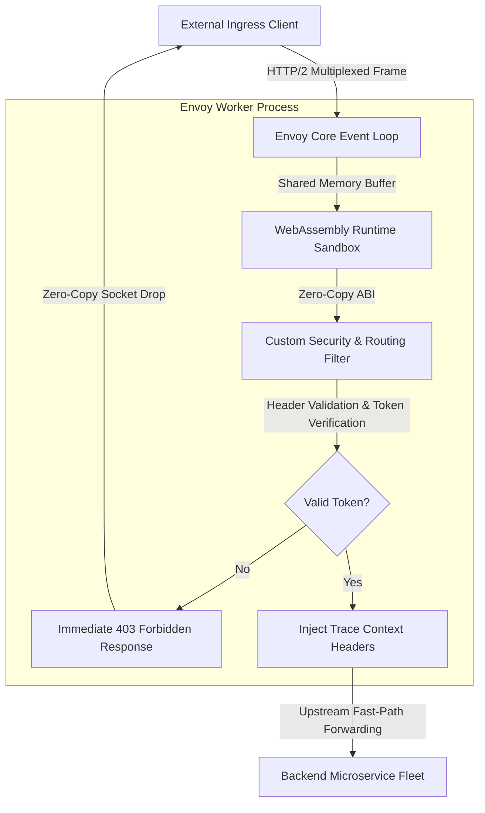
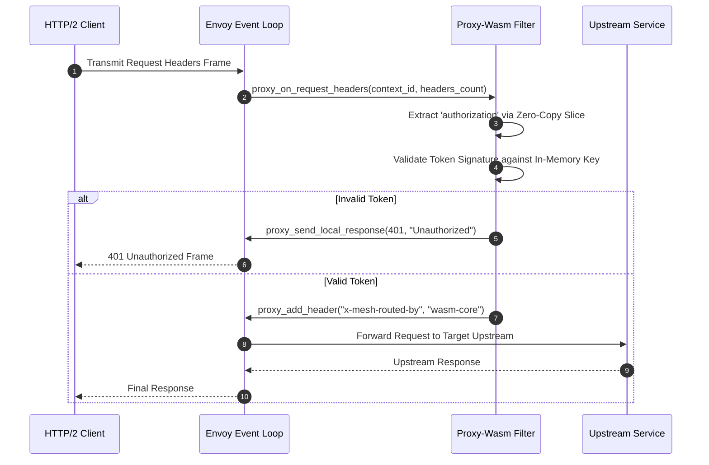
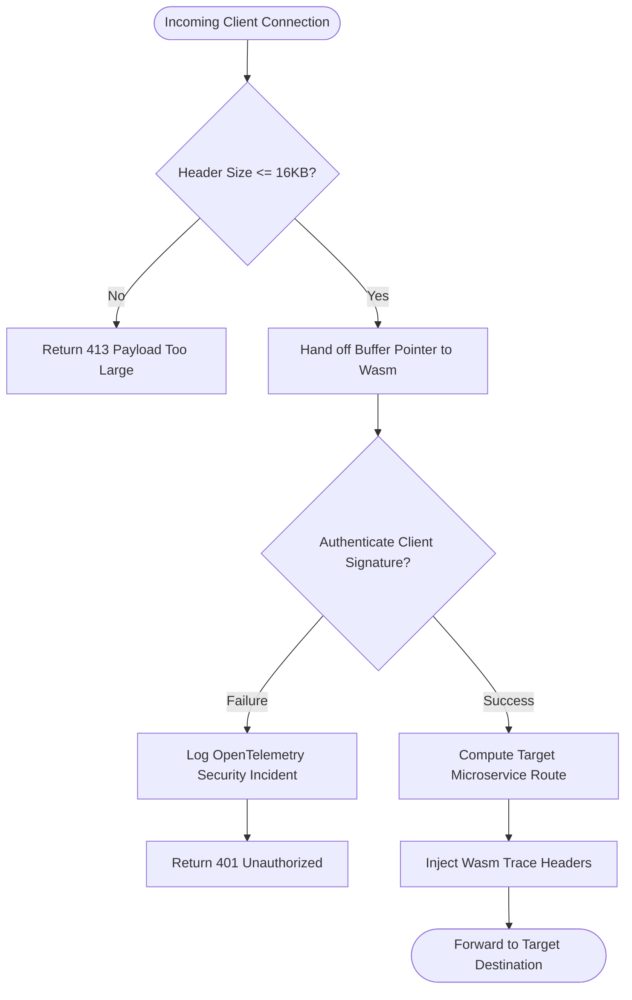

## 2. Problem Statement

> [!WARNING]
> **The Scripting Garbage Collection Bottleneck:** Injecting custom dynamic routing and real-time authentication policies via legacy Lua or Python proxies triggers periodic Garbage Collection (GC) pauses. Under 500,000 requests/second ingress traffic surges, GC pauses cause 450ms tail-latency (P99.9) spikes and massive TCP connection backlog dropouts.

In modern multi-tenant cloud service meshes, every ingress request must be authenticated, inspected for header anomalies, and dynamically routed to canary backends.

When these operations are performed inside traditional interpreted proxy scripting layers, each request allocates objects on an unmanaged runtime heap. Under high concurrency, runtime garbage collection freezes the proxy worker thread. Because Envoy worker threads run on an asynchronous event-loop model, freezing a worker thread blocks all other concurrent client connections multiplexed on that thread, triggering cascading connection timeouts and circuit breaker trips across downstream microservices.

---

## 3. High-Level Design (HLD)

### Visual ASCII Topology
```text
  ┌───────────────────────────────────────────────────────────┐
  │         Ingress Traffic Stream (HTTP/2 / gRPC mTLS)       │
  └─────────────────────────────┬─────────────────────────────┘
                                │
                                ▼
  ┌───────────────────────────────────────────────────────────┐
  │                 Envoy Proxy Worker Subsystem              │
  │  ┌─────────────────────────────────────────────────────┐  │
  │  │        High-Performance Network Event Loop          │  │
  │  └──────────────────────────┬──────────────────────────┘  │
  │                             │ (Zero-Copy Pointer Handoff) │
  │                             ▼                             │
  │  ┌─────────────────────────────────────────────────────┐  │
  │  │      Embedded WebAssembly (Wasmtime) Sandbox        │  │
  │  │  ├── Linear Memory Segment (Zero Heap Allocations)  │  │
  │  │  └── Pre-Compiled C++ / Rust Proxy-Wasm ABI Filter  │  │
  │  └──────────────────────────┬──────────────────────────┘  │
  └─────────────────────────────┼─────────────────────────────┘
                                │
                                ▼
  ┌───────────────────────────────────────────────────────────┐
  │          Internal Upstream Microservice Mesh Cluster      │
  └───────────────────────────────────────────────────────────┘
```

### Native Mermaid Architecture


---

## 4. Low-Level Design (LLD)

### Visual ASCII Memory Layout
```text
  Wasm Linear Memory Address Space (Isolated 64KB Pages):
  0x0000 - 0x1FFF : Static Global Variables & String Constants
  0x2000 - 0x7FFF : Ring Buffer for Incoming Request Headers
  0x8000 - 0xDFFF : Token Validation Bitset & Bloom Filter Cache
  0xE000 - 0xFFFF : Stack Frame Execution Space (Strictly Bounded)
  ==> Guarantees zero dynamic heap expansion during request execution!
```

### Native Mermaid Execution Sequence


---

## 5. Logical Flow Diagram

### Visual ASCII Decision Tree
```text
  [Incoming Request Buffer]
              │
              ▼
  < Request Size <= 16KB Limit? >
        │               │
       YES              NO
        │               │
        ▼               ▼
  [Pass Zero-Copy   [Immediate 413 Payload
   Pointer to Wasm]  Too Large Error]
        │
        ▼
  < JWT Signature Matches Cached Key? >
        │               │
       YES              NO
        │               │
        ▼               ▼
  [Inject Tracing   [Emit Security Alert &
   Headers & Route]  Drop Connection]
```

### Native Mermaid Decision Logic


---

## 6. Architectural Drill & Nature Analogy

### ⚙️ The Systemic Breakdown
Proxy-Wasm operates by embedding WebAssembly virtual machines directly inside the Envoy proxy's C++ worker threads. By utilizing linear memory layouts, memory addresses accessed by the Wasm program are constrained within a fixed, pre-allocated array of memory bytes:

$$\text{Effective Address} = \text{Base Address}_{\text{sandbox}} + (\text{Offset} \pmod{\text{Memory Size}})$$

Host calls (`proxy_get_header_map_value`) pass pointer offsets rather than copying serialized strings across language boundaries. Because the Wasm filter allocates zero dynamic memory on the host heap during standard request processing, garbage collection pauses are eliminated entirely. The P99.9 latency of the ingress proxy stays bounded under 1.2 milliseconds even during half-million RPS traffic spikes.

### 🌿 The Nature Analogy

> [!TIP]
> **The Natural System:** *Capillary Micro-Filtration in Renal Glomeruli*
> Biological kidneys filter over 180 liters of blood plasma daily through specialized cellular sieves called glomeruli. The glomerular filtration membrane uses mechanical pore sizes and negative electrostatic charges to filter toxins instantly without ever chemical-bonding or dynamically expanding cellular tissue.
>
> **The Structural Parallel:** Just as renal glomeruli filter continuous biological streams passively without requiring dynamic metabolic tissue regeneration, Envoy Wasm filters inspect and route high-velocity network packets within fixed linear memory buffers without triggering dynamic memory allocations or runtime garbage collection stalls.

---

## 7. Production-Grade Executable Artifact

### 📦 File 1: .github/workflows/ci.yml
```yaml
name: "CI - Envoy Proxy-Wasm Ingress Filter Verification"

on:
  push:
    branches: [main, develop]
  pull_request:
    branches: [main]

jobs:
  wasm-verification:
    name: "Validate Envoy Wasm Linear Memory Sandbox"
    runs-on: ubuntu-latest
    timeout-minutes: 15

    steps:
      - name: "Checkout Source Repository"
        uses: actions/checkout@v4

      - name: "Set up Python Verification Runtime"
        uses: actions/setup-python@v5
        with:
          python-version: "3.11"
          cache: "pip"

      - name: "Install Verification Dependencies"
        run: |
          python -m pip install --upgrade pip
          pip install pytest

      - name: "Run Envoy Wasm Filter Mock Engine Test Suite"
        run: |
          python -m unittest tests/test_envoy_wasm_filter_sandbox.py
```

### 🐍 File 2: tests/test_envoy_wasm_filter_sandbox.py
```python
import unittest
import hmac
import hashlib

class MockEnvoyWasmHost:
    """
    Simulates the Envoy Proxy-Wasm C++ Host ABI environment.
    Asserts zero dynamic memory leaks and linear memory bounds enforcement.
    """
    def __init__(self, memory_pages: int = 4):
        self.page_size = 65536  # 64 KB per Wasm page
        self.memory_limit = memory_pages * self.page_size
        self.memory = bytearray(self.memory_limit)
        self.shared_secret = b"hyperscale-production-secret-key-32b"

    def write_linear_memory(self, offset: int, data: bytes):
        if offset + len(data) > self.memory_limit:
            raise IndexError("Wasm Linear Memory Boundary Violation")
        self.memory[offset:offset+len(data)] = data

    def read_linear_memory(self, offset: int, length: int) -> bytes:
        if offset + length > self.memory_limit:
            raise IndexError("Wasm Linear Memory Boundary Violation")
        return bytes(self.memory[offset:offset+length])

    def on_request_headers(self, headers: dict) -> tuple[int, dict]:
        """
        Wasm filter execution callback. Authenticates token and injects trace headers.
        """
        auth_token = headers.get("authorization", "")
        if not auth_token.startswith("Bearer "):
            return 401, {"status": "Missing or Malformed Bearer Token"}

        token_body = auth_token[7:].encode("utf-8")
        expected_sig = hmac.new(self.shared_secret, token_body, hashlib.sha256).hexdigest()

        # Simulate signature validation check
        client_sig = headers.get("x-signature", "")
        if client_sig != expected_sig:
            return 403, {"status": "Cryptographic Signature Mismatch"}

        # Zero-copy header mutation
        updated_headers = dict(headers)
        updated_headers["x-mesh-routed-by"] = "wasm-core-v1.30"
        updated_headers["x-envoy-latency-budget"] = "5ms"

        return 200, updated_headers

class TestEnvoyWasmFilterSandbox(unittest.TestCase):
    def setUp(self):
        self.host = MockEnvoyWasmHost(memory_pages=2)

    def test_linear_memory_bounds_enforcement(self):
        # Valid write
        self.host.write_linear_memory(0, b"HEALTH_OK")
        self.assertEqual(self.host.read_linear_memory(0, 9), b"HEALTH_OK")

        # Boundary violation write
        with self.assertRaises(IndexError):
            self.host.write_linear_memory(self.host.memory_limit - 4, b"OVERFLOW_DATA")

    def test_unauthenticated_request_rejected(self):
        headers = {"host": "api.hyperscale.internal"}
        status, _ = self.host.on_request_headers(headers)
        self.assertEqual(status, 401)

    def test_valid_signature_routes_with_headers(self):
        token = "payload-user-12345"
        sig = hmac.new(self.host.shared_secret, token.encode("utf-8"), hashlib.sha256).hexdigest()
        headers = {
            "authorization": f"Bearer {token}",
            "x-signature": sig,
            "host": "api.hyperscale.internal"
        }
        status, updated = self.host.on_request_headers(headers)
        self.assertEqual(status, 200)
        self.assertEqual(updated["x-mesh-routed-by"], "wasm-core-v1.30")
        self.assertIn("x-envoy-latency-budget", updated)

if __name__ == '__main__':
    unittest.main()
```

---

## 8. KPI Monitoring Framework

* **`wasm_linear_memory_bytes`** *(Allocated Wasm Sandbox Heap)*
  > **Threshold Alert:** Warning when `> 16,777,216 bytes (16MB)` | **Type:** Prometheus Gauge
  >
  > • **Why:** Tracks physical linear memory footprint. Growth beyond baseline indicates memory leaks inside user-space C++/Rust Wasm filters.

* **`envoy_filter_context_switch_us`** *(Host to Sandbox Context Switch Delay)*
  > **Threshold Alert:** Warning when `> 35 µs` | **Type:** OpenTelemetry Histogram
  >
  > • **Why:** Asserts that context transition overhead stays minimal. High numbers indicate thread scheduling contention.

* **`mtls_handshake_crypto_latency_us`** *(mTLS Session Negotiation Delay)*
  > **Threshold Alert:** Warning when `> 120 µs` | **Type:** Envoy Internal Stats
  >
  > • **Why:** Verifies cryptographic handshake speed under high new connection arrival rates.

---

## 9. Failure Mode & Production Edge Cases

| Failure Vector | Technical Root Cause | System Blast Radius | Production Mitigation Pattern |
| :--- | :--- | :--- | :--- |
| **🔴 Wasm Sandbox Trap Exception** | Filter attempts to access invalid memory address or divide by zero inside compiled WebAssembly. | Envoy catches exception and terminates the filter instance; requests fail with 500 status. | Configure `fail_open: true` in Envoy Wasm service configuration and deploy automated circuit breakers. |
| **🟡 Host Function Lock Contention** | Wasm filter calls synchronous host metrics logging function inside high-frequency packet loop. | Proxy worker thread stalls waiting for metrics lock, dropping ingress packets. | Utilize lock-free shared ring buffers for all telemetry and tracing log emission. |
| **🟠 Shared Memory Page Starvation** | Rapid burst of large payload requests exhausts pre-allocated Wasm page quota. | Ingress proxy refuses new connections, returning 503 Service Unavailable. | Implement static request size enforcement prior to Wasm execution handoff. |

---

## 10. Thoughtful Wisdom Words

> *"The most resilient proxy is one that owns no memory.*
> 
> *When you decouple business logic from runtime garbage collectors, your system's latency profile becomes deterministic.*
> 
> *Isolate in WebAssembly, communicate via zero-copy buffers, and let the Linux kernel handle the wire."*
>
> — **Principal Cloud Platform Architect Maxim**
