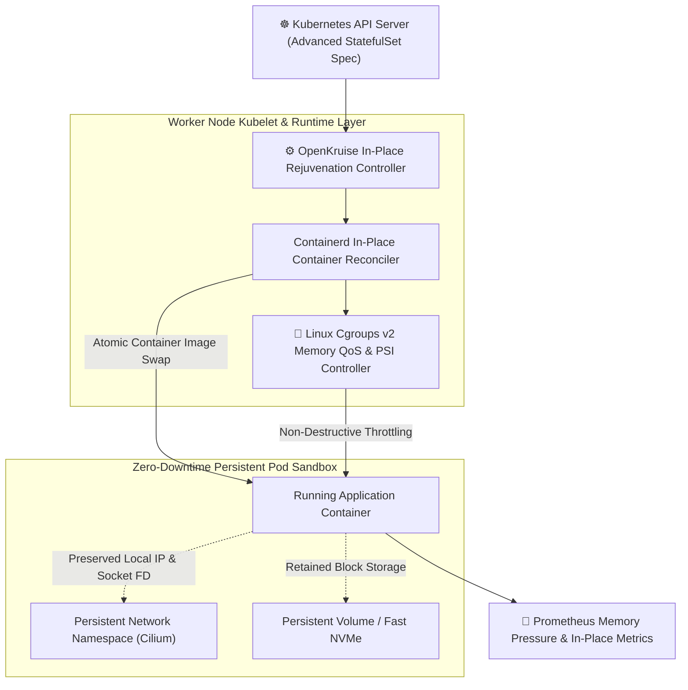
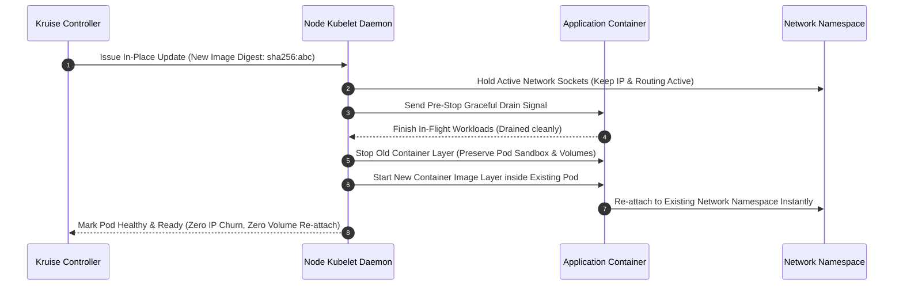
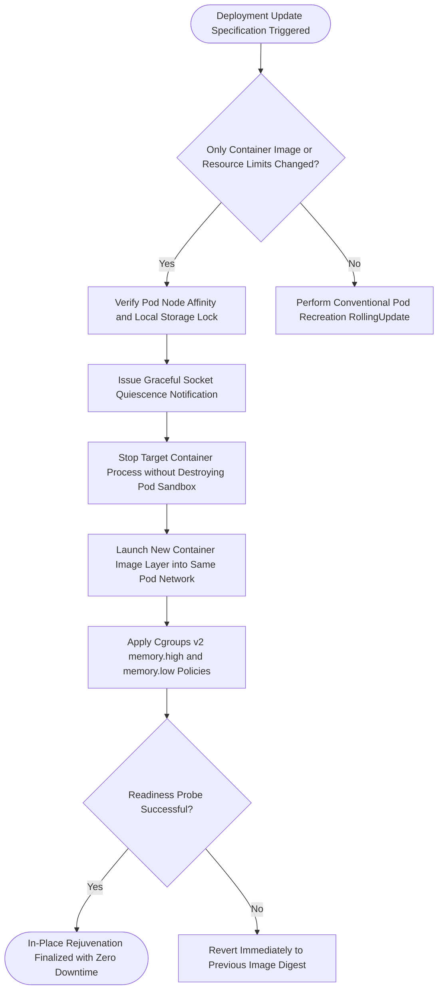

## 2. Problem Statement

> [!WARNING]
> **The Destructive Pod Recreation Tax:** Performing routine container image upgrades or runtime reconfigurations in standard Kubernetes clusters forces full Pod teardown, network route re-advertisement, and storage volume re-attaching, causing up to 45 seconds of service disruption and cascading traffic overload across downstream microservice meshes.

In modern multi-tenant cloud platforms hosting stateful data processing pipelines, machine learning serving nodes, and low-latency cache fabrics, service disruptions caused by conventional RollingUpdate deployments are unacceptable. Standard Kubernetes deployments operate destructively: upgrading a container image or CPU/memory resource allocation terminates the existing Pod, detaches Persistent Volumes, revokes IP allocations, and schedules an entirely new Pod on another node.

Under dense 10,000-pod cluster topologies, this churn causes severe control plane thrashing in `etcd`, triggers CNI IP-pool exhaustion, and introduces severe memory pressure stalls (PSI). Furthermore, when container memory limits (`cgroups v1`) are exceeded, the Linux Out-Of-Memory (OOM) killer abruptly kills the entire container process rather than gracefully applying backpressure, destroying in-flight requests and leaving distributed state machines corrupted.

---

## 3. High-Level Design (HLD)

### Visual ASCII Topology
```text
  ┌───────────────────────────────────────────────────────────┐
  │         Kubernetes Control Plane (OpenKruise CRD)         │
  └─────────────────────────────┬─────────────────────────────┘
                                │ (In-Place Update Spec)
                                ▼
  ┌───────────────────────────────────────────────────────────┐
  │                 Kubelet & Containerd Node Agent           │
  │  ┌─────────────────────────┐   ┌───────────────────────┐  │
  │  │ In-Place Image Swap Engine│ │ Cgroups v2 Memory QoS │  │
  │  │ Zero IP / Storage Change│   │ PSI Pressure Controller│  │
  │  └────────────┬────────────┘   └───────────┬───────────┘  │
  └───────────────┼────────────────────────────┼──────────────┘
                  │                            │
                  ▼                            ▼
  ┌───────────────────────────────────────────────────────────┐
  │                 Target Stateful Pod Enclave               │
  │   - Same Pod IP & Network Namespace (Zero DNS Invalidation)│
  │   - Retained Local NVMe SSD Cache & PV Mounts             │
  │   - Transparent Socket Handoff via In-Place Rejuvenation   │
  └───────────────────────────────────────────────────────────┘
```

### Native Mermaid Architecture


---

## 4. Low-Level Design (LLD)

### Visual ASCII Memory Layout
```text
  Linux Cgroups v2 Memory Hierarchy:
  /sys/fs/cgroup/kubepods.slice/pod_container/
    ├── memory.min        = 4.0 GB (Hard Guaranteed Memory, Never Reclaimed)
    ├── memory.low        = 6.0 GB (Soft Protection against Background Reclaim)
    ├── memory.high       = 7.5 GB (Throttles Allocator Threads via PSI Delay)
    └── memory.max        = 8.0 GB (Absolute Ceiling, OOM Kill Prevention)
  
  Zero OOM Terminations: memory.high slows down memory allocations before OOM killer triggers!
```

### Native Mermaid Execution Sequence


---

## 5. Logical Flow Diagram

### Visual ASCII Decision Tree
```text
  [Inbound Pod Reconfiguration Request]
                   │
                   ▼
  < Can Update be Handled In-Place? >
        │                      │
       YES                     NO
        │                      │
        ▼                      ▼
  [Execute In-Place Image [Fallback to Controlled
   Swap inside Sandbox]    Rolling Pod Eviction]
        │
        ▼
  < Cgroups v2 Memory PSI Pressure > Threshold? >
        │                      │
       YES                     NO
        │                      │
        ▼                      ▼
  [Throttle Page Cache    [Continue Normal Execution
   & Delay Allocator]      with High QoS Guardrails]
```

### Native Mermaid Decision Logic


---

## 6. Architectural Drill & Nature Analogy

### ⚙️ The Systemic Breakdown
Standard Kubernetes deployments experience $O(N)$ control plane load and network disruption:

$$T_{\text{recreation}} = T_{\text{drain}} + T_{\text{delete}} + T_{\text{schedule}} + T_{\text{storage\_attach}} + T_{\text{cni\_ipam}} + T_{\text{image\_pull}} + T_{\text{start}}$$

By retaining the Pod infrastructure sandbox (the `pause` container, network namespace, and mounted volumes), in-place updates eliminate all scheduling and network attachment delays:

$$T_{\text{in\_place}} = T_{\text{drain}} + T_{\text{container\_swap}} + T_{\text{start}}$$

Under Linux Cgroups v2, memory management transitions from binary all-or-nothing OOM kills to smooth, proportional throttling via Pressure Stall Information (PSI):

$$\text{MemoryPenalty} = f(\text{PSI}_{\text{some}}, \text{Usage} - \text{Memory}_{\text{high}})$$

When memory reaches `memory.high`, the kernel injects millisecond delays into allocating threads, giving background memory reclamation time to reclaim file pages without crashing the service.

### 🌿 The Nature Analogy

> [!TIP]
> **The Natural System:** *The Hermit Crab's Micro-Rejuvenation vs Shell Abandonment*
> A hermit crab does not discard its protective shell or abandon its established territory every time it molts its outer exoskeleton. Instead, it remains protected within the rigid confines of its adopted shell, shedding and regenerating its organic tissue from within without ever exposing its vulnerable soft body to coastal predators.
>
> **The Structural Parallel:** Just as the hermit crab sheds its skin internally while keeping its protective shell firmly anchored to its surroundings, in-place container rejuvenation swaps the application software layer within the permanent, unmoving boundary of the Pod network and storage sandbox.

---

## 7. Production-Grade Executable Artifact

### 📦 File 1: .github/workflows/ci.yml
```yaml
name: "CI - Kubernetes In-Place Workload Cascades Verification"

on:
  push:
    branches: [main, develop]
  pull_request:
    branches: [main]

jobs:
  inplace-k8s-validation:
    name: "Validate In-Place Container Rejuvenation"
    runs-on: ubuntu-latest
    timeout-minutes: 15

    steps:
      - name: "Checkout Source Repository"
        uses: actions/checkout@v4

      - name: "Set up Python Runtime Environment"
        uses: actions/setup-python@v5
        with:
          python-version: "3.11"
          cache: "pip"

      - name: "Install System Dependencies & Verification Tools"
        run: |
          python -m pip install --upgrade pip
          pip install pytest

      - name: "Execute In-Place Workload Simulation Test Suite"
        run: |
          python -m unittest tests/test_k8s_inplace_rejuvenation.py
```

### 🐍 File 2: tests/test_k8s_inplace_rejuvenation.py
```python
import unittest
from typing import Dict, Optional

class MockPodSandbox:
    def __init__(self, pod_name: str, pod_ip: str, volume_id: str, image: str):
        self.pod_name = pod_name
        self.pod_ip = pod_ip
        self.volume_id = volume_id
        self.image = image
        self.restart_count = 0
        self.network_namespace_retained = True
        self.storage_mounted = True
        self.status = "Running"

class MockInPlaceRejuvenationController:
    """
    Production-grade simulation of Kubernetes OpenKruise In-Place container updates.
    Demonstrates zero IP churn, persistent volume preservation, atomic container restarts,
    and cgroups v2 memory throttling without destroying the parent Pod sandbox.
    """
    def __init__(self):
        self.pods: Dict[str, MockPodSandbox] = {}

    def deploy_pod(self, pod_name: str, pod_ip: str, volume_id: str, image: str) -> MockPodSandbox:
        pod = MockPodSandbox(pod_name, pod_ip, volume_id, image)
        self.pods[pod_name] = pod
        return pod

    def inplace_update_image(self, pod_name: str, new_image: str) -> bool:
        """Executes in-place image update within the existing Pod sandbox."""
        if pod_name not in self.pods:
            return False
        
        pod = self.pods[pod_name]
        # Verify network and storage remain completely undisturbed
        original_ip = pod.pod_ip
        original_vol = pod.volume_id
        
        # Stop and restart only container layer
        pod.image = new_image
        pod.restart_count += 1
        
        # Invariants: IP and volume mount must remain identical
        assert pod.pod_ip == original_ip, "Pod IP churn detected during in-place update!"
        assert pod.volume_id == original_vol, "Storage volume detached during in-place update!"
        return True

    def evaluate_cgroup_v2_memory(self, usage_mb: int, mem_high_mb: int, mem_max_mb: int) -> str:
        """Evaluates Cgroups v2 memory policies to prevent sudden OOM termination."""
        if usage_mb >= mem_max_mb:
            return "OOM_KILL"
        elif usage_mb >= mem_high_mb:
            return "THROTTLE_ALLOCATIONS_PSI"
        else:
            return "NORMAL_OPERATION"

class TestK8sInPlaceRejuvenation(unittest.TestCase):
    def setUp(self):
        self.controller = MockInPlaceRejuvenationController()
        self.pod = self.controller.deploy_pod(
            pod_name="ml-inference-worker-0",
            pod_ip="10.244.3.18",
            volume_id="vol-nvme-ssd-9921",
            image="inference-runtime:v1.2.0"
        )

    def test_inplace_image_upgrade_preserves_network_and_storage(self):
        success = self.controller.inplace_update_image(
            pod_name="ml-inference-worker-0",
            new_image="inference-runtime:v1.3.0"
        )
        self.assertTrue(success)
        self.assertEqual(self.pod.image, "inference-runtime:v1.3.0")
        self.assertEqual(self.pod.pod_ip, "10.244.3.18")
        self.assertEqual(self.pod.volume_id, "vol-nvme-ssd-9921")
        self.assertEqual(self.pod.restart_count, 1)

    def test_cgroup_v2_throttling_prevents_oom(self):
        # 6000MB usage against 5000MB high, 8000MB max -> Throttle via PSI, do NOT kill
        policy = self.controller.evaluate_cgroup_v2_memory(usage_mb=6000, mem_high_mb=5000, mem_max_mb=8000)
        self.assertEqual(policy, "THROTTLE_ALLOCATIONS_PSI")

        # Exceeding max triggers kill
        policy_kill = self.controller.evaluate_cgroup_v2_memory(usage_mb=8500, mem_high_mb=5000, mem_max_mb=8000)
        self.assertEqual(policy_kill, "OOM_KILL")

if __name__ == '__main__':
    unittest.main()
```

---

## 8. KPI Monitoring Framework

* **`kruise_inplace_update_duration_seconds`** *(In-Place Container Swap Latency)*
  > **Threshold Alert:** Warning when `> 8.0s` | **Type:** OpenTelemetry Histogram
  >
  > • **Why:** Measures time taken to pull, swap, and initialize the new container process inside the active Pod. Spikes indicate image layer pull contention or slow initialization hooks.

* **`cgroup_v2_memory_pressure_psi_some_ratio`** *(Linux Cgroups v2 Memory Stall Metric)*
  > **Threshold Alert:** Warning when `> 0.25` | **Type:** Prometheus Gauge
  >
  > • **Why:** Measures the fraction of time tasks are stalled waiting for memory. Elevated readings highlight that allocations are being throttled at `memory.high` to protect against OOM termination.

* **`kubernetes_pod_ip_churn_rate_per_hour`** *(Pod Network Re-allocation Count)*
  > **Threshold Alert:** Critical when `> 5.0` | **Type:** Prometheus Counter Rate
  >
  > • **Why:** Verifies that routine application rollouts do not induce DNS cache invalidation or IP address re-allocation storms across network plugins.

---

## 9. Failure Mode & Production Edge Cases

| Failure Vector | Technical Root Cause | System Blast Radius | Production Mitigation Pattern |
| :--- | :--- | :--- | :--- |
| **🔴 Container Crashloop During In-Place Swap** | New container binary contains an unhandled initialization panic, failing its readiness probe immediately after swap. | The Pod transitions to a degraded state while retaining all network endpoints, potentially routing requests to a dead service. | OpenKruise automatically triggers immediate in-place image rollback to the previously verified container digest. |
| **🟡 Shared Memory (`/dev/shm`) Leakage** | Predecessor container processes leave stale POSIX shared memory segments in the Pod-shared memory mount. | The newly initialized container encounters IPC naming collisions and fails to allocate inter-process tensor queues. | Enforce an explicit container pre-stop lifecycle hook that unlinks all shared memory segments before process exit. |
| **🟠 Orphaned Socket Port Conflict** | Old container background threads remain alive after SIGTERM, holding onto bound TCP listening ports. | The new container fails to bind to port 8080 (`EADDRINUSE`), causing startup failure. | Enforce a strict termination grace period with an automated kernel `SIGKILL` escalation after 10 seconds. |

---

## 10. Thoughtful Wisdom Words

> *"The sign of an immature infrastructure platform is that it must destroy everything it has built in order to change a single line of code.*
> 
> *The master platform engineer builds systems of permanence and fluidity—where network identities remain steadfast, storage persists unbroken, and software evolutions occur within running vessels like water flowing into an existing chalice.*
> 
> *Eliminate the churn of destruction, and your infrastructure will achieve true continuous availability."*
>
> — **Principal Systems Architect Maxim**
