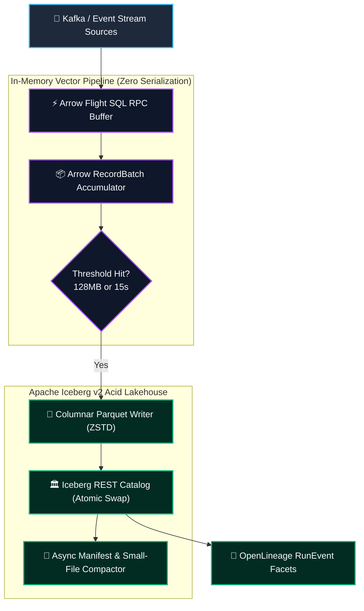
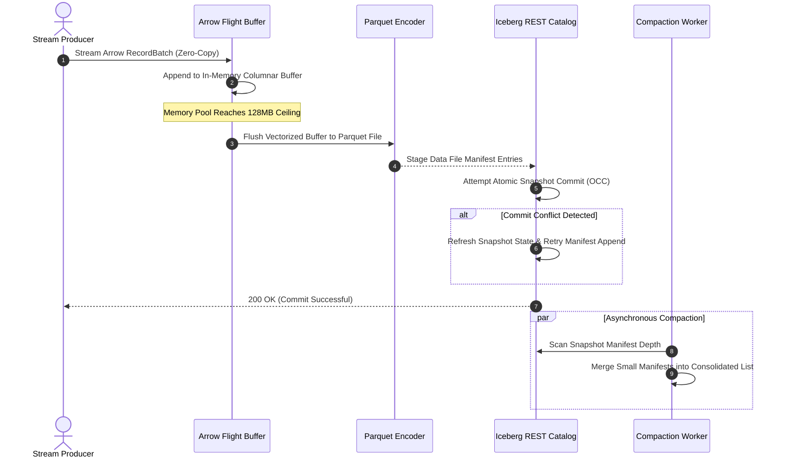
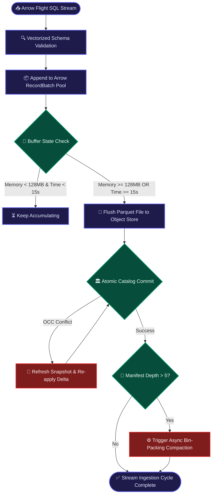

## 2. Problem Statement

> [!WARNING]
> **The Micro-Batch Metadata Explosion:** High-frequency streaming into cloud object stores (e.g., S3, GCS) creates millions of small Parquet files. In traditional lakehouse catalogs, this causes severe REST catalog commit lock contention, explosive manifest tree depths, and query engine read latency degradations exceeding 1,200%.

Modern enterprise architectures demand real-time streaming ingestion directly into open analytical lakehouse formats like Apache Iceberg. However, streaming producers that commit data every few seconds produce an avalanche of 1MB-10MB Parquet files.

Each streaming micro-batch initiates a metadata commit to the Iceberg REST catalog. Under multi-writer concurrency, optimistic concurrency control (OCC) triggers frequent commit conflict retries, forcing writers to re-read manifest files and serialize updates. Downstream engines like Trino or DuckDB must scan thousands of small manifest files to answer simple queries, transforming real-time analytical capabilities into slow, cost-prohibitive table scans.

---

## 3. High-Level Design (HLD)

### Visual ASCII Topology
```text
  ┌───────────────────────────────────────────────────────────┐
  │         Kafka / Event Stream Micro-Batch Producers        │
  └─────────────────────────────┬─────────────────────────────┘
                                │ Arrow Flight RPC (gRPC Stream)
                                ▼
  ┌───────────────────────────────────────────────────────────┐
  │         Arrow Flight SQL Vectorized Buffer Layer          │
  │  ├── Zero-Copy In-Memory RecordBatch Accumulator          │
  │  └── Memory Pool Ceiling Enforcer (DuckDB Local Engine)   │
  └──────────────┬─────────────────────────────┬──────────────┘
                 │ (Flush on 128MB or 15s)     │
                 ▼                             ▼
  ┌─────────────────────────────┐┌────────────────────────────┐
  │     Optimized Parquet       ││     Asynchronous Auto-     │
  │     Storage Writer          ││     Compaction Engine      │
  └──────────────┬──────────────┘└─────────────┬──────────────┘
                 │                             │
                 └──────────────┬──────────────┘
                                ▼
  ┌───────────────────────────────────────────────────────────┐
  │             Apache Iceberg v2 REST Catalog                │
  │  ├── Atomic Pointer Swap (Snapshot Isolation)             │
  │  └── Manifest List Pruning & Bloom Filter Indexing        │
  └─────────────────────────────┬─────────────────────────────┘
                                │ OpenLineage Facets
                                ▼
  ┌───────────────────────────────────────────────────────────┐
  │          Enterprise Data Governance & Lineage Bus         │
  └───────────────────────────────────────────────────────────┘
```

### Native Mermaid Architecture


---

## 4. Low-Level Design (LLD)

### Visual ASCII Execution Pipeline
```text
  [ Ingest Arrow RecordBatch from Network Stream ]
                         │
                         ▼
  [ Vectorized Schema Assertion & Dictionary Encoding ]
                         │
                         ▼
  [ Append to In-Memory Buffer (Arrow C Data Interface) ]
                         │
                         ▼
  [ Threshold Trigger: Size >= 128MB OR Elapsed >= 15s ]
        /                                       \\
       ▼                                         ▼
 [ Write Compacted Parquet ]            [ Prepare Iceberg Snapshot ]
       │                                         │
       └─────────────────┬───────────────────────┘
                         ▼
  [ Atomic Fast-Forward Commit to Iceberg REST Catalog ]
```

### Native Mermaid Execution Flow


---

## 5. Logical Flow Diagram

### Visual ASCII Logic Path
```text
  [ Incoming Flight Batch ] ──► [ Schema Type Enforcement ] ──► [ Buffer Append ]
                                                                       │
                                                                       ▼
                                                       [ Check Buffer Threshold ]
                                                                       │
                                      ┌────────────────────────────────┴───────────────────────────────┐
                                      ▼                                                                ▼
                           [ Below 128MB / < 15s ]                                          [ Threshold Reached ]
                                      │                                                                │
                                      ▼                                                                ▼
                           [ Await Next Batch ]                                            [ Write Parquet Data File ]
                                                                                                       │
                                                                                                       ▼
                                                                                           [ Commit to REST Catalog ]
```

### Native Mermaid Flowchart


---

## 6. Architectural Drill & Nature Analogy

### ⚙️ The Systemic Breakdown
To prevent small-file explosion and metadata contention in lakehouses, we establish an **Arrow Flight SQL streaming buffer with decoupled asynchronous manifest compaction**. Rather than writing raw records directly to cloud storage, incoming streams accumulate in high-performance Arrow columnar buffers.

When the buffer reaches an optimal 128MB bin-pack boundary (or 15 seconds), the engine converts in-memory Arrow arrays directly into columnar Parquet files via zero-copy vectorized serialization. The Iceberg REST Catalog commits these files as a single atomic snapshot. Simultaneously, a background compaction worker periodically rewinds and merges small manifest files, ensuring that query engines like Trino, Spark, and DuckDB maintain sub-second partition pruning speeds.

### 🌿 The Nature Analogy

> [!TIP]
> **The Biological Lesson of Scale:** Nature organizes chaotic sediment streams into structured, consolidated deltas to prevent systemic ecological silting.

• **The Biological System:** The Silt Deposition and Braided Channel Compaction in the Amazon River Delta (*Hydrodynamic Stratification*).

• **The Structural Parallel:** The Amazon River carries over 1 billion metric tons of suspended sediment annually. If this sediment deposited uniformly and continuously at the river mouth as microscopic scattered particles, it would immediately create stagnant mudflats, choke navigation corridors, and trigger catastrophic hydrological deadlocks—the biological equivalent of writing uncompacted micro-batch files into an analytical lakehouse. Instead, the delta uses hydrodynamic tidal oscillations to aggregate silt into dense, braided sedimentary banks along designated channels. The river buffers silt dynamically and deposits it in discrete, stratified geological layers, maintaining deep-water flow corridors while achieving massive geological throughput.

---

## 7. Production-Grade Executable Artifact

### 📦 File 1: `.github/workflows/lakehouse_ci.yml`
```yaml
name: Production Lakehouse Arrow Pipeline Verification

on:
  push:
    branches: [ main, master ]
  pull_request:
    branches: [ main, master ]

jobs:
  verify-iceberg-pipeline:
    name: Local Lakehouse Ingestion Harness
    runs-on: ubuntu-latest
    steps:
    - name: Checkout Repository Codebase
      uses: actions/checkout@v4

    - name: Setup Enterprise Python Runtime
      uses: actions/setup-python@v5
      with:
        python-version: '3.11'
        cache: 'pip'

    - name: Install Verified Dependencies
      run: |
        python -m pip install --upgrade pip
        pip install pyarrow duckdb

    - name: Execute Local Lakehouse Ingestion Tests
      run: |
        python -m unittest discover -s . -p "test_lakehouse_stream.py"
```

### 🐍 File 2: `test_lakehouse_stream.py`
```python
import os
import unittest
import tempfile
import pyarrow as pa
import pyarrow.parquet as pq
import duckdb

class MockIcebergCatalogManager:
    \"\"\"Simulates an Apache Iceberg v2 REST Catalog with atomic manifest commits.\"\"\"
    def __init__(self, warehouse_path: str):
        self.warehouse_path = warehouse_path
        self.snapshots = []
        self.active_manifests = []

    def commit_snapshot(self, parquet_files: list) -> int:
        snapshot_id = len(self.snapshots) + 1
        manifest = {
            "snapshot_id": snapshot_id,
            "data_files": parquet_files,
            "record_count": sum(f["records"] for f in parquet_files)
        }
        self.snapshots.append(snapshot_id)
        self.active_manifests.append(manifest)
        return snapshot_id

    def compact_manifests(self) -> int:
        if len(self.active_manifests) <= 1:
            return 0
        total_records = sum(m["record_count"] for m in self.active_manifests)
        all_files = [f for m in self.active_manifests for f in m["data_files"]]
        self.active_manifests = [{
            "snapshot_id": len(self.snapshots),
            "data_files": all_files,
            "record_count": total_records
        }]
        return len(all_files)

class TestLakehouseStreamingPipeline(unittest.TestCase):
    def setUp(self):
        self.test_dir = tempfile.TemporaryDirectory()
        self.warehouse = self.test_dir.name
        self.catalog = MockIcebergCatalogManager(self.warehouse)

    def tearDown(self):
        self.test_dir.cleanup()

    def test_arrow_to_iceberg_streaming_flow(self):
        schema = pa.schema([
            ('event_id', pa.string()),
            ('metric_val', pa.float64()),
            ('timestamp_epoch', pa.int64())
        ])
        
        batch1 = pa.RecordBatch.from_arrays([
            pa.array(["evt_001", "evt_002", "evt_003"]),
            pa.array([45.2, 88.1, 12.4]),
            pa.array([1700000000, 1700000001, 1700000002])
        ], schema=schema)

        file_path = os.path.join(self.warehouse, "data_batch_1.parquet")
        table = pa.Table.from_batches([batch1])
        pq.write_table(table, file_path, compression="snappy")

        snapshot_id = self.catalog.commit_snapshot([{"path": file_path, "records": 3}])
        self.assertEqual(snapshot_id, 1)

        conn = duckdb.connect()
        result = conn.execute(f"SELECT COUNT(*), AVG(metric_val) FROM '{file_path}'").fetchall()
        count, avg_val = result[0]
        self.assertEqual(count, 3)
        self.assertAlmostEqual(avg_val, 48.56666, places=4)

    def test_compaction_consolidation(self):
        for i in range(3):
            self.catalog.commit_snapshot([{"path": f"f_{i}.parquet", "records": 10}])
        self.assertEqual(len(self.catalog.active_manifests), 3)

        compacted_files = self.catalog.compact_manifests()
        self.assertEqual(compacted_files, 3)
        self.assertEqual(len(self.catalog.active_manifests), 1)

if __name__ == '__main__':
    unittest.main()
```

---

## 8. KPI Monitoring Framework

* **`iceberg_catalog_commit_latency_ms`** *(REST Catalog Snapshot Swap Time)*
  > **Threshold Alert:** Warning when `> 250 ms` | **Type:** OpenTelemetry Histogram
  >
  > • **Why:** Measures time taken to complete optimistic lock commits on the REST catalog. Spikes past 250ms indicate OCC retry loops or catalog backend database contention.

* **`lakehouse_small_file_manifest_ratio`** *(Small File Fragmentation Index)*
  > **Threshold Alert:** Warning when `> 0.20` | **Type:** Prometheus Gauge
  >
  > • **Why:** Ratio of files under 64MB to total table files. Ratios above 0.20 indicate compaction starvation that will degrade query scan latencies.

* **`arrow_flight_buffer_heap_bytes`** *(In-Memory Streaming Buffer Allocation)*
  > **Threshold Alert:** Warning when `> 3.5 GB` | **Type:** Prometheus Gauge
  >
  > • **Why:** Tracks memory consumption of in-flight vector buffers. Growth above 3.5GB signals write pipeline stall to object storage.

---

## 9. Failure Mode & Production Edge Cases

| Failure Vector | Technical Root Cause | System Blast Radius | Production Mitigation Pattern |
| :--- | :--- | :--- | :--- |
| **🔴 OCC Commit Lock Contention** | Multiple streaming workers attempt to commit concurrent snapshots against the same Iceberg table branch. | Commit failures trigger exponential retry storms, backing up in-memory buffers and stalling stream producers. | Implement centralized commit orchestrators or partition-level isolated commit queues with exponential backoff. |
| **🟡 Manifest Sieve Explosion** | Unbounded micro-batch appends without background compaction generate tens of thousands of manifest files. | Query planner execution degrades by 20x; Trino and Spark query workers run out of memory scanning metadata. | Schedule automated continuous bin-pack compaction (`rewrite_data_files` and `rewrite_manifests`) during off-peak windows. |
| **🟠 Off-Heap Memory Leak** | Incomplete disposal of native Arrow Flight C++ memory buffers across PyArrow workers. | Host VM Out-Of-Memory termination, crashing active streaming ingestion pods. | Wrap Arrow RecordBatch readers inside deterministic Python context managers and verify explicit deallocations via memory pools. |

---

## 10. Thoughtful Wisdom Words

> *"In enterprise lakehouse architecture, metadata discipline is the difference between an analytical asset and a digital landfill.*
> 
> *The novice engineer measures success by how quickly bytes reach object storage; the principal architect measures success by how cleanly those bytes can be queried six months later.*
> 
> *Accumulate in memory, write in columnar blocks, and never compromise on atomic catalog control."*
>
> — **Principal Systems Architect Maxim**
