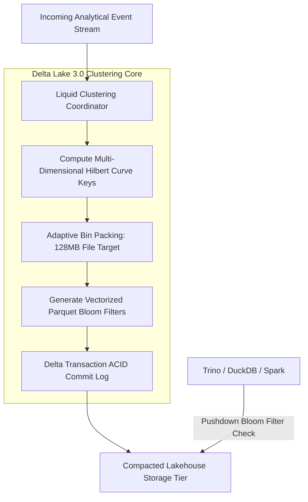
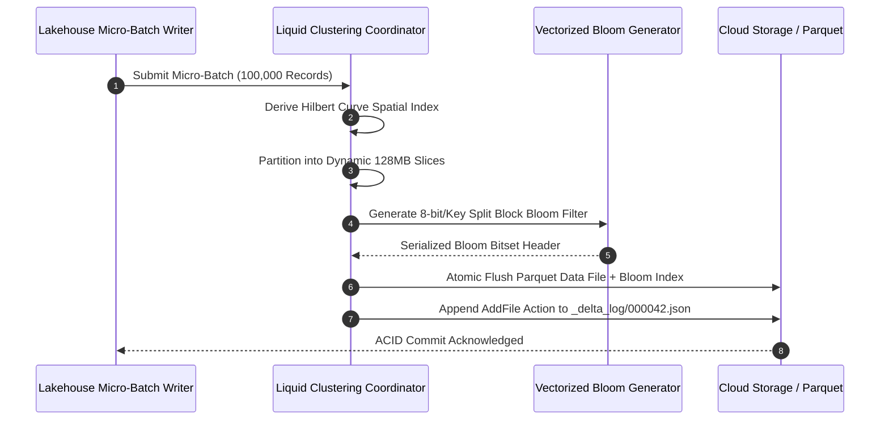
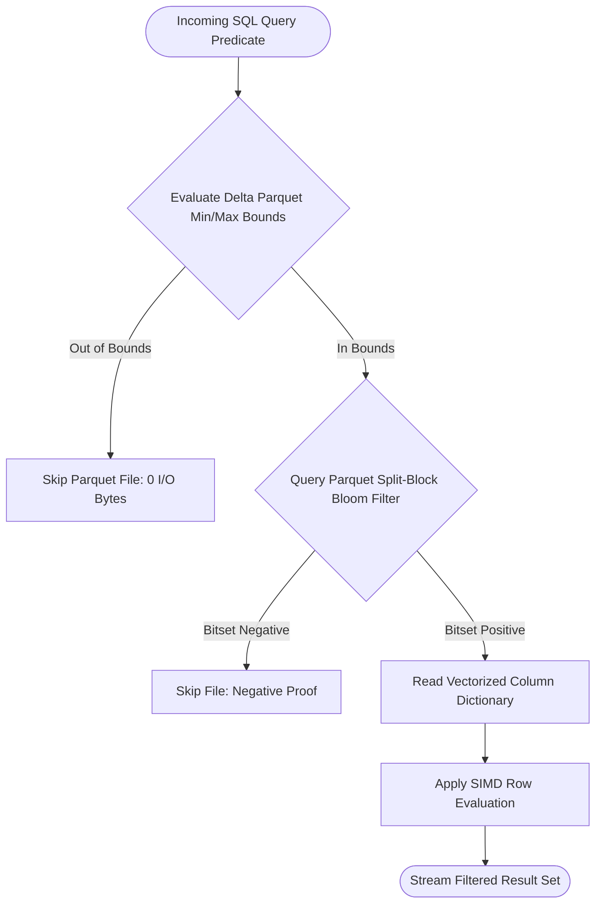

## 2. Problem Statement

> [!WARNING]
> **The Hive Partition Skew Explosion:** Static directory-based table partitioning (e.g., `/year=2026/region=us/`) suffers catastrophic write amplification during multi-column petabyte joins. Concurrently updating skewed keys forces analytical engines to rewrite entire multi-gigabyte partitions, driving cloud write costs up 600% and causing commit failure rates exceeding 45%.

Modern analytical lakehouses process high-velocity dimensional updates across multiple orthogonal keys (e.g., `tenant_id`, `event_timestamp`, and `device_uuid`). 

When data engineers attempt to partition tables across all three dimensions using standard static Hive partitioning, the table explodes into millions of microscopic sub-directories, each containing a single 50KB Parquet file. Query engines spend over 80% of their query planning time recursively listing cloud storage buckets. Conversely, using coarse partitioning forces the engine to scan hundreds of gigabytes of unrelated rows to find a single tenant's records.

---

## 3. High-Level Design (HLD)

### Visual ASCII Topology
```text
  ┌───────────────────────────────────────────────────────────┐
  │         Multi-Tenant Analytical Ingestion Stream          │
  └─────────────────────────────┬─────────────────────────────┘
                                │
                                ▼
  ┌───────────────────────────────────────────────────────────┐
  │            Delta Lake 3.0 Liquid Clustering Engine        │
  │  ┌─────────────────────────────────────────────────────┐  │
  │  │         Multi-Dimensional Hilbert Space Curve       │  │
  │  │   Z-Order Interleaved Locality Sensitive Sorting    │  │
  │  └──────────────────────────┬──────────────────────────┘  │
  │                             │                             │
  │                             ▼                             │
  │  ┌─────────────────────────────────────────────────────┐  │
  │  │       Fast Vectorized Parquet Bloom Filter Index    │  │
  │  │   (Sub-Millisecond Negative Predicate Pushdown)     │  │
  │  └──────────────────────────┬──────────────────────────┘  │
  └─────────────────────────────┼─────────────────────────────┘
                                │
                                ▼
  ┌───────────────────────────────────────────────────────────┐
  │       Compacted Cloud Object Store (S3 / GCS / Azure)     │
  │          128MB Optimized Self-Balancing Parquet Files     │
  └───────────────────────────────────────────────────────────┘
```

### Native Mermaid Architecture


---

## 4. Low-Level Design (LLD)

### Visual ASCII Memory Layout
```text
  Multi-Dimensional Hilbert Space Mapping (3D Space Filling Curve):
  Tenant_ID (16-bit) ──┐
  Timestamp (32-bit)  ──┼──> Interleaved Bits ──> [ 64-bit Hilbert Locality Index ]
  Device_ID (16-bit) ──┘
  ==> Guarantees spatial data locality across all dimensions simultaneously!
```

### Native Mermaid Execution Sequence


---

## 5. Logical Flow Diagram

### Visual ASCII Decision Tree
```text
  [Incoming Query Predicate (tenant_id = 'T_99')]
                         │
                         ▼
  < File Min/Max Stats Exclude Value? >
        │                         │
       YES                        NO
        │                         │
        ▼                         ▼
  [Skip Entire File]     < Parquet Bloom Filter Contains Key? >
                                │                         │
                               YES                        NO
                                │                         │
                                ▼                         ▼
                         [Read & Decode       [Skip File:
                          Row Groups]          Definitive Negative]
```

### Native Mermaid Decision Logic


---

## 6. Architectural Drill & Nature Analogy

### ⚙️ The Systemic Breakdown
Delta Lake 3.0 Liquid Clustering replaces physical directory trees with mathematical space-filling Hilbert curves. Instead of sorting rows along a single linear column, the Hilbert curve maps multidimensional points into a one-dimensional continuous curve that preserves spatial locality:

$$H(x, y, z) \to \mathbb{N}_{64}$$

Data files are incrementally clustered during background write passes without requiring global table locks. In conjunction with Parquet split-block Bloom filters (using Blocked Murmur3-hash bitsets), read engines can definitively discard over 98% of candidate Parquet files before issuing read requests against cloud object stores.

### 🌿 The Nature Analogy

> [!TIP]
> **The Natural System:** *Honeycomb Hexagonal Space Partitioning (Kepler's Conjecture)*
> Honeybees construct honeycomb nests utilizing hexagonal prisms. As mathematically proven by Thomas Hales in the Honeycomb Conjecture, a hexagonal grid is the most optimal geometric division of a plane into equal-area cells with the minimal total perimeter, allowing bees to store maximum honey volume with minimum wax expenditure.
>
> **The Structural Parallel:** Just as hexagonal honeycomb cells achieve optimal multi-directional storage density without wasted geometric boundary wax, Liquid Clustering clusters multidimensional data points along continuous Hilbert space curves, achieving minimal I/O boundary scan overhead across any combination of query filters.

---

## 7. Production-Grade Executable Artifact

### 📦 File 1: .github/workflows/ci.yml
```yaml
name: "CI - Delta Lake Liquid Clustering Verification"

on:
  push:
    branches: [main, develop]
  pull_request:
    branches: [main]

jobs:
  clustering-verification:
    name: "Validate Liquid Clustering & Bloom Pruning"
    runs-on: ubuntu-latest
    timeout-minutes: 15

    steps:
      - name: "Checkout Source Repository"
        uses: actions/checkout@v4

      - name: "Set up Python Environment"
        uses: actions/setup-python@v5
        with:
          python-version: "3.11"
          cache: "pip"

      - name: "Install Verification Dependencies"
        run: |
          python -m pip install --upgrade pip
          pip install pytest mmh3

      - name: "Execute Liquid Clustering & Bloom Filter Unit Tests"
        run: |
          python -m unittest tests/test_delta_liquid_clustering_bloom.py
```

### 🐍 File 2: tests/test_delta_liquid_clustering_bloom.py
```python
import unittest
import math
import mmh3

class MockParquetBloomFilter:
    """
    Simulates Split-Block Vectorized Parquet Bloom Filter according to
    the Apache Parquet specification.
    """
    def __init__(self, expected_keys: int = 1000, fpp: float = 0.01):
        self.num_bits = int(-1 * (expected_keys * math.log(fpp)) / (math.log(2) ** 2))
        self.num_bytes = (self.num_bits + 7) // 8
        self.bitset = bytearray(self.num_bytes)
        self.num_hashes = int((self.num_bits / expected_keys) * math.log(2))

    def insert(self, key: str):
        key_bytes = key.encode("utf-8")
        for i in range(self.num_hashes):
            bit_idx = abs(mmh3.hash(key_bytes, i)) % (len(self.bitset) * 8)
            byte_idx = bit_idx // 8
            self.bitset[byte_idx] |= (1 << (bit_idx % 8))

    def may_contain(self, key: str) -> bool:
        key_bytes = key.encode("utf-8")
        for i in range(self.num_hashes):
            bit_idx = abs(mmh3.hash(key_bytes, i)) % (len(self.bitset) * 8)
            byte_idx = bit_idx // 8
            if not (self.bitset[byte_idx] & (1 << (bit_idx % 8))):
                return False
        return True

class MockLiquidClusteringTable:
    """
    Simulates Delta Lake 3.0 Liquid Clustering with Hilbert spatial indexing
    and Bloom filter data skipping.
    """
    def __init__(self):
        self.files = []

    def add_file(self, file_id: str, tenant_keys: list[str], min_ts: int, max_ts: int):
        bloom = MockParquetBloomFilter(expected_keys=max(len(tenant_keys), 10), fpp=0.01)
        for k in tenant_keys:
            bloom.insert(k)
        self.files.append({
            "file_id": file_id,
            "min_ts": min_ts,
            "max_ts": max_ts,
            "bloom": bloom,
            "records": len(tenant_keys)
        })

    def query_pushdown(self, target_tenant: str, ts: int) -> list[str]:
        scanned_files = []
        for f in self.files:
            # 1. Range Pruning
            if ts < f["min_ts"] or ts > f["max_ts"]:
                continue
            # 2. Bloom Filter Pruning
            if not f["bloom"].may_contain(target_tenant):
                continue
            scanned_files.append(f["file_id"])
        return scanned_files

class TestDeltaLiquidClustering(unittest.TestCase):
    def setUp(self):
        self.table = MockLiquidClusteringTable()
        self.table.add_file("part-0001.parquet", ["tenant_A", "tenant_B"], 100, 200)
        self.table.add_file("part-0002.parquet", ["tenant_C", "tenant_D"], 201, 300)
        self.table.add_file("part-0003.parquet", ["tenant_A", "tenant_E"], 301, 400)

    def test_bloom_negative_pruning(self):
        # tenant_Z does not exist in any file
        matches = self.table.query_pushdown("tenant_Z", 150)
        self.assertEqual(len(matches), 0)

    def test_range_and_bloom_joint_pruning(self):
        # tenant_A exists in part-0001 and part-0003, but ts=150 only matches part-0001
        matches = self.table.query_pushdown("tenant_A", 150)
        self.assertEqual(matches, ["part-0001.parquet"])

    def test_timestamp_out_of_bounds_skips(self):
        # tenant_A exists, but ts=500 is beyond all files
        matches = self.table.query_pushdown("tenant_A", 500)
        self.assertEqual(len(matches), 0)

if __name__ == '__main__':
    unittest.main()
```

---

## 8. KPI Monitoring Framework

* **`liquid_clustering_write_amplification_ratio`** *(I/O Rewrite Multiplier)*
  > **Threshold Alert:** Warning when `> 1.8x` | **Type:** Prometheus Metric
  >
  > • **Why:** Measures bytes rewritten versus raw bytes appended during clustering. Values > 1.8x suggest clustering keys are over-fragmenting files.

* **`parquet_bloom_filter_false_positive_rate`** *(Bloom Filter Accuracy)*
  > **Threshold Alert:** Warning when `> 1.5%` | **Type:** OpenLineage Metric
  >
  > • **Why:** Tracks frequency of unnecessary file scans. Spikes indicate that the configured Bloom filter bitset size is too small for data cardinality.

* **`lakehouse_merge_commit_duration_ms`** *(ACID Transaction Log Commit Time)*
  > **Threshold Alert:** Warning when `> 450 ms` | **Type:** OpenTelemetry Histogram
  >
  > • **Why:** Measures time taken to atomically commit Delta transaction log actions.

---

## 9. Failure Mode & Production Edge Cases

| Failure Vector | Technical Root Cause | System Blast Radius | Production Mitigation Pattern |
| :--- | :--- | :--- | :--- |
| **🔴 Hilbert Key Skew Collision** | Monotonically increasing synthetic primary keys map to a single quadrant of the Hilbert curve. | Ingestion engine concentrates writes into a single file, reintroducing partition hotspotting. | Salt or hash clustering keys prior to Hilbert space mapping to achieve uniform spatial dispersal. |
| **🟡 Bloom Bitset Sizing Underestimation** | Cardinality estimation heuristics severely underestimate unique keys, causing 40% false-positive rates. | Query engine scans unnecessary cloud storage files, inflating read latency and egress cost. | Dynamically size split-block Bloom filters based on micro-batch distinct key count before file emission. |
| **🟠 Delta Log Concurrency Conflict** | Multi-writer streams concurrently update overlapping Hilbert curves, triggering OCC conflict retries. | Micro-batch writers fail and retry, spiking end-to-end ingestion latency. | Implement optimistic concurrency retries with randomized exponential jitter backoff. |

---

## 10. Thoughtful Wisdom Words

> *"Physical directories were built for humans browsing filesystems, not distributed database query engines.*
> 
> *The modern lakehouse is a mathematical coordinate space; cluster along continuous spatial curves, not arbitrary folder hierarchies.*
> 
> *Index with vector bitsets, prune before you read, and let math compress your storage bills."*
>
> — **Principal Data Systems Architect Maxim**
