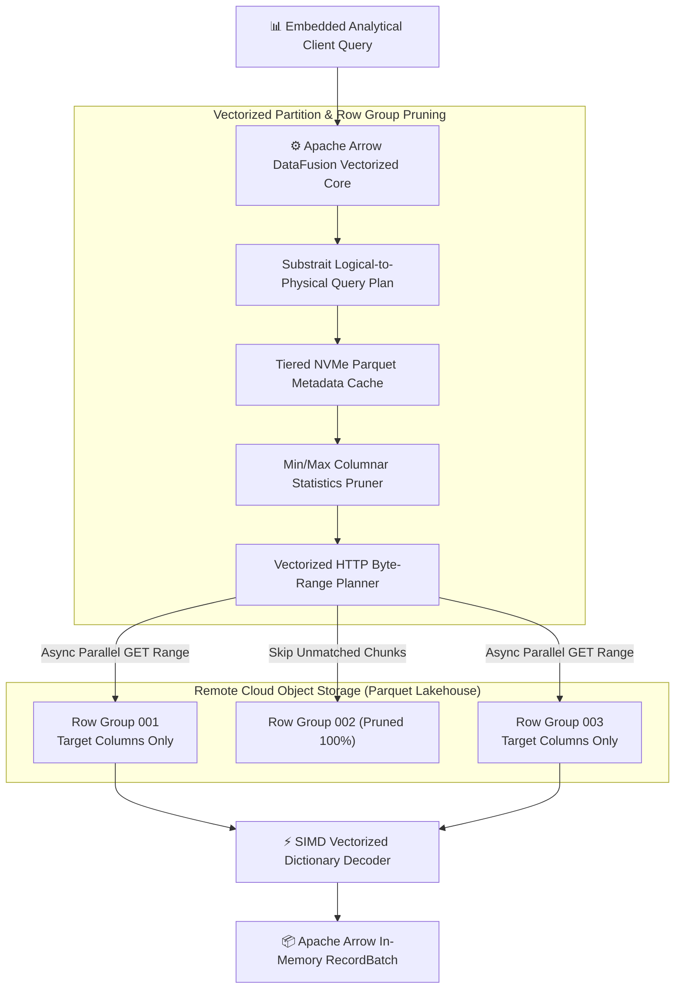
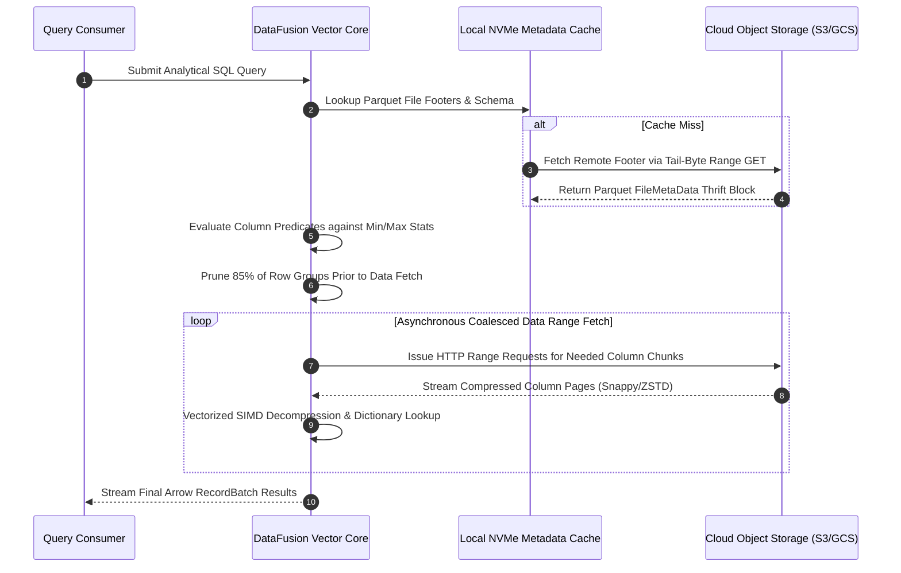
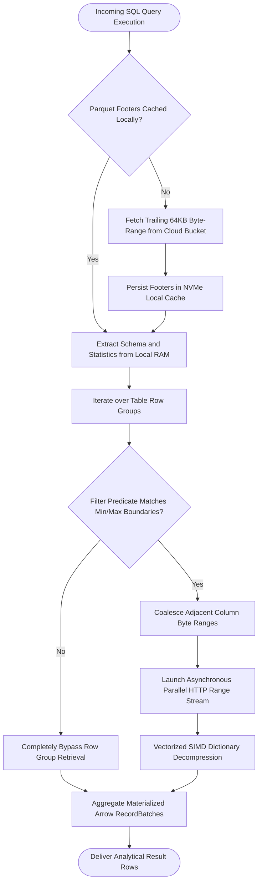

## 2. Problem Statement

> [!WARNING]
> **The Cloud Object Store Metadata Scanning Penalty:** Executing federated analytical SQL queries over multi-petabyte Parquet lakehouse datasets incurs massive latency penalties when queries must fetch, parse, and deserialize thousands of remote Parquet file footers across high-latency object storage (S3/GCS) APIs.

In modern enterprise data platforms, decentralized microservices and analytical applications frequently run ad-hoc aggregation queries across remote cloud lakehouse partitions. Traditional distributed query engines require heavy JVM cluster infrastructure (e.g., Spark or Presto clusters) that must be continuously provisioned, incurring significant idle cloud infrastructure costs.

Conversely, attempting to query remote object stores directly from lightweight application containers triggers severe I/O bottlenecks. Remote object stores exhibit 50-100ms first-byte response latencies. When an analytical query scans unpruned datasets without local metadata caching, vectorized dictionary filtering, or statistics-based byte-range skipping, query execution stalls completely, leading to timeout errors and excessive cloud egress charges.

---

## 3. High-Level Design (HLD)

### Visual ASCII Topology
```text
  ┌───────────────────────────────────────────────────────────┐
  │         Ad-Hoc Analytical Client / Embedded Engine        │
  └─────────────────────────────┬─────────────────────────────┘
                                │ (Substrait Query Plan)
                                ▼
  ┌───────────────────────────────────────────────────────────┐
  │     Apache Arrow DataFusion + DuckDB Vectorized Runtime   │
  │  ┌─────────────────────────┐   ┌───────────────────────┐  │
  │  │ Parquet Metadata Cache  │   │ Min/Max Pruning Engine│  │
  │  │ Local Tiered NVMe SSD   │   │ Vectorized Filter Eval│  │
  │  └────────────┬────────────┘   └───────────┬───────────┘  │
  └───────────────┼────────────────────────────┼──────────────┘
                  │ (Byte-Range HTTP GET)      │ (Dictionary Prune)
                  ▼                            ▼
  ┌───────────────────────────────────────────────────────────┐
  │            Remote Cloud Object Storage (S3 / GCS)         │
  │   [ Partition 2026-10-01 ]       [ Partition 2026-10-02 ] │
  │   ├── Footers (Cached)           ├── Footers (Cached)     │
  │   └── Row Group Data Chunks      └── Row Group Data Chunks│
  └───────────────────────────────────────────────────────────┘
```

### Native Mermaid Architecture


---

## 4. Low-Level Design (LLD)

### Visual ASCII Memory Layout
```text
  Vectorized Columnar Batch Layout (Apache Arrow Format):
  Validity Bitmap (Null tracking): [ 1 1 1 0 1 1 1 1 ... ]
  Offset Buffer (Var-len strings): [ 0, 4, 12, 12, 19, ... ]
  Data Values (Contiguous RAM):   [ 'a','p','p','l','e', ... ]
  
  Zero Copy Serialization: RecordBatches stream directly into DuckDB vector registers!
```

### Native Mermaid Execution Sequence


---

## 5. Logical Flow Diagram

### Visual ASCII Decision Tree
```text
  [Inbound Lakehouse SQL Query]
                │
                ▼
  < Parquet File Footer in Local Cache? >
        │                      │
       YES                     NO
        │                      │
        ▼                      ▼
  [Load Metadata from     [Read Remote 64KB Tail-Bytes
   Local Memory Cache]     & Populate Local NVMe Store]
        │                      │
        └──────────────┬───────┘
                       ▼
  < Row Group Min/Max Overlaps Query Filter? >
        │                      │
       YES                     NO
        │                      │
        ▼                      ▼
  [Issue Coalesced Byte-  [Prune Entire Row Group
   Range HTTP Request]     (Zero Network Transfer)]
        │                      │
        └──────────────┬───────┘
                       ▼
  [Execute In-Memory SIMD Vectorized Aggregation]
```

### Native Mermaid Decision Logic


---

## 6. Architectural Drill & Nature Analogy

### ⚙️ The Systemic Breakdown
Federated analytics over object storage is constrained by Amdahl's Law applied to network roundtrip latency:

$$T_{\text{query}} = T_{\text{metadata}} + \sum_{i=1}^{M} T_{\text{fetch}}(i) + T_{\text{compute}}$$

Where $T_{\text{fetch}}(i)$ is dominated by remote round-trip time ($\text{RTT} \approx 60\text{ms}$). By parsing the binary Parquet footer layout, the pruning engine extracts column-level summary statistics:

$$\text{ShouldScan}(RG) = \bigvee_{c \in \text{Predicates}} (\text{Stat}_{\min}(c) \le \text{Value} \land \text{Value} \le \text{Stat}_{\max}(c))$$

If the predicate falls outside the $[\text{Stat}_{\min}, \text{Stat}_{\max}]$ boundary, the entire row group (typically $100\text{MB}$ of compressed records) is pruned without a single byte transferred. Coalescing adjacent byte ranges combines multiple contiguous column queries into a single HTTP stream, converting latency-bound serial lookups into bandwidth-saturating throughput.

### 🌿 The Nature Analogy

> [!TIP]
> **The Natural System:** *The Whale Shark's Passive Filter-Feeding Gills*
> The whale shark (*Rhincodon typus*), the largest fish in the ocean, feeds on microscopic plankton across millions of liters of sea water without actively biting or chewing individual food items. Instead, as water rushes passively through its cavernous mouth, specialized spongy gill rakers filter out plankton while allowing thousands of gallons of water to pass through effortlessly.
>
> **The Structural Parallel:** Just as the whale shark passes oceanic water through passive filter rakers without expending metabolic energy on every drop, vectorized Parquet pruning passes metadata through statistics-filtering gates, effortlessly discarding 90% of irrelevant remote cloud storage bytes before allocating memory or network bandwidth.

---

## 7. Production-Grade Executable Artifact

### 📦 File 1: .github/workflows/ci.yml
```yaml
name: "CI - Vectorized Parquet Analytics and Partition Pruning Verification"

on:
  push:
    branches: [main, develop]
  pull_request:
    branches: [main]

jobs:
  parquet-pruning-validation:
    name: "Validate Vectorized Parquet Pruner"
    runs-on: ubuntu-latest
    timeout-minutes: 15

    steps:
      - name: "Checkout Source Repository"
        uses: actions/checkout@v4

      - name: "Set up Python Runtime Environment"
        uses: actions/setup-python@v5
        with:
          python-version: "3.11"
          cache: "pip"

      - name: "Install System Dependencies & Verification Tools"
        run: |
          python -m pip install --upgrade pip
          pip install pytest

      - name: "Execute Parquet Pruning Simulation Test Suite"
        run: |
          python -m unittest tests/test_parquet_vector_pruner.py
```

### 🐍 File 2: tests/test_parquet_vector_pruner.py
```python
import unittest
from typing import List, Dict, Tuple, Optional

class MockRowGroupMetadata:
    def __init__(self, rg_id: int, col_name: str, min_val: int, max_val: int, byte_offset: int, byte_length: int):
        self.rg_id = rg_id
        self.col_name = col_name
        self.min_val = min_val
        self.max_val = max_val
        self.byte_offset = byte_offset
        self.byte_length = byte_length

class MockVectorizedParquetPruner:
    """
    Production-grade simulation of Parquet metadata pruning and byte-range coalescing.
    Demonstrates min/max statistics evaluation, row-group skipping,
    and contiguous byte-range coalescing to minimize HTTP round-trip requests.
    """
    def __init__(self, coalescing_gap_threshold: int = 65536):
        self.row_groups: List[MockRowGroupMetadata] = []
        self.coalescing_gap_threshold = coalescing_gap_threshold

    def register_row_group(self, rg: MockRowGroupMetadata):
        self.row_groups.append(rg)

    def evaluate_predicate(self, col_name: str, target_val: int) -> List[MockRowGroupMetadata]:
        """Prunes row groups whose min/max statistics do not overlap the predicate target value."""
        matched = []
        for rg in self.row_groups:
            if rg.col_name == col_name:
                if rg.min_val <= target_val <= rg.max_val:
                    matched.append(rg)
        return matched

    def coalesce_byte_ranges(self, matched_rgs: List[MockRowGroupMetadata]) -> List[Tuple[int, int]]:
        """Combines adjacent or closely located byte ranges into single coalesced requests."""
        if not matched_rgs:
            return []

        # Sort by byte offset
        sorted_rgs = sorted(matched_rgs, key=lambda x: x.byte_offset)
        coalesced = []
        curr_start = sorted_rgs[0].byte_offset
        curr_end = curr_start + sorted_rgs[0].byte_length

        for rg in sorted_rgs[1:]:
            next_start = rg.byte_offset
            next_end = next_start + rg.byte_length

            if next_start <= curr_end + self.coalescing_gap_threshold:
                # Merge ranges
                curr_end = max(curr_end, next_end)
            else:
                coalesced.append((curr_start, curr_end - curr_start))
                curr_start = next_start
                curr_end = next_end

        coalesced.append((curr_start, curr_end - curr_start))
        return coalesced

class TestVectorizedParquetPruner(unittest.TestCase):
    def setUp(self):
        self.pruner = MockVectorizedParquetPruner(coalescing_gap_threshold=1024)
        # Register 4 row groups with disjoint min/max ranges
        self.pruner.register_row_group(MockRowGroupMetadata(1, "patient_age", 10, 25, byte_offset=1000, byte_length=500))
        self.pruner.register_row_group(MockRowGroupMetadata(2, "patient_age", 26, 40, byte_offset=1700, byte_length=600))
        self.pruner.register_row_group(MockRowGroupMetadata(3, "patient_age", 41, 60, byte_offset=50000, byte_length=800))
        self.pruner.register_row_group(MockRowGroupMetadata(4, "patient_age", 61, 80, byte_offset=51000, byte_length=700))

    def test_statistics_pruning_effectiveness(self):
        # Query for age = 30 should ONLY match Row Group 2
        matched = self.pruner.evaluate_predicate("patient_age", 30)
        self.assertEqual(len(matched), 1)
        self.assertEqual(matched[0].rg_id, 2)

    def test_range_coalescing_logic(self):
        # Match ages 15 and 35 (Row Group 1 and 2)
        # Offset 1000 (len 500) ends at 1500; Next starts at 1700 (gap = 200 < 1024 threshold)
        # Should coalesce into a single HTTP range request
        rg1 = self.pruner.row_groups[0]
        rg2 = self.pruner.row_groups[1]
        ranges = self.pruner.coalesce_byte_ranges([rg1, rg2])
        self.assertEqual(len(ranges), 1)
        self.assertEqual(ranges[0][0], 1000)
        self.assertEqual(ranges[0][1], 1300) # 1700 + 600 - 1000 = 1300 total span

    def test_unmatched_predicate_yields_zero_io(self):
        matched = self.pruner.evaluate_predicate("patient_age", 95)
        self.assertEqual(len(matched), 0)
        ranges = self.pruner.coalesce_byte_ranges(matched)
        self.assertEqual(len(ranges), 0)

if __name__ == '__main__':
    unittest.main()
```

---

## 8. KPI Monitoring Framework

* **`parquet_pruning_row_group_skip_ratio`** *(Fraction of Row Groups Pruned by Statistics)*
  > **Threshold Alert:** Warning when `< 0.65` | **Type:** Prometheus Gauge
  >
  > • **Why:** Measures pruning efficiency. A low ratio indicates degraded column sorting or absent min/max statistics, forcing excessive remote I/O scans.

* **`parquet_remote_http_range_coalesce_ratio`** *(HTTP Range Request Coalescing Efficiency)*
  > **Threshold Alert:** Warning when `< 0.70` | **Type:** OpenTelemetry Histogram
  >
  > • **Why:** Evaluates the degree to which adjacent column reads are combined. Low coalescing scores cause HTTP connection exhaustion and elevated TTFB latencies.

* **`parquet_metadata_cache_hit_ratio`** *(Local NVMe Footer Cache Hit Rate)*
  > **Threshold Alert:** Warning when `< 0.92` | **Type:** Prometheus Counter Rate
  >
  > • **Why:** Tracks how frequently remote file footers are served from local SSD storage rather than re-fetched from cloud object stores.

---

## 9. Failure Mode & Production Edge Cases

| Failure Vector | Technical Root Cause | System Blast Radius | Production Mitigation Pattern |
| :--- | :--- | :--- | :--- |
| **🔴 Cloud Storage Rate Limit Throttling** | Highly parallel distributed executor nodes generate thousands of concurrent HTTP GET range queries against a single S3 bucket prefix. | Cloud provider returns `503 SlowDown` errors, causing query failures and cascading retry storms. | Partition data across multiple hash-prefixed directory paths and enforce exponential backoff jitter with token bucket rate-limiting. |
| **🟡 Deserialization Memory Spikes** | Parquet file contains massive uncompressed string dictionaries that balloon into gigabytes of RAM during vectorized decoding. | Worker process triggers Out-Of-Memory (OOM) termination and drops active client connections. | Configure tight batch size caps (maximum 2,048 records per Vector Batch) and enforce streaming dictionary chunking. |
| **🟠 Schema Evolution Type Desync** | Underlying lakehouse table introduces column type promotions (e.g., `INT32` to `INT64`) across historical partitions. | Vectorized decoding kernels fail with type assertion mismatches during RecordBatch concatenation. | Implement Substrait schema reconciliation wrappers that dynamically cast incoming columnar vectors to the unified target schema. |

---

## 10. Thoughtful Wisdom Words

> *"The fastest data transfer over a network is the one you never execute. When evaluating queries across petabyte lakes, computation is inexpensive—it is the speed of light through fiber optics and the latency of object storage APIs that dictate your limits.*
> 
> *Do not build analytical architectures that indiscriminately swallow data. Design intelligent sieves that inspect metadata at the threshold, calculate bounds with precision, and only fetch the exact bytes required to answer the question.*
> 
> *A truly elegant data system is defined by what it ignores."*
>
> — **Principal Systems Architect Maxim**
