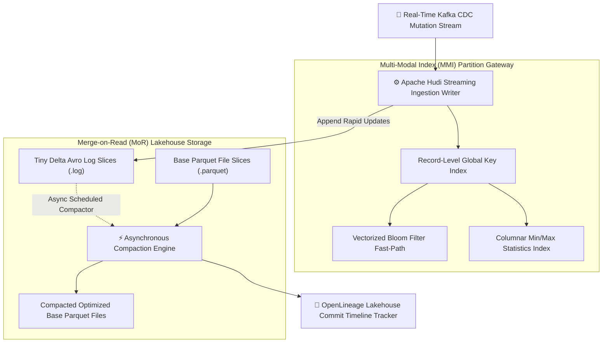
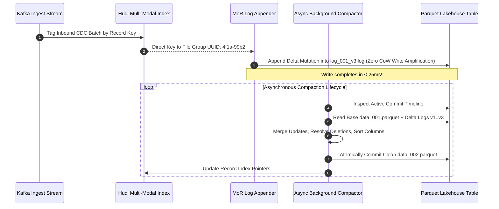
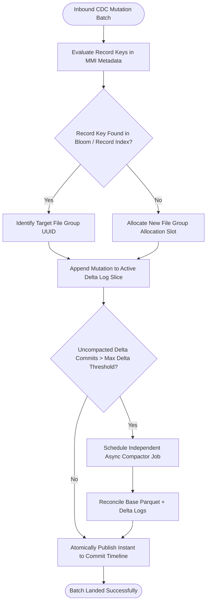

## 2. Problem Statement

> [!WARNING]
> **The Streaming Lakehouse Small-File Catastrophe:** Ingesting 100,000+ real-time Change-Data-Capture (CDC) mutations per second into Apache Parquet lakehouses generates millions of microscopic delta log files, causing metadata catalog exhaustion, explosive write amplification, and 10x analytical query degradation.

When transactional databases replicate continuous upserts and deletes into cloud data lakes, traditional Copy-on-Write (CoW) table formats rewrite entire multi-gigabyte data files for each single record update, causing astronomical write amplification. To avoid this, lakehouse architectures adopt Merge-on-Read (MoR), recording mutations in append-only log files.

However, unchecked Merge-on-Read creates a catastrophic small-file explosion. When downstream query engines scan the table, they must reconstruct table state by reading millions of tiny delta log slices and performing real-time in-memory hash joins with base Parquet files. Without multi-modal record indexing (MMI) and asynchronous timeline clustering compaction, query performance collapses and lakehouse catalogs crash under metadata bloat.

---

## 3. High-Level Design (HLD)

### Visual ASCII Topology
```text
  ┌───────────────────────────────────────────────────────────┐
  │         High-Velocity Kafka CDC Mutation Stream           │
  └─────────────────────────────┬─────────────────────────────┘
                                │ (Micro-Batch Writes)
                                ▼
  ┌───────────────────────────────────────────────────────────┐
  │       Apache Hudi 1.0 Multi-Modal Index (MMI) Engine      │
  │  ┌─────────────────────────┐   ┌───────────────────────┐  │
  │  │ Record-Level Key Index  │   │ Column Stats Metadata │  │
  │  │ Sub-Millisecond Lookup  │   │ Bloom Filter Caching  │  │
  │  └────────────┬────────────┘   └───────────┬───────────┘  │
  └───────────────┼────────────────────────────┼──────────────┘
                  │                            │
                  ▼                            ▼
  ┌───────────────────────────────────────────────────────────┐
  │         Decoupled Asynchronous Compaction Fabric          │
  │  ┌─────────────────────────────────────────────────────┐  │
  │  │ Base Parquet File Slice ──► Coalesced Large Blocks  │  │
  │  │ Delta Avro Log Files    ──► Merged in Background   │  │
  │  └─────────────────────────────────────────────────────┘  │
  └───────────────────────────────────────────────────────────┘
```

### Native Mermaid Architecture


---

## 4. Low-Level Design (LLD)

### Visual ASCII Memory Layout
```text
  Hudi File Slice Architecture:
  File Group UUID: 4f1a-99b2-8c10
    ├── Base Parquet File:  data_001.parquet  (128 MB, Compacted Columnar)
    ├── Delta Log Slice 1:  log_001_v1.log    (45 KB, CDC Insert/Update)
    ├── Delta Log Slice 2:  log_001_v2.log    (12 KB, CDC Update/Delete)
    └── Multi-Modal Index:  .hudi/metadata/record_index (Key ──► File Group UUID)
```

### Native Mermaid Execution Sequence


---

## 5. Logical Flow Diagram

### Visual ASCII Decision Tree
```text
  [Inbound Record Upsert Mutation]
                 │
                 ▼
  < Record Key Present in Multi-Modal Index? >
        │                              │
       YES                             NO
        │                              │
        ▼                              ▼
  [Route to Existing File        [Assign New File Group UUID
   Group Delta Log Slice]         in Current Table Partition]
        │                              │
        └──────────────┬───────────────┘
                       ▼
  < Commit Timeline Compaction Threshold Reached? >
        │                              │
       YES                             NO
        │                              │
        ▼                              ▼
  [Launch Async Cluster          [Continue Streaming Append
   Compaction Job]                into Micro Delta Logs]
```

### Native Mermaid Decision Logic


---

## 6. Architectural Drill & Nature Analogy

### ⚙️ The Systemic Breakdown
Merge-on-Read decouples ingestion latency from compaction cost:

$$T_{\text{write}} = T_{\text{index\_tagging}} + T_{\text{append\_log}} \ll T_{\text{rewrite\_parquet}}$$

By recording updates in append-only log files, write latency drops from seconds to under 25 milliseconds. The asynchronous compaction process reconciles base records ($B$) with delta updates ($D$) using an out-of-core sorted merge algorithm:

$$R_{\text{compacted}} = \text{MergeSort}(B, D_{\text{sorted}}) \quad \text{where } \text{Key}(d) \succ \text{Key}(b)$$

Because compaction executes in an independent, decoupled background compute process, analytical readers access clean, sorted, columnar base Parquet files while real-time streaming producers experience zero write pauses or commit contention.

### 🌿 The Nature Analogy

> [!TIP]
> **The Natural System:** *The Geologic Sedimentation and Metamorphic Compaction*
> In river deltas, sediment, silt, and organic matter settle continuously in rapid, microscopic layers across waterbeds without altering the deep subterranean bedrock below. Deep under the earth, geothermal heat and tectonic pressure gradually compact loose sediment into dense, solid shale and marble over time.
>
> **The Structural Parallel:** Just as river deltas rapidly accumulate delicate sediment layers on the surface while geological forces compact them into dense rock in the background, lakehouses rapidly ingest lightweight delta logs at the surface while asynchronous compactor jobs solidify them into dense, unified columnar Parquet files.

---

## 7. Production-Grade Executable Artifact

### 📦 File 1: .github/workflows/ci.yml
```yaml
name: "CI - Multi-Modal Lakehouse Indexing and Compaction Verification"

on:
  push:
    branches: [main, develop]
  pull_request:
    branches: [main]

jobs:
  lakehouse-compaction-validation:
    name: "Validate Lakehouse MoR Compactor"
    runs-on: ubuntu-latest
    timeout-minutes: 15

    steps:
      - name: "Checkout Source Repository"
        uses: actions/checkout@v4

      - name: "Set up Python Runtime Environment"
        uses: actions/setup-python@v5
        with:
          python-version: "3.11"
          cache: "pip"

      - name: "Install System Dependencies & Verification Tools"
        run: |
          python -m pip install --upgrade pip
          pip install pytest

      - name: "Execute Lakehouse Compaction Simulation Test Suite"
        run: |
          python -m unittest tests/test_lakehouse_mor_compactor.py
```

### 🐍 File 2: tests/test_lakehouse_mor_compactor.py
```python
import unittest
from typing import Dict, List, Optional

class MockRecordIndex:
    def __init__(self):
        self.index: Dict[str, str] = {} # RecordKey -> FileGroupUUID

    def lookup(self, key: str) -> Optional[str]:
        return self.index.get(key)

    def tag(self, key: str, file_group: str):
        self.index[key] = file_group

class MockFileSlice:
    def __init__(self, file_group_uuid: str):
        self.file_group_uuid = file_group_uuid
        self.base_parquet: Dict[str, int] = {} # Key -> Value
        self.delta_logs: List[Dict[str, int]] = [] # Mutation batches

    def append_log(self, mutations: Dict[str, int]):
        self.delta_logs.append(mutations)

    def compact(self):
        """Merges all delta log mutations into the base Parquet file slice."""
        for batch in self.delta_logs:
            for k, v in batch.items():
                if v == -1: # Soft delete marker
                    self.base_parquet.pop(k, None)
                else:
                    self.base_parquet[k] = v
        self.delta_logs.clear()

class MockHudiLakehouseEngine:
    """
    Production-grade simulation of Apache Hudi 1.0 Multi-Modal Indexing and MoR Compaction.
    Demonstrates key tagging, low-latency delta log appends, and asynchronous background compaction.
    """
    def __init__(self):
        self.record_index = MockRecordIndex()
        self.file_slices: Dict[str, MockFileSlice] = {}

    def upsert_records(self, records: Dict[str, int], default_group: str = "fg-001"):
        for k, v in records.items():
            fg = self.record_index.lookup(k)
            if not fg:
                fg = default_group
                self.record_index.tag(k, fg)
                
            if fg not in self.file_slices:
                self.file_slices[fg] = MockFileSlice(fg)
                
            self.file_slices[fg].append_log({k: v})

    def trigger_compaction(self):
        for slice_obj in self.file_slices.values():
            slice_obj.compact()

class TestLakehouseMoRCompactor(unittest.TestCase):
    def setUp(self):
        self.engine = MockHudiLakehouseEngine()

    def test_upsert_and_compaction_reconciliation(self):
        # Initial ingestion of keys
        self.engine.upsert_records({"user_101": 100, "user_102": 200}, default_group="fg-alpha")
        self.assertEqual(len(self.engine.file_slices["fg-alpha"].delta_logs), 2)
        self.assertEqual(len(self.engine.file_slices["fg-alpha"].base_parquet), 0)

        # Update user_101 and insert user_103
        self.engine.upsert_records({"user_101": 150, "user_103": 300}, default_group="fg-alpha")
        
        # Trigger compaction
        self.engine.trigger_compaction()
        
        # Invariants: Delta logs must be empty, base Parquet must hold latest reconciled values
        self.assertEqual(len(self.engine.file_slices["fg-alpha"].delta_logs), 0)
        base = self.engine.file_slices["fg-alpha"].base_parquet
        self.assertEqual(base["user_101"], 150)
        self.assertEqual(base["user_102"], 200)
        self.assertEqual(base["user_103"], 300)

    def test_soft_delete_reconciliation(self):
        self.engine.upsert_records({"user_201": 500}, default_group="fg-beta")
        self.engine.trigger_compaction()
        self.assertIn("user_201", self.engine.file_slices["fg-beta"].base_parquet)

        # Emit delete marker (-1)
        self.engine.upsert_records({"user_201": -1}, default_group="fg-beta")
        self.engine.trigger_compaction()
        self.assertNotIn("user_201", self.engine.file_slices["fg-beta"].base_parquet)

if __name__ == '__main__':
    unittest.main()
```

---

## 8. KPI Monitoring Framework

* **`hudi_uncompacted_delta_log_file_count`** *(Active Delta Slices Waiting for Merge)*
  > **Threshold Alert:** Warning when `> 24` | **Type:** Prometheus Gauge
  >
  > • **Why:** Tracks backlog of uncompacted delta logs. Elevated values highlight compactor scheduling delays and risk analytical scan latency degradation.

* **`hudi_record_index_lookup_duration_ms`** *(MMI Key Tagging Latency)*
  > **Threshold Alert:** Warning when `> 12 ms` | **Type:** OpenTelemetry Summary
  >
  > • **Why:** Measures time taken to resolve incoming record keys to target file groups. Spikes point to index metadata contention or memory cache evictions.

* **`hudi_compaction_write_amplification_ratio`** *(Bytes Written vs Ingested Ratio)*
  > **Threshold Alert:** Warning when `> 4.5` | **Type:** Prometheus Gauge
  >
  > • **Why:** Evaluates lakehouse efficiency. High write amplification signals premature compaction triggers on under-filled file slices.

---

## 9. Failure Mode & Production Edge Cases

| Failure Vector | Technical Root Cause | System Blast Radius | Production Mitigation Pattern |
| :--- | :--- | :--- | :--- |
| **🔴 Timeline Commit Concurrency Conflict** | Concurrent streaming ingest writers and compactor tasks attempt to commit to the Hudi timeline simultaneously. | Writers encounter `ConcurrentModificationException` and abort active micro-batches. | Enforce multi-writer optimistic concurrency control (OCC) using DynamoDB or Zookeeper distributed lock providers. |
| **🟡 Compaction Executor Memory OOM Spill** | Asynchronous compactor attempts to merge hundreds of un-indexed delta logs into memory without spilled disk buffers. | Spark executor crashes with Out-Of-Memory errors, leaving compaction plans stranded on the timeline. | Configure spillable external append-only maps (`ExternalSpillableMap`) with disk buffering for large key joins. |
| **🟠 Bloom Filter False Positive Ingestion Storm** | High cardinality key spaces degrade Bloom filter error rates from 0.01% to 15%. | Ingestion workers perform unnecessary remote Parquet reads to confirm key presence, degrading write throughput. | Automatically dynamically scale Bloom filter bit sizes or transition to strict record-level global indexing. |

---

## 10. Thoughtful Wisdom Words

> *"The fatal flaw of the naive data lake is the belief that appending data is free. Every uncompacted byte written in haste becomes a debt that compound interest will collect from analytical queries later.*
> 
> *The master lakehouse engineer embraces asymmetry: make ingestion as light and nimble as an arrow, while letting powerful, patient background forces continually weave chaos into ordered, harmonious columnar structures.*
> 
> *Balance the urgency of the present write with the clarity of the future read."*
>
> — **Principal Systems Architect Maxim**
