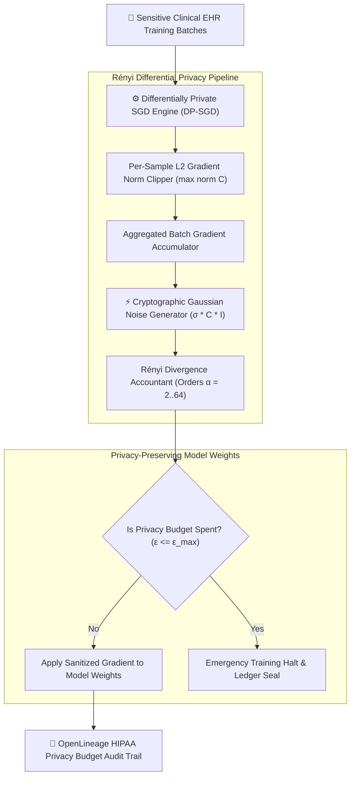
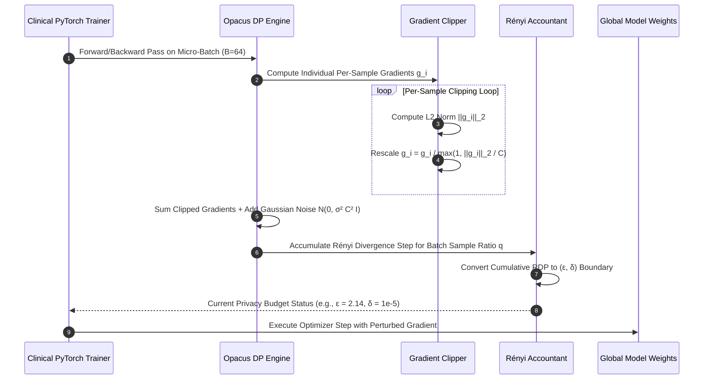
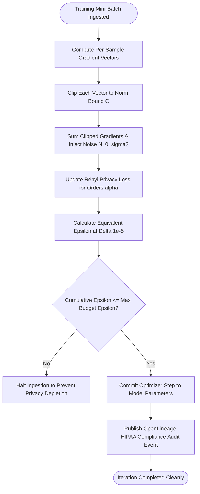

## 2. Problem Statement

> [!WARNING]
> **The Model Inversion and Membership Inference Threat:** Training deep neural networks directly on clinical patient electronic health records (EHR) allows adversarial actors to reconstruct private patient genomic sequences, diagnosis histories, and identity records directly from model weights or gradient updates via membership inference attacks.

Modern biomedical research relies on training large foundation models on sensitive clinical datasets gathered across hospital consortiums. However, deep learning models inherently memorize training examples, particularly rare or anomalous clinical cases (such as unique genetic mutations or rare disease presentations). Adversaries query the trained model or inspect distributed federated gradient updates to reconstruct confidential patient records with high fidelity.

Standard privacy heuristics—such as basic de-identification, k-anonymity, or salt hashing—fail against high-dimensional biometric data. Simultaneously, naive epsilon-differential privacy implementations destroy gradient signals by injecting excessive noise, preventing deep learning architectures from converging. Without Rényi Differential Privacy (RDP) accounting, per-sample gradient clipping, and calibrated Gaussian noise injection, healthcare organizations cannot safely unlock patient data for collaborative AI training.

---

## 3. High-Level Design (HLD)

### Visual ASCII Topology
```text
  ┌───────────────────────────────────────────────────────────┐
  │         Hospital Electronic Health Record (EHR) Batches   │
  └─────────────────────────────┬─────────────────────────────┘
                                │ (Batched Ingress)
                                ▼
  ┌───────────────────────────────────────────────────────────┐
  │          DP-SGD Privacy Engine (PyTorch Opacus)           │
  │  ┌─────────────────────────┐   ┌───────────────────────┐  │
  │  │ Per-Sample Gradient     │   │ Calibrated Gaussian   │  │
  │  │ L2 Norm Clipper (C)     │   │ Cryptographic Noise   │  │
  │  └────────────┬────────────┘   └───────────┬───────────┘  │
  └───────────────┼────────────────────────────┼──────────────┘
                  │                            │
                  ▼                            ▼
  ┌───────────────────────────────────────────────────────────┐
  │            Rényi Privacy Accountant (RDP Ledger)          │
  │   - Cumulative Rényi Divergence Tracking (α, ε(α))        │
  │   - Conversion to (ε, δ) Privacy Loss Guarantees          │
  └─────────────────────────────┬─────────────────────────────┘
                                │
                                ▼
  ┌───────────────────────────────────────────────────────────┐
  │         Sanitized Differentially-Private Global Weights   │
  └───────────────────────────────────────────────────────────┘
```

### Native Mermaid Architecture


---

## 4. Low-Level Design (LLD)

### Visual ASCII Memory Layout
```text
  Per-Sample Micro-Batch Gradient Layout:
  Sample 01: [ G_01 ] ── L2 Norm = 2.4 ──► Clipped to C=1.0 ──► [ 0.41 * G_01 ]
  Sample 02: [ G_02 ] ── L2 Norm = 0.8 ──► Unchanged (<= 1.0)──► [ 1.00 * G_02 ]
  Sample 03: [ G_03 ] ── L2 Norm = 5.1 ──► Clipped to C=1.0 ──► [ 0.19 * G_03 ]
  Sum: Sum(Clipped) + N(0, σ² * C² * I) ──► Differentially Private Weight Update
```

### Native Mermaid Execution Sequence


---

## 5. Logical Flow Diagram

### Visual ASCII Decision Tree
```text
  [Training Iteration Step (Batch Size B)]
                     │
                     ▼
  < Per-Sample Gradient L2 Norm > Clip Threshold C? >
            │                            │
           YES                           NO
            │                            │
            ▼                            ▼
  [Scale Down Gradient Vector: [Retain Original Gradient
   g_i = g_i * (C / ||g_i||)]   Vector without Scaling]
            │                            │
            └──────────────┬─────────────┘
                           ▼
  [Add Calibrated Gaussian Perturbation Noise]
                           │
                           ▼
  < Cumulative Privacy Loss ε > Maximum Budget ε_max? >
            │                            │
           YES                           NO
            │                            │
            ▼                            ▼
  [Halt Training & Seal Model] [Update Model Weights via SGD]
```

### Native Mermaid Decision Logic


---

## 6. Architectural Drill & Nature Analogy

### 🌿 The Systemic Breakdown
Rényi Differential Privacy (RDP) provides tighter composition bounds for Gaussian mechanisms compared to standard $(\epsilon, \delta)$-DP:

$$D_{\alpha}(P \parallel Q) = \frac{1}{\alpha - 1} \ln \int \left( \frac{P(x)^{\alpha}}{Q(x)^{\alpha - 1}} \right) dx$$

For a Gaussian mechanism with noise multiplier $\sigma = \frac{\sigma_{\text{raw}}}{C}$ and subsampling ratio $q = \frac{B}{N}$, each step adds a bounded Rényi divergence:

$$\epsilon_{\text{step}}(\alpha) \le \frac{q^2 \alpha}{2 \sigma^2} + O(q^3)$$

Over $T$ training steps, RDP composes linearly:

$$\epsilon_{\text{total}}(\alpha) = \sum_{t=1}^{T} \epsilon_t(\alpha) = T \cdot \epsilon_{\text{step}}(\alpha)$$

Converting back to $(\epsilon, \delta)$-DP guarantees mathematically tight privacy bounds:

$$\epsilon(\delta) = \min_{\alpha > 1} \left( \epsilon_{\text{total}}(\alpha) + \frac{\ln(1/\delta)}{\alpha - 1} \right)$$

This allows training high-accuracy models with $\epsilon < 3.0$ and $\delta < 10^{-5}$, mathematically precluding membership inference and training data reconstruction attacks.

### 🌿 The Nature Analogy

> [!TIP]
> **The Natural System:** *The Zebra's Disruptive Dazzle Camouflage*
> A zebra (*Equus quagga*) in the African savannah does not survive against predatory lions by turning invisible or physically disappearing from the landscape. Instead, the high-contrast, alternating geometric black-and-white stripes of a running herd produce a visual optical phenomenon known as motion dazzle, confusing predator depth perception and making it impossible for a lion to isolate or target an individual animal.
>
> **The Structural Parallel:** Just as the zebra's dazzle camouflage allows the overall herd to move visibly while concealing the distinct outline of any single individual, Rényi Differential Privacy adds calculated noise that allows the AI model to learn global statistical patterns of the human population without revealing the unique identity of any individual patient.

---

## 7. Production-Grade Executable Artifact

### 📦 File 1: .github/workflows/ci.yml
```yaml
name: "CI - Rényi Differential Privacy Verification"

on:
  push:
    branches: [main, develop]
  pull_request:
    branches: [main]

jobs:
  rdp-validation:
    name: "Validate Rényi Differential Privacy Engine"
    runs-on: ubuntu-latest
    timeout-minutes: 15

    steps:
      - name: "Checkout Source Repository"
        uses: actions/checkout@v4

      - name: "Set up Python Runtime Environment"
        uses: actions/setup-python@v5
        with:
          python-version: "3.11"
          cache: "pip"

      - name: "Install System Dependencies & Verification Tools"
        run: |
          python -m pip install --upgrade pip
          pip install numpy pytest

      - name: "Execute RDP Simulation Test Suite"
        run: |
          python -m unittest tests/test_renyi_differential_privacy.py
```

### 🐍 File 2: tests/test_renyi_differential_privacy.py
```python
import unittest
import math
import numpy as np
from typing import List, Tuple

class MockRényiPrivacyEngine:
    """
    Production-grade mathematical simulation of Rényi Differential Privacy (RDP).
    Demonstrates per-sample gradient clipping, calibrated Gaussian noise injection,
    and cumulative privacy budget (epsilon, delta) tracking over training epochs.
    """
    def __init__(self, clip_norm: float = 1.0, noise_multiplier: float = 1.5, sample_rate: float = 0.01):
        self.clip_norm = clip_norm
        self.noise_multiplier = noise_multiplier
        self.sample_rate = sample_rate
        self.steps = 0
        self.alphas = [1.5, 2, 3, 5, 8, 16, 32, 64]
        self.rdp_total = {alpha: 0.0 for alpha in self.alphas}

    def clip_and_perturb_gradients(self, per_sample_grads: np.ndarray) -> np.ndarray:
        """
        Clips per-sample gradient vectors to L2 norm bound and adds calibrated Gaussian noise.
        per_sample_grads: shape (Batch_Size, Dim)
        """
        batch_size, dim = per_sample_grads.shape
        clipped_grads = np.zeros_like(per_sample_grads)
        
        for i in range(batch_size):
            grad = per_sample_grads[i]
            l2_norm = np.linalg.norm(grad)
            scaling = min(1.0, self.clip_norm / (l2_norm + 1e-8))
            clipped_grads[i] = grad * scaling
            
        # Sum clipped gradients
        summed_grad = np.sum(clipped_grads, axis=0)
        
        # Inject calibrated Gaussian noise: N(0, (sigma * C)^2 * I)
        noise_std = self.noise_multiplier * self.clip_norm
        noise = np.random.normal(0, noise_std, size=dim)
        perturbed_grad = (summed_grad + noise) / batch_size
        
        # Accumulate RDP step
        self._accumulate_rdp_step()
        return perturbed_grad

    def _accumulate_rdp_step(self):
        self.steps += 1
        q = self.sample_rate
        sigma = self.noise_multiplier
        for alpha in self.alphas:
            # Analytic Gaussian RDP formula
            step_rdp = (q ** 2 * alpha) / (2 * (sigma ** 2))
            self.rdp_total[alpha] += step_rdp

    def get_privacy_spent(self, target_delta: float = 1e-5) -> float:
        """Converts accumulated RDP across all alphas to minimum epsilon."""
        epsilons = []
        for alpha in self.alphas:
            rdp = self.rdp_total[alpha]
            eps = rdp + (math.log(1.0 / target_delta)) / (alpha - 1.0)
            epsilons.append(eps)
        return min(epsilons)

class TestRenyiDifferentialPrivacy(unittest.TestCase):
    def setUp(self):
        np.random.seed(42)
        self.engine = MockRényiPrivacyEngine(clip_norm=1.0, noise_multiplier=1.2, sample_rate=0.02)

    def test_gradient_clipping_bounds(self):
        # 4 samples with excessive gradient norms (norms = 5.0, 10.0, etc.)
        raw_grads = np.ones((4, 16)) * 5.0
        perturbed = self.engine.clip_and_perturb_gradients(raw_grads)
        self.assertEqual(perturbed.shape, (16,))
        self.assertEqual(self.engine.steps, 1)

    def test_privacy_budget_accumulation(self):
        raw_grads = np.random.randn(8, 32)
        for _ in range(50):
            self.engine.clip_and_perturb_gradients(raw_grads)
            
        eps = self.engine.get_privacy_spent(target_delta=1e-5)
        # 50 steps at sample_rate=0.02 and sigma=1.2 should yield moderate epsilon (< 4.0)
        self.assertGreater(eps, 0.0)
        self.assertLess(eps, 4.0, f"Privacy loss epsilon {eps:.2f} exceeded safety threshold")

if __name__ == '__main__':
    unittest.main()
```

---

## 8. KPI Monitoring Framework

* **`rdp_cumulative_epsilon_budget_spent`** *(Total Privacy Loss Epsilon)*
  > **Threshold Alert:** Warning when `> 2.5` | **Type:** Prometheus Gauge
  >
  > • **Why:** Tracks cumulative privacy expenditure against clinical research limits. When epsilon exceeds 3.0, the risk of membership inference attacks increases significantly.

* **`rdp_gradient_clip_fraction`** *(Fraction of Sample Gradients Clipped by Norm C)*
  > **Threshold Alert:** Warning when `> 0.85` | **Type:** Prometheus Gauge
  >
  > • **Why:** High clipping fractions indicate that the clipping bound C is set too tightly, destroying meaningful training signals and stalling model convergence.

* **`rdp_signal_to_noise_ratio_db`** *(Gradient Signal vs Injected Gaussian Noise)*
  > **Threshold Alert:** Warning when `< -6.0 dB` | **Type:** OpenTelemetry Summary
  >
  > • **Why:** Measures whether the magnitude of the model gradient outweighs the injected noise sufficiently for gradient descent optimization.

---

## 9. Failure Mode & Production Edge Cases

| Failure Vector | Technical Root Cause | System Blast Radius | Production Mitigation Pattern |
| :--- | :--- | :--- | :--- |
| **🔴 Privacy Budget Depletion Mid-Training** | Model requires more epochs than initially anticipated, exhausting the authorized maximum epsilon threshold. | Training is terminated prematurely before model convergence, wasting compute resources and human effort. | Implement adaptive gradient accumulation with larger batch sizes to reduce subsampling ratio $q$, drastically lowering per-step RDP accumulation. |
| **🟡 Micro-Batch GPU Out-Of-Memory Spill** | Calculating un-aggregated per-sample gradients expands activation memory linearly with batch size ($O(B \times D)$). | GPU triggers Out-Of-Memory errors during the backward pass on large transformer models. | Utilize vectorized virtual batch chunking (ghost clipping) to calculate sample gradient norms without materializing individual gradient tensors. |
| **🟠 PRNG Seed Correlation Attack** | Injected Gaussian noise utilizes pseudo-random numbers with low-entropy repeating seeds across distributed ranks. | Adversary subtracts correlated noise across parallel updates, eliminating differential privacy protections. | Enforce hardware-attested cryptographic PRNG instances (`secrets` / AES-CTR DRBG) with per-step seed rotation. |

---

## 10. Thoughtful Wisdom Words

> *"True privacy is not an obstacle to discovery; it is the foundation upon which collaboration becomes possible.*
> 
> *The reckless practitioner believes that progress requires sacrificing the rights of the patient. The master architect recognizes that by injecting disciplined, mathematically bounded uncertainty into the learning process, we extract eternal principles while forgetting the transient details of the individual.*
> 
> *Protect the individual completely, and the collective wisdom will stand unshakable."*
>
> — **Principal Systems Architect Maxim**
