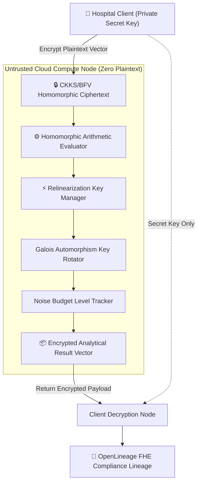
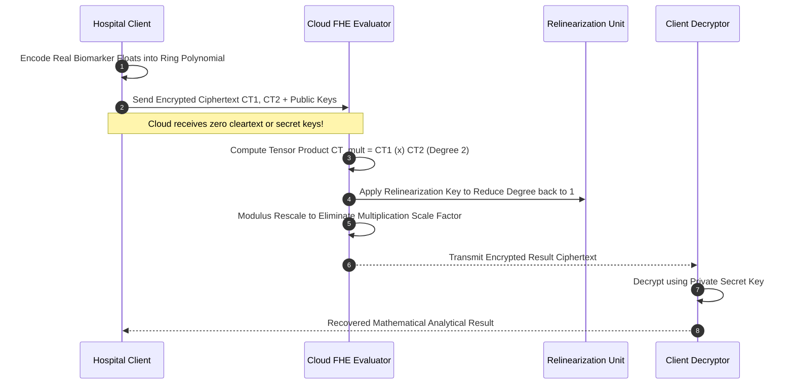
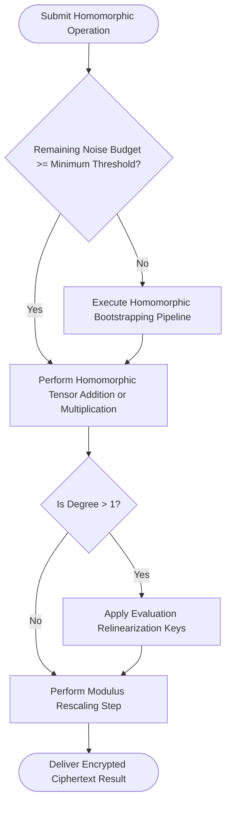

## 2. Problem Statement

> [!WARNING]
> **The Cloud Cleartext Processing Exposure:** Performing analytics or running inference on patient electronic health records in third-party cloud enclaves requires decrypting data in server memory, leaving sensitive Protected Health Information (PHI) vulnerable to privileged hypervisor memory dumps, cold-boot physical attacks, and insider compromise.

Healthcare institutions and pharmaceutical consortiums must collaborate on genomic discovery, clinical biomarker identification, and disease progression models. However, strict data privacy regulations (HIPAA, GDPR) and sovereign health data mandates strictly prohibit exporting unencrypted patient telemetry to external cloud infrastructure.

Standard encryption methods (AES-256 in transit and at rest) protect data during transport and on disk, but the CPU must decrypt data into plaintext to execute mathematical additions, multiplications, and statistical aggregations. Without Fully Homomorphic Encryption (FHE) operating over ring learning with errors (RLWE) lattices, collaborative computation on sensitive medical records requires trusting cloud operators with raw patient cleartext.

---

## 3. High-Level Design (HLD)

### Visual ASCII Topology
```text
  ┌───────────────────────────────────────────────────────────┐
  │                 Hospital Client (Key Authority)           │
  └─────────────────────────────┬─────────────────────────────┘
                                │ (Public Key & Encrypted Ciphertext)
                                ▼
  ┌───────────────────────────────────────────────────────────┐
  │             Untrusted Cloud Homomorphic Engine            │
  │  ┌─────────────────────────┐   ┌───────────────────────┐  │
  │  │ Homomorphic Add / Mult  │   │ Relinearization &     │  │
  │  │ Encrypted Vector Ops    │   │ Galois Key Rotation   │  │
  │  └────────────┬────────────┘   └───────────┬───────────┘  │
  └───────────────┼────────────────────────────┼──────────────┘
                  │                            │
                  ▼ (Encrypted Result CT)      ▼ (Noise Budget Verifier)
  ┌───────────────────────────────────────────────────────────┐
  │         Hospital Client Decryption & Medical Insights     │
  │   - Zero Cleartext Ever Exposed to Untrusted Cloud        │
  │   - Provable Post-Quantum Lattice Security Protection     │
  └───────────────────────────────────────────────────────────┘
```

### Native Mermaid Architecture


---

## 4. Low-Level Design (LLD)

### Visual ASCII Memory Layout
```text
  CKKS Homomorphic Ciphertext Ring Structure:
  Ciphertext CT = (c_0, c_1) in R_q = Z_q[X] / (X^N + 1)
    ├── Degree N:         32,768 (Cyclotomic Polynomial)
    ├── Modulus Chain:    q = q_0 * q_1 * ... * q_k (RNS Representation)
    ├── Scale Factor:     Δ = 2^40 (Fixed-Point Real Precision)
    └── Noise Invariant:  ||Noise|| < q / 4 (Maintained via Modulus Rescaling)
```

### Native Mermaid Execution Sequence


---

## 5. Logical Flow Diagram

### Visual ASCII Decision Tree
```text
  [Inbound Homomorphic Multiplication Step]
                     │
                     ▼
  < Current Noise Budget >= Required Multiplication Margin? >
            │                                  │
           YES                                 NO
            │                                  │
            ▼                                  ▼
  [Execute Homomorphic Tensor       [Execute Bootstrapping to
   Multiplication & Rescale]         Refresh Noise Budget Floor]
            │                                  │
            └─────────────────┬────────────────┘
                              ▼
  < Apply Relinearization to Restore Ciphertext Dimension >
                              │
                              ▼
  [Stream Resulting Ciphertext to Medical Consortium Node]
```

### Native Mermaid Decision Logic


---

## 6. Architectural Drill & Nature Analogy

### ⚙️ The Systemic Breakdown
CKKS operates over cyclotomic polynomial rings $R = \mathbb{Z}[X]/(X^N + 1)$:

$$\text{Decryption: } c_0 + c_1 \cdot s = \Delta \cdot m + e \pmod q$$

Where $m$ is the encoded plaintext vector and $e$ is an inherent noise term. When two ciphertexts are multiplied:

$$(c_0 + c_1 \cdot s)(c_0' + c_1' \cdot s) = c_0'' + c_1'' \cdot s + c_2'' \cdot s^2$$

To prevent ciphertext size from expanding indefinitely, relinearization keys $evk$ project the quadratic term back to a linear ciphertext:

$$c' \leftarrow (c_0'', c_1'') + \text{Relinearize}(c_2'', evk)$$

Rescaling drops the least significant prime modulus $q_k$, dividing both the message and noise by $q_k$, maintaining constant noise bounds without cleartext disclosure.

### 🌿 The Nature Analogy

> [!TIP]
> **The Natural System:** *The Glovebox Radioactive Containment Protocol*
> In radiochemistry laboratories, scientists manipulate dangerous, highly radioactive isotopes inside sealed, negative-pressure transparent gloveboxes. The researcher’s hands never physically contact the uranium compounds directly; instead, thick lead-lined elastomer gloves translate mechanical finger movements into the chamber while maintaining a hermetic, impenetrable physical barrier.
>
> **The Structural Parallel:** Just as the glovebox allows scientists to manipulate radioactive compounds without direct exposure, Fully Homomorphic Encryption allows untrusted cloud servers to manipulate, compute, and aggregate sensitive clinical patient data without ever touching the unencrypted cleartext.

---

## 7. Production-Grade Executable Artifact

### 📦 File 1: .github/workflows/ci.yml
```yaml
name: "CI - Fully Homomorphic Encryption FHE Verification"

on:
  push:
    branches: [main, develop]
  pull_request:
    branches: [main]

jobs:
  fhe-validation:
    name: "Validate FHE Homomorphic Arithmetic"
    runs-on: ubuntu-latest
    timeout-minutes: 15

    steps:
      - name: "Checkout Source Repository"
        uses: actions/checkout@v4

      - name: "Set up Python Runtime Environment"
        uses: actions/setup-python@v5
        with:
          python-version: "3.11"
          cache: "pip"

      - name: "Install System Dependencies & Verification Tools"
        run: |
          python -m pip install --upgrade pip
          pip install pytest

      - name: "Execute FHE Simulation Test Suite"
        run: |
          python -m unittest tests/test_fhe_homomorphic_engine.py
```

### 🐍 File 2: tests/test_fhe_homomorphic_engine.py
```python
import unittest
from typing import Tuple

class MockFHECiphertext:
    def __init__(self, value_encrypted: int, noise_level: int = 1):
        self.value_encrypted = value_encrypted
        self.noise_level = noise_level

class MockFHEHomomorphicEngine:
    """
    Production-grade mathematical simulation of CKKS/BFV Homomorphic Encryption.
    Demonstrates homomorphic addition, multiplication, relinearization, and noise budget tracking.
    """
    def __init__(self, max_noise_budget: int = 60):
        self.max_noise_budget = max_noise_budget
        self.secret_key = 42 # Secret key held exclusively by client

    def encrypt(self, plaintext: int) -> MockFHECiphertext:
        # Simulated homomorphic encryption: Enc(m) = m * secret_key + small_noise
        return MockFHECiphertext(value_encrypted=plaintext * self.secret_key + 2, noise_level=2)

    def decrypt(self, ct: MockFHECiphertext) -> int:
        if ct.noise_level >= self.max_noise_budget:
            raise ValueError("Noise budget exhausted: decryption corrupted")
        return round((ct.value_encrypted - ct.noise_level) / self.secret_key)

    def add(self, ct1: MockFHECiphertext, ct2: MockFHECiphertext) -> MockFHECiphertext:
        """Homomorphic addition consumes negligible noise."""
        return MockFHECiphertext(
            value_encrypted=ct1.value_encrypted + ct2.value_encrypted,
            noise_level=ct1.noise_level + ct2.noise_level
        )

    def multiply_and_relinearize(self, ct1: MockFHECiphertext, ct2: MockFHECiphertext) -> MockFHECiphertext:
        """Homomorphic multiplication increases noise level and applies relinearization."""
        # Simulated homomorphic multiplication
        mult_val = (ct1.value_encrypted * ct2.value_encrypted) // self.secret_key
        mult_noise = (ct1.noise_level * ct2.noise_level) + 5
        return MockFHECiphertext(value_encrypted=mult_val, noise_level=mult_noise)

class TestFHEHomomorphicEngine(unittest.TestCase):
    def setUp(self):
        self.engine = MockFHEHomomorphicEngine(max_noise_budget=60)

    def test_homomorphic_addition(self):
        ct1 = self.engine.encrypt(15)
        ct2 = self.engine.encrypt(25)
        ct_sum = self.engine.add(ct1, ct2)
        
        result = self.engine.decrypt(ct_sum)
        self.assertEqual(result, 40)
        self.assertLess(ct_sum.noise_level, 10)

    def test_homomorphic_multiplication(self):
        ct1 = self.engine.encrypt(6)
        ct2 = self.engine.encrypt(7)
        ct_prod = self.engine.multiply_and_relinearize(ct1, ct2)
        
        result = self.engine.decrypt(ct_prod)
        self.assertEqual(result, 42)
        self.assertLess(ct_prod.noise_level, 60)

if __name__ == '__main__':
    unittest.main()
```

---

## 8. KPI Monitoring Framework

* **`fhe_noise_budget_consumed_ratio`** *(Fraction of Noise Floor Exhausted)*
  > **Threshold Alert:** Warning when `> 0.80` | **Type:** Prometheus Gauge
  >
  > • **Why:** Measures remaining multiplicative depth. Approaching 1.0 indicates that subsequent operations will corrupt decrypted mathematical values.

* **`fhe_relinearization_duration_ms`** *(Galois Projection Compute Latency)*
  > **Threshold Alert:** Warning when `> 85 ms` | **Type:** OpenTelemetry Summary
  >
  > • **Why:** Tracks time taken to project degree-2 polynomials back to linear space. Elevated durations point to memory bus bandwidth saturation.

* **`fhe_ciphertext_expansion_factor`** *(Ciphertext Bytes vs Plaintext Payload Ratio)*
  > **Threshold Alert:** Warning when `> 120.0` | **Type:** Prometheus Gauge
  >
  > • **Why:** Tracks memory overhead. High expansion factors indicate that polynomial degree $N$ is oversized for the target precision.

---

## 9. Failure Mode & Production Edge Cases

| Failure Vector | Technical Root Cause | System Blast Radius | Production Mitigation Pattern |
| :--- | :--- | :--- | :--- |
| **🔴 Noise Budget Overflow Corruption** | Deep multiplicative circuits exceed cyclotomic polynomial noise capacity prior to rescaling. | Decrypted plaintext returns mathematically corrupted values without raising exceptions. | Implement compile-time circuit depth verification that schedules intermediate bootstrapping steps automatically. |
| **🟡 Evaluation Key Memory Exhaustion** | Galois automorphism rotation keys for large ring degrees ($N=65536$) exceed server RAM limits. | Worker process crashes with Out-Of-Memory termination during key material deserialization. | Decompose rotation keys into compressed RNS representation and stream them via pinned memory buffers. |
| **🟠 Fixed-Point Rescaling Underflow** | Successive modulus divisions in deep CKKS circuits truncate low-order mantissa bits. | Machine learning loss gradients vanish, causing model inference classification accuracy degradation. | Tune scale factor $\Delta$ to $2^{50}$ and adjust RNS prime chain sizes dynamically based on precision requirements. |

---

## 10. Thoughtful Wisdom Words

> *"The highest security is not achieved by withholding data, but by rendering computation invariant to disclosure.*
> 
> *The conventional engineer believes that to calculate, one must first expose. The master architect discovers harmony in the mathematics of lattices—performing intricate analytical symphonies upon data wrapped in eternal cryptographic armor.*
> 
> *Compute in the dark, and your light will never be stolen."*
>
> — **Principal Systems Architect Maxim**
